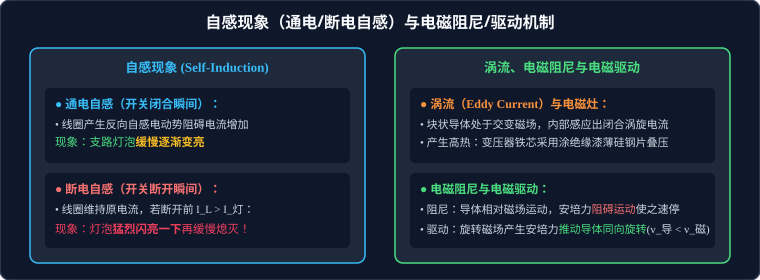

# 03 · 自感、互感与涡流

## 核心物理概念与内涵

> [!NOTE]
> 本节严格遵循人教版物理选择性必修第二册体系，引入电磁惯性、能量储能与涡旋场流动图景，全面解析互感、自感、涡流及电磁阻尼与驱动在现代工程与高考中的考查核心。

### 1. 互感现象（Mutual Induction）

当两个线圈靠近放置时，若其中一个线圈中的电流发生变化，它所激发的磁场穿过另一个线圈的磁通量也随之发生变化，从而在另一个线圈中产生感应电动势，这种现象称为**互感现象**。

* **工程应用**：交流变压器、无线电能传输（无线快充）、电磁炉感应加热线圈；
* **互感干扰与防止**：在灵敏电子仪器中，为了避免导线间的互感干扰，常采用金属屏蔽罩隔离，或采用**双线并绕法**（使相邻导线电流大小相等、方向相反，磁场相互完全抵消）。

---

## 自感现象（Self-Induction）与电磁惯性

当一个线圈自身的电流发生变化时，穿过线圈自身的磁通量亦随之发生变化，从而在该线圈**自身激发出感应电动势**，这种现象称为**自感现象**，产生的感应电动势称为**自感电动势（Self-induced EMF）**。



### 1. 自感电动势与自感系数

根据法拉第电磁感应定律与欧姆定律，自感电动势与线圈内电流的变化率成正比：
$$E_L = -L \frac{\Delta I}{\Delta t}$$

* **自感系数 $L$（电感量，Inductance）**：
  * 描述线圈产生自感电动势能力的物理参量；
  * **决定因素**：完全由线圈本身的物理构造决定（线圈长度、截面积、匝数平方 $N^2$，以及**内部有无铁芯**；插入高导磁率铁芯可使自感系数激增成百上千倍）；
  * **单位**：亨利（$\text{H}$），$1\,\text{H} = 1\,\text{V}\cdot\text{s}/\text{A} = 1\,\Omega\cdot\text{s}$。
* **可汗学院物理直观：电磁世界的“质量”与“惯性”**
  * 在力学中，物体的质量 $m$ 阻碍速度 $v$ 的突变（惯性定律）；
  * 在电磁学中，电感 $L$ 扮演了完全相同的角色——**阻碍电流 $I$ 的突变**！
  * 电流增加时，产生反向电动势阻碍电流增加；电流减小时，产生顺向电动势阻碍电流减小。电流**绝不可能发生瞬间阶跃突变**！
  * 线圈储存的磁场能量为：
    $$E_{\text{磁}} = \frac{1}{2} L I^2$$
    （完美对应力学动能公式 $E_k = \frac{1}{2} m v^2$）。

---

## 经典高考实验模型：通电自感与断电自感

### 1. 通电自感现象（Make-switch Experiment）

```
         ┌──[ 开关 S ]───[ 电源 E ]───┐
         │                           │
         ├───[ 电阻 R ]────[ 灯泡 A₁ ]┤
         │                           │
         └───[ 线圈 L ]────[ 灯泡 A₂ ]┘
```

* **电路参数配置**：调节变阻器 $R$，使得电路稳定时两支路电流完全相等（灯泡 $A_1$ 与 $A_2$ 稳态亮度完全一致）。
* **物理过程分析**：
  * 在闭合开关 $S$ 的瞬间，通过线圈 $L$ 的电流从零迅速增大；
  * 线圈产生巨大的反向自感电动势阻碍电流增大；
  * **实验现象**：
    * 灯泡 $A_1$ 所在支路无电感，**立刻正常发光**；
    * 灯泡 $A_2$ 所在支路受到自感电动势强烈阻碍，其电流只能缓慢增大，**逐渐变亮**；
    * 经过一段时间达到稳态后，自感电动势降为零，两灯亮度达到完全相同。

---

### 2. 断电自感现象（Break-switch Experiment，高考极高频考点）

```
         ┌──[ 开关 S ]───[ 电源 E ]───┐
         │                           │
         ├───[ 线圈 (L, r) ]─────────┤
         │                           │
         └───[ 灯泡 A (阻值 R) ]─────┘
```

* **物理过程推演**：
  * 开关 $S$ 处于闭合状态时，线圈支路与灯泡支路并联。设稳态通过线圈的电流为 $I_L = \dfrac{E}{r}$，通过灯泡的电流为 $I_A = \dfrac{E}{R}$。
  * 当开关 $S$ **突然断开**的瞬间，外电路电源被切断；
  * 线圈由于具有强烈的自感效应，必须维持自身原电流 $I_L$ 不变，且方向不变；
  * 线圈 $L$ 充当临时电源，与灯泡 $A$ 构成封闭回路，电流由线圈流出经灯泡反向流回。
* **灯泡是否“闪亮一下”的判定铁律**：

> [!IMPORTANT]
> **断开瞬间灯泡是否闪亮的唯一判据**：
> 比较开关断开前瞬间，通过线圈的稳态电流 $I_L$ 与通过灯泡的稳态电流 $I_A$ 的相对大小！

1. **若 $I_L > I_A$（即线圈内阻 $r < R$）**：
   * 断开瞬间，回路电流瞬间由原灯泡电流 $I_A$ 跃升至线圈维持的较大电流 $I_L$；
   * **现象**：灯泡**猛烈闪亮一下**，然后随着磁场能的释放逐渐变暗熄灭！
2. **若 $I_L \le I_A$（即线圈内阻 $r \ge R$）**：
   * 断开瞬间，回路电流直接等于或小于灯泡原有电流；
   * **现象**：灯泡**绝不闪亮**，只是从原有亮度逐渐变暗直至完全熄灭！

---

## 涡流、电磁阻尼与电磁驱动

### 1. 涡流（Eddy Current）及其应用与防护

* **形成机制**：当块状金属导体置于随时间变化的交变磁场中，或在非均匀磁场中运动时，在金属内部垂直于磁场的平面内会感应出像旋涡一样的闭合环形电流，称为**涡电流（涡流）**。
* **热效应应用**：
  * **高频感应炉**：利用高频交变磁场在金属工件中产生极强的涡流，几秒内使金属红热熔化，用于冶炼高纯度特种合金。
  * **家用电磁灶**：灶盘高频交变电流产生交变磁场，在铁磁性平底锅底部激发剧烈涡流自身发热，热效率高达 $90\%$ 以上。
* **涡流的防护与切断**：
  * 在变压器和交流电动机铁芯中，涡流会造成大量的电能损耗并导致铁芯严重过热；
  * **工程解决方案**：绝不用整块纯铁作为铁芯，而是采用**涂有绝缘漆的薄硅钢片叠压**而成，使涡流被绝缘层阻断在极薄的横截面内，极大地增大了回路电阻，使涡流损耗降低到微乎其微。

---

### 2. 电磁阻尼（Electromagnetic Damping）

* **物理原理**：当闭合金属导体或磁铁相对运动时，在导体中激发的感应电流所受到的安培力，由楞次定律必然**阻碍导体的相对机械运动**。这种利用电磁感应使运动物体快速静止的技术称为电磁阻尼。
* **典型应用**：
  * **灵敏电流计指针**：电流计线圈骨架采用轻质铝框制成，在磁场中偏转时铝框内产生涡流阻尼，使指针几乎瞬间平稳停在读数位置，消除无休止的来回晃动；
  * **磁悬浮列车与高铁电磁制动**：高速行驶时在铁轨上产生强涡流反向安培力制动，不磨损机械部件且制动力强劲。

---

### 3. 电磁驱动（Electromagnetic Drive）

* **物理原理**：若磁场自身相对导体发生运动（如旋转磁场），导体在磁场中感应出电流，感应电流在磁场中所受的安培力方向与磁场运动方向相同，**推动导体跟随磁场一同运动**。
* **转速滞后铁律**：
  导体的运动速度 $v_{\text{导}}$ 必然**严格小于**旋转磁场的转速 $v_{\text{磁}}$（$v_{\text{导}} < v_{\text{磁}}$）！
  > **反证法证明**：若导体转速追平磁场转速（$v_{\text{导}} = v_{\text{磁}}$），则两者之间无相对切割运动，磁通量不再改变，感应电流瞬间消失为零，安培力消失，导体失去驱动力。
* **现代工业基石**：这是全球工业界广泛应用的**三相异步交流电动机（Induction Motor）**的物理运作基石！

---

## 高频易错盲区与避坑指南

* [×] **误区 1**：认为断电自感中，只要线圈自感系数 $L$ 足够大，断开瞬间灯泡就一定会闪亮一下。
  > [√] **正解**：自感系数 $L$ 只决定放电时间的长短（延时变慢），**决定是否“闪亮一下”的唯一判据是断开前电流大小是否满足 $I_L > I_A$**！若断开前线圈电流小于灯泡电流，无论 $L$ 有多大，灯泡也绝不会闪亮。

* [×] **误区 2**：在电磁炉上使用耐热玻璃锅或陶瓷平底锅加热食物。
  > [√] **正解**：玻璃和陶瓷是绝缘体，自由电荷浓度极低，无法在交变磁场中感应出涡流，电磁炉完全无法对其加热。电磁炉必须使用铁磁性金属锅具。
