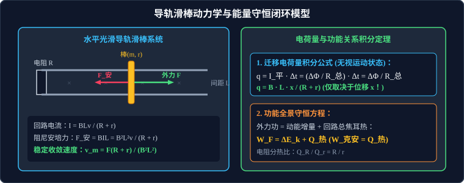

# 考点 · 电磁感应导轨滑棒动力学与能量综合

## 考点模型深度解析

> [!IMPORTANT]
> 导轨滑棒综合问题是历年高考物理压轴大题中当之无愧的“综合之王”。
> 它横跨**法拉第电磁感应定律、全电路欧姆定律、安培力左手定则、牛顿第二定律、动量定理积分以及动能定理与能量守恒定律**。解题核心在于洞悉物理量之间的闭环因果反馈演变机制。



---

## 力-电-磁-能量四维闭环因果反馈网络

无论何种导轨滑棒构型，其内部均蕴含着相同的基本因果链：

```
     ┌─────────────────────────────────────────────────────────────┐
     │                                                             │
     ▼                                                             │
【机械运动 v】 ──► 【动生电动势 E = BLv】 ──► 【回路电流 I = E / R_总】
                                                    │
                                                    ▼
【加速度 a = ΣF / m】 ◄── 【牛顿第二定律】 ◄── 【安培力 F_安 = BIL】
```

* **负反馈稳态收敛特征**：速度 $v$ 增大 $\implies$ 安培力 $F_{\text{安}}$ 增大 $\implies$ 合阻力增大 $\implies$ 加速度 $a$ 减小。因此，受恒力或重力驱动的单棒系统，其运动加速度必然不断衰减，**最终必然收敛于匀速直线运动状态（稳态 $a = 0$）**！

---

## 经典单棒三大动力学演化模型

### 模型 A：恒力驱动的光滑水平导轨单棒（恒力 $F$）

一质量为 $m$、阻值为 $r$、长度为 $L$ 的金属棒放置在相距为 $L$ 的光滑水平平行金属导轨上，一端接定值电阻 $R$。垂直导轨平面存在磁感应强度为 $B$ 的竖直匀强磁场。自静止施加水平恒力 $F$。

1. **瞬时微分方程**：
   $$F - F_{\text{安}} = m a \implies F - \frac{B^2 L^2 v}{R + r} = m \frac{dv}{dt}$$
2. **运动性质判据**：
   因为加速度 $a = \dfrac{F - \frac{B^2 L^2 v}{R+r}}{m}$，随着速度 $v$ 的增大，加速度 $a$ 单调减小，金属棒做**加速度逐渐减小的变加速直线运动**。
3. **收敛终端最大速度（Terminal Velocity）**：
   当合外力为零时加速度 $a = 0$，速度达到极值 $v_m$：
   $$F - \frac{B^2 L^2 v_m}{R + r} = 0 \implies v_m = \frac{F (R + r)}{B^2 L^2}$$
4. **稳态功率平衡**：
   此时外力的机械功率完全等于回路中消耗的总电热功率：
   $$P_{\text{外}} = F v_m = \left(\frac{B^2 L^2 v_m}{R+r}\right) v_m = \frac{B^2 L^2 v_m^2}{R + r} = I_m^2 (R + r) = P_{\text{热}}$$

---

### 模型 B：初速度释放的电磁阻尼减速模型（动量定理积分）

金属棒以初速度 $v_0$ 射入光滑水平导轨，不受任何外力，仅在安培阻力作用下减速。

1. **运动性质**：
   $$-F_{\text{安}} = m \frac{dv}{dt} \implies -\frac{B^2 L^2 v}{R + r} = m a$$
   金属棒做**加速度逐渐减小的变减速直线运动**，最终速度衰减为零。
2. **动量定理微元积分求滑行总距离 $x$**：
   在极短时间微元 $dt$ 内，应用动量定理：
   $$-F_{\text{安}} dt = m dv \implies -\left(\frac{B^2 L^2 v}{R + r}\right) dt = m dv$$
   两边从 $t = 0$ 到最终静止进行定积分：
   $$-\frac{B^2 L^2}{R + r} \int_0^{t_{\text{终}}} v dt = m \int_{v_0}^0 dv$$
   因为 $\int_0^{t_{\text{终}}} v dt = x$（金属棒滑行的总位移）：
   $$-\frac{B^2 L^2}{R + r} x = m (0 - v_0) = -m v_0$$
   解得滑行总距离：
   $$x = \frac{m v_0 (R + r)}{B^2 L^2}$$
3. **总电荷量与焦耳热**：
   * 迁移总电荷量：$q = \dfrac{\Delta \Phi}{R_{\text{总}}} = \dfrac{BLx}{R+r} = \dfrac{m v_0}{BL}$；
   * 产生的总焦耳热：由能量守恒，全部初始动能耗散为内能：
     $$Q_{\text{热}} = \frac{1}{2} m v_0^2$$
     电阻 $R$ 分得的热量为：$Q_R = \dfrac{R}{R+r} Q_{\text{热}}$。

---

### 模型 C：倾斜导轨重力下滑模型（倾角 $\alpha$）

金属棒沿倾角为 $\alpha$ 的光滑斜面导轨自静止下滑，磁场垂直斜面向上。
* **运动方程**：
  $$mg \sin\alpha - \frac{B^2 L^2 v}{R + r} = m a$$
* **收敛最大速度**：
  $$v_m = \frac{mg \sin\alpha (R + r)}{B^2 L^2}$$
* **能量守恒方程（下滑高度 $h$、位移 $s = \dfrac{h}{\sin\alpha}$）**：
  $$m g h = \frac{1}{2} m v^2 + Q_{\text{热}}$$

---

## 导轨双棒动力学耦合模型

两根质量分别为 $m_1$ 和 $m_2$、阻值分别为 $r_1$ 和 $r_2$ 的金属棒 1 和棒 2，平行放置在光滑水平导轨上。

```
       ═════════════════════════════════════════════════
          │                  磁场 B (垂直纸面)      │
       [棒 1 (m₁, r₁)]                          [棒 2 (m₂, r₂)]
          │ (受恒力 F 或初速 v₀)                   │
       ═════════════════════════════════════════════════
```

### 1. 初速度 $v_0$ 释放、无外力双棒系统（动量守恒）
* 初始棒 1 具有初速度 $v_0$，棒 2 静止。
* **回路电动势**：由两棒的速度差决定，反接串联：
  $$E = B L (v_1 - v_2)$$
* **两棒受力**：棒 1 受反向安培阻力，棒 2 受同向安培驱动力。两棒受到的安培力大小相等、方向相反（$F_{\text{安1}} = -F_{\text{安2}}$）。
* **系统动量守恒**：
  整个双棒系统合外力为零，动量严格守恒：
  $$m_1 v_1 + m_2 v_2 = m_1 v_0$$
* **最终稳态速度**：
  当两棒速度相等（$v_1 = v_2 = v_{\text{共}}$）时，速度差为零，回路感应电流消失，安培力降为零，两棒保持共同速度匀速运动：
  $$v_{\text{共}} = \frac{m_1}{m_1 + m_2} v_0$$
* **能量损失（总焦耳热）**：
  $$Q_{\text{热}} = \frac{1}{2} m_1 v_0^2 - \frac{1}{2} (m_1 + m_2) v_{\text{共}}^2$$

---

## 高考黑科技：含电容器导轨滑棒“电磁等效质量”模型

在光滑水平导轨一端连接一容量为 $C$ 的**理想电容器**（无电阻），金属棒质量为 $m$、长为 $L$，导轨电阻忽略不计。施加恒定外力 $F$ 自静止拉动棒。

### 1. 严格微分方程推导
* 设某一时刻金属棒的速度为 $v$，导体棒产生动生电动势：$E = B L v$；
* 电容器充上电荷量：$Q = C \cdot U_C = C E = C B L v$；
* 回路中的瞬时瞬时电流为电荷量的时间变化率：
  $$I = \frac{dQ}{dt} = \frac{d}{dt}(C B L v) = C B L \frac{dv}{dt} = C B L a$$
  （式中 $a = \dfrac{dv}{dt}$ 为瞬时加速度）。
* 金属棒受到的安培力：
  $$F_{\text{安}} = B I L = B (C B L a) L = (C B^2 L^2) a$$
* 由牛顿第二定律列动力学方程：
  $$F - F_{\text{安}} = m a \implies F - (C B^2 L^2) a = m a$$
  移项整理导出：
  $$a = \frac{F}{m + C B^2 L^2} = \text{恒定常数！}$$

> [!IMPORTANT]
> **含容导轨的惊人结论**：
> 1. 金属棒并**不做变加速运动**，而是以恒定加速度 $a$ 做**匀加速直线运动**！
> 2. 电容器在此过程中表现得就像给金属棒额外增加了一个虚拟的**“电磁等效质量” $m_{\text{等效}} = C B^2 L^2$**！
> 3. 外力所做的功，一部分转化为金属棒的机械动能 $\dfrac{1}{2}mv^2$，另一部分精准地转化为电容器内部储存的静电场能量 $E_C = \dfrac{1}{2} C U^2$！

---

## 高考压轴题规范书写防失分守则

1. **必须明确正方向**：在列动量定理 $\sum F \Delta t = m \Delta v$ 之前，必须在答卷上白纸黑字写明“规定水平向右为正方向”；
2. **安培力表达式必须逐步书写**：
   * 先写 $E = BLv$；
   * 再写 $I = \dfrac{E}{R_{\text{总}}}$；
   * 进而写出 $F_{\text{安}} = BIL = \dfrac{B^2 L^2 v}{R_{\text{总}}}$；
   * 严禁无推导直接在牛顿第二定律中套入安培力复合公式；
3. **能量守恒方程要明确能量项**：
   * 标明“由能量守恒定律：$W_{\text{外}} = \Delta E_k + Q_{\text{总}}$”；
   * 若要求特定电阻的发热量，必须交代分压分热公式：$Q_R = \dfrac{R}{R+r} Q_{\text{总}}$。
