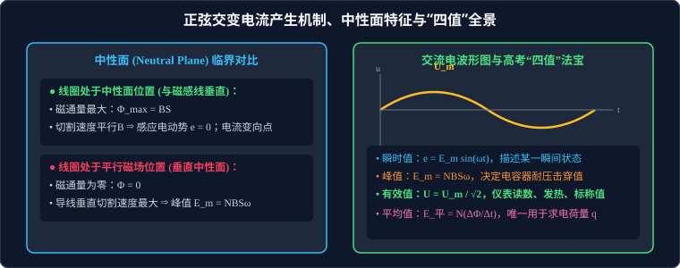

# 01 · 正弦交变电流的产生与描述

## 核心物理概念与内涵

> [!NOTE]
> 本节严格遵循人教版高中物理选择性必修第二册体系，结合微元积分、能量等效与几何旋转投影，全面梳理正弦交流电的生成规律、参数表征与电路元器件响应。

### 1. 交变电流（Alternating Current, AC）的概念

* **定义**：大小和方向随时间做**周期性变化**的电流统称为交变电流。
* **正弦交变电流**：若电流、电压随时间按正弦（或余弦）三角函数规律周期性变化，则称为正弦式交变电流。现代工业电网输送的均为正弦交流电（我国民用电标准：频率 $50\,\text{Hz}$，有效值电压 $220\,\text{V}$）。

---

## 正弦交流电的产生机制与中性面特征

将一个面积为 $S$、匝数为 $N$ 的矩形闭合线圈置于磁感应强度为 $B$ 的匀强磁场中，使其绕垂直于磁感线的对称轴 $OO'$ 以恒定角速度 $\omega$ 逆时针匀速转动。

### 1. 中性面（Neutral Plane）的两大核心物理临界

当线圈转动到其**平面与磁感线垂直**的位置时，该特殊平面称为**中性面**。

| 物理状态参量 | 线圈处于中性面位置（线圈平面 $\perp \vec{B}$） | 线圈处于垂直中性面位置（线圈平面 $\parallel \vec{B}$） |
| :--- | :--- | :--- |
| **磁通量 $\Phi$** | **达到最大值**：$\Phi_{\text{max}} = B S$ | **为零**：$\Phi = 0$ |
| **磁通量变化率 $\dfrac{\Delta \Phi}{\Delta t}$** | **为零**（线圈边平行滑行，不切割磁感线） | **达到最大值**（线圈两边以线速度 $v$ 垂直切割磁感线） |
| **感应电动势 $e$** | **为零**：$e = 0$ | **达到峰值**：$E_m = N B S \omega$ |
| **电流方向转变点** | **每经过中性面一次，感应电流方向改变一次**（每转动一周经过中性面 2 次，电流方向改变 2 次） | 感应电流达到瞬时最大峰值电流 $I_m$ |

### 2. 瞬时值动力学方程的严格推导

设线圈长为 $L_1$、宽为 $L_2$（面积 $S = L_1 L_2$）。线圈两切割边的线速度为 $v = \omega \cdot \dfrac{L_2}{2}$。
* 若从**线圈位于中性面位置开始计时（$t=0$ 时 $\theta = 0$）**：
  经过时间 $t$，线圈转过角度为 $\theta = \omega t$。
  两边垂直切割磁场的有效速度分量为 $v_{\perp} = v \sin(\omega t)$。
  整根线圈（$N$ 匝，2 条长边共同切割产生同向叠加电动势）产生的感应电动势为：
  $$e(t) = 2 N B L_1 v_{\perp} = 2 N B L_1 \left( \omega \frac{L_2}{2} \right) \sin(\omega t) = N B (L_1 L_2) \omega \sin(\omega t)$$
  即：
  $$e(t) = E_m \sin(\omega t)$$
  式中峰值（最大值）电动势为：
  $$E_m = N B S \omega$$
* 若从**线圈平行于磁场位置（垂直中性面）开始计时**：
  $$e(t) = E_m \cos(\omega t)$$

> [!TIP]
> **普适推论**：
> 峰值公式 $E_m = NBS\omega$ 与线圈的几何形状（矩形、圆形、三角形或任意不规则闭合线圈）毫无关系，与转轴位于线圈的中央还是某一边缘也毫无关系！只要线圈总面积为 $S$ 且绕垂直于磁场的轴匀速旋转，峰值恒为 $NBS\omega$。

---

## 描述交流电的核心物理量：高考“四值”解题法宝

高考中处理交流电计算，必须严格区分四种不同取值的物理内涵与适用规则：

### 1. 瞬时值（Instantaneous Value）：$e(t), u(t), i(t)$
* **含义**：交变电流在某一特定瞬间的具体数值。
* **表达**：$e = E_m \sin(\omega t)$，$u = U_m \sin(\omega t)$，$i = I_m \sin(\omega t)$。
* **应用**：用于求解**某一特定时刻或特定转角位置**线圈所受的安培力力矩、线圈的动力学加速度。

### 2. 峰值 / 最大值（Peak Value）：$E_m, U_m, I_m$
* **含义**：交变电流在一个周期内所能达到的最大瞬时幅度：$E_m = NBS\omega$。
* **唯一关键应用场景（耐压击穿极限）**：
  * 电容器接入交流电路时，**电容器的标称耐压值（击穿电压）必须严格大于交流电的峰值 $U_m$**！
  * 若将耐压值为 $250\,\text{V}$ 的电容接在有效值为 $220\,\text{V}$ 的交流市电上，由于市电峰值 $U_m = 220\sqrt{2} \approx 311\,\text{V} > 250\,\text{V}$，电容器将在瞬间被击穿爆炸！

### 3. 有效值（Effective Value / RMS，高考绝对核心）
* **物理定义（等效热效应法）**：
  让交变电流 $i(t)$ 和恒定直流电 $I$ 分别通过相同阻值的电阻 $R$，若它们在**一个完整周期 $T$ 内产生的热量完全相等**，则该直流电的数值就定义为该交变电流的有效值。
  $$I^2 R T = \int_0^T i^2(t) R dt \implies I = \sqrt{\frac{1}{T}\int_0^T i^2(t) dt}$$
* **正弦交流电有效值换算定理**：
  对于严格的正弦或余弦交流电，积分计算可精确导出：
  $$E = \frac{E_m}{\sqrt{2}} \approx 0.707 E_m, \quad U = \frac{U_m}{\sqrt{2}}, \quad I = \frac{I_m}{\sqrt{2}}$$
* **有效值的四大法定应用场景**：
  1. **所有交流电表的测量读数**（交流电压表、交流电流表指针指示的均是有效值）；
  2. **电气设备的铭牌标称参数**（如“$220\,\text{V}, 100\,\text{W}$”中的电压为有效值）；
  3. **计算电功、电热与电功率**：$W = UIt$、$P = UI$、$Q = I^2Rt$（式中量必须全部代入有效值）；
  4. **保险丝的熔断电流**（保险丝熔断取决于电流热积累，属于有效值范畴）。

### 4. 平均值（Average Value）：$\bar{E}, \bar{U}, \bar{I}$
* **含义**：法拉第电磁感应定律求出的某段时间段内的平均电动势：
  $$\bar{E} = N \frac{|\Delta \Phi|}{\Delta t}$$
* **唯一法定应用场景（电荷量计算）**：
  计算在某段时间 $\Delta t$ 内流过导体截面的**感应电荷量 $q$**：
  $$q = \bar{I} \Delta t = \frac{\bar{E}}{R_{\text{总}}} \Delta t = N \frac{\Delta \Phi}{R_{\text{总}}}$$
  > [!WARNING]
  > **绝对禁忌**：求电荷量绝不能用有效值计算 $I \Delta t$！求电热和功率绝不能用平均值计算 $\bar{I}^2 R t$！

---

## 非正弦交变电流的有效值计算范式

高考常考方波、锯齿波或半波整流交流电的有效值求解，必须回归**“等效热效应法”**列方程：

### 经典模型：正负半周不对称方波脉冲
一个交变电流在一个周期 $T$ 内：前 $\dfrac{1}{3}T$ 时间内电流为 $+I_1$，后 $\dfrac{2}{3}T$ 时间内电流为 $-I_2$。求该电流的有效值 $I$。
* **根据热效应定义列方程**：
  $$I^2 R T = I_1^2 R \left(\frac{1}{3}T\right) + I_2^2 R \left(\frac{2}{3}T\right)$$
* **约去 $R$ 和 $T$**：
  $$I^2 = \frac{1}{3}I_1^2 + \frac{2}{3}I_2^2 \implies I = \sqrt{\frac{I_1^2 + 2I_2^2}{3}}$$

---

## 电感与电容对交流电的阻碍作用

| 储能元件 | 物理量与阻抗表征 | 对交流电的作用特性 | 经典工程滤波应用 |
| :--- | :--- | :--- | :--- |
| **电感线圈（$L$）** | **感抗（Inductive Reactance）**：$X_L = 2\pi f L = \omega L$ | **“通直流、阻交流；通低频、阻高频”**（交流电频率 $f$ 越高、自感系数 $L$ 越大，感抗越大） | 高频扼流圈（阻高频通低频）、低频扼流圈（阻交流通直流） |
| **电容器（$C$）** | **容抗（Capacitive Reactance）**：$X_C = \dfrac{1}{2\pi f C} = \dfrac{1}{\omega C}$ | **“通交流、隔直流；通高频、阻低频”**（交流电频率 $f$ 越高、电容 $C$ 越大，容抗越小） | 隔直电容（隔离直流偏置）、高频旁路电容（滤除高频杂波噪声） |

---

## 高频易错盲区与避坑指南

* [×] **误区 1**：认为所有波形的交变电流有效值与最大值都满足 $U = \dfrac{U_m}{\sqrt{2}}$。
  > [√] **正解**：$U = \dfrac{U_m}{\sqrt{2}}$ **仅在正弦或余弦交流电中严格成立**！对于方波，有效值等于峰值 $U = U_m$；对于其他波形，必须根据热效应积分定义自行推导。

* [×] **误区 2**：在计算线圈旋转转过 $90^\circ$ 回路产生的焦耳热时，使用平均电流 $\bar{I}$ 计算 $Q = \bar{I}^2 R t$。
  > [√] **正解**：求热量、功率和电功，必须使用**有效值** $Q = I^2 R t$！只有求迁移电量才使用平均值。
