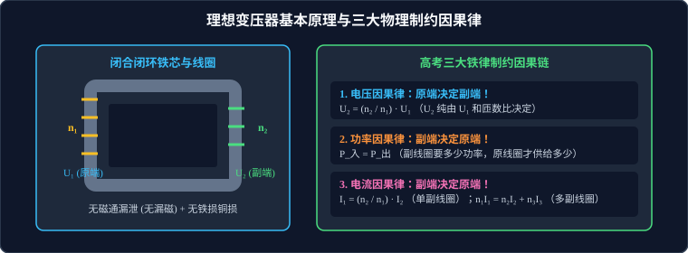

# 02 · 理想变压器

## 核心物理概念与内涵

> [!NOTE]
> 本节严格遵循人教版物理选择性必修第二册体系，建立闭合磁路无损耗传输的理想化物理模型，系统解构变压、变流与阻抗变换的核心机理，明确因果逻辑制约体系。

### 1. 理想变压器的构造与模型假设

变压器是利用**互感原理**改变交流电压和电流的静止电气设备。

* **基本构造**：
  * **闭合铁芯**：由高导磁率的硅钢片叠压而成，提供磁通量的闭合回路；
  * **原线圈（初级线圈，Primary Coil）**：与交流电源连接，匝数为 $n_1$；
  * **副线圈（次级线圈，Secondary Coil）**：与用电负载连接，匝数为 $n_2$。
* **“理想变压器（Ideal Transformer）”的四大物理假设**：
  1. **无磁通漏泄（无漏磁）**：所有的磁感线都被限制在闭合铁芯内部，穿过原线圈和副线圈每匝线圈的磁通量 $\Phi$ 及变化率 $\dfrac{\Delta \Phi}{\Delta t}$ 完全相等；
  2. **无铜损（线圈电阻为零）**：线圈导线电阻为零，电流流过线圈时不产生任何焦耳热损耗；
  3. **无铁损（铁芯无损耗）**：铁芯在交变磁化过程中没有涡流发热损耗，亦无磁滞损耗；
  4. **传输效率 100%（能量守恒）**：原线圈输入的电功率全部传递给副线圈：
     $$P_{\text{入}} = P_{\text{出}}$$

---

## 核心公式推导矩阵

### 1. 变压比（Voltage Ratio）推导

在无漏磁假设下，穿过原、副线圈每一匝的磁通量变化率 $\dfrac{\Delta \Phi}{\Delta t}$ 分秒不差完全相等。
* 原线圈产生的自感电动势：$E_1 = n_1 \left|\dfrac{\Delta \Phi}{\Delta t}\right|$；由于线圈内阻为零，路端电压等于反电动势：
  $$U_1 = E_1 = n_1 \left|\frac{\Delta \Phi}{\Delta t}\right|$$
* 副线圈产生的感应电动势：$E_2 = n_2 \left|\dfrac{\Delta \Phi}{\Delta t}\right|$；副线圈路端输出电压：
  $$U_2 = E_2 = n_2 \left|\frac{\Delta \Phi}{\Delta t}\right|$$
* 两式相比直接导出**电压比公式**：
  $$\frac{U_1}{U_2} = \frac{n_1}{n_2}$$

* **分类与应用**：
  * 若 $n_2 > n_1$：$U_2 > U_1$，为**升压变压器（Step-up Transformer）**；
  * 若 $n_2 < n_1$：$U_2 < U_1$，为**降压变压器（Step-down Transformer）**。

---

### 2. 变流比（Current Ratio）与多副线圈功率守恒

#### A. 只有一个副线圈的单输出电路
根据能量守恒定律，输入功率等于输出功率：
$$P_{\text{入}} = P_{\text{出}} \implies U_1 I_1 = U_2 I_2$$
结合电压比公式 $\dfrac{U_1}{U_2} = \dfrac{n_1}{n_2}$，移项可得：
$$\frac{I_1}{I_2} = \frac{U_2}{U_1} = \frac{n_2}{n_1}$$
> **结论**：只有一个副线圈时，原副线圈的电流与它们的匝数成**反比**！电压升高的同时，电流必然等比例降低。

#### B. 具有多个副线圈的电路（高考极高频失分陷阱）
设理想变压器有一个原线圈（匝数 $n_1$）和两个独立的副线圈（匝数分别为 $n_2$ 和 $n_3$）。
* **电压关系依然独立成立**：
  $$\frac{U_1}{U_2} = \frac{n_1}{n_2}, \quad \frac{U_1}{U_3} = \frac{n_1}{n_3}$$
* **电流关系的严格求解（必须回归能量守恒）**：
  根据功率平衡：
  $$P_1 = P_2 + P_3 \implies U_1 I_1 = U_2 I_2 + U_3 I_3$$
  将 $U_2 = \dfrac{n_2}{n_1} U_1$ 与 $U_3 = \dfrac{n_3}{n_1} U_1$ 代入上式，两边约去 $U_1$ 并同乘 $n_1$：
  $$n_1 I_1 = n_2 I_2 + n_3 I_3$$
  推广至任意 $k$ 个副线圈的**安匝平衡方程**：
  $$n_1 I_1 = \sum_{i=2}^k n_i I_i$$

> [!WARNING]
> **高考严重失分警示**：
> 多个副线圈并存时，**电流绝对不再与匝数成反比**！即 $\dfrac{I_1}{I_2} \neq \dfrac{n_2}{n_1}$！此时必须通过功率守恒方程 $P_{\text{入}} = \sum P_{\text{出}}$ 或安匝方程 $n_1 I_1 = \sum n_i I_i$ 联立求解！

---

## 理想变压器运行中的“三大物理因果制约律”

分析变压器动态变化时，必须理清“谁决定谁”的因果关系，严禁颠倒因果逻辑：

### 1. 电压制约关系：【原端决定副端】
* 输入电压 $U_1$ 由输入端的交流发电机或电网唯一供给（相当于理想恒压源）；
* 副线圈两端输出电压 $U_2 = \dfrac{n_2}{n_1} U_1$ **只由输入电压 $U_1$ 和匝数比决定**；
* 只要 $U_1$ 和匝数不变，无论副线圈接入多大的负载电阻 $R$、甚至负载短路或断路，**$U_2$ 均保持绝对恒定**！

### 2. 功率制约关系：【副端决定原端】
* 副线圈的输出功率 $P_{\text{出}} = \dfrac{U_2^2}{R_{\text{负载}}}$，由负载自身电阻和工作状态决定；
* 原线圈的输入功率是被动跟随的：**副线圈需要消耗多少电功率，原线圈才从电源吸收多少电功率**：
  $$P_{\text{入}} = P_{\text{出}}$$
* 若副线圈空载断开（$R \to \infty$，$P_{\text{出}} = 0$），则理想原线圈吸收的净功率即为零！

### 3. 电流制约关系：【副端决定原端】
* 副线圈输出电流 $I_2 = \dfrac{U_2}{R_{\text{负载}}}$，由副线圈电压和负载电阻决定；
* 原线圈电流是被动决定的：$I_1 = \dfrac{n_2}{n_1} I_2$；
* 负载电阻减小（用电器增多）$\implies I_2$ 增大 $\implies$ 原线圈电流 $I_1$ 同步增大。

---

## 频率特性与直流电响应

1. **频率守恒定律**：
   变压器依靠铁芯中交变磁场互感工作，交变磁通量的振荡频率与原线圈交流电完全相同。因此，**变压器只改变电压与电流幅值，绝对不改变交变电流的频率和周期**：
   $$f_1 = f_2, \quad T_1 = T_2$$
2. **直流电不能变压**：
   若将恒定直流电源接入原线圈，铁芯中产生的是恒定磁场，穿过副线圈的磁通量保持恒定（$\dfrac{\Delta \Phi}{\Delta t} = 0$），因此**副线圈绝对不会产生任何感应电动势（$U_2 = 0$）**！
   > [!CAUTION]
   > 若将变压器原线圈误接到直流电源上，由于原线圈没有反电动势阻碍直流电，线圈阻抗极小（仅有微小直流电阻），会瞬间产生巨大的破坏性短路电流烧毁线圈！

---

## 高频易错盲区与避坑指南

* [×] **误区 1**：认为副线圈负载电阻增大时，副线圈输出电压 $U_2$ 会增大。
  > [√] **正解**：理想变压器副线圈输出电压 $U_2 = \dfrac{n_2}{n_1} U_1$ 与负载阻值无关，恒定不变。变大的是负载电阻，减小的是输出电流 $I_2$ 与输出功率 $P_{\text{出}}$。

* [×] **误区 2**：在含有两个副线圈的题目中，直接根据 $\dfrac{I_1}{I_2} = \dfrac{n_2}{n_1}$ 求解原线圈电流。
  > [√] **正解**：多副线圈中该反比公式彻底失效，必须依据能量守恒 $U_1 I_1 = U_2 I_2 + U_3 I_3$ 求解。
