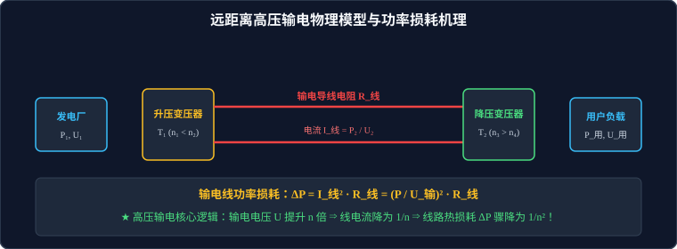

# 03 · 远距离输电

## 核心物理概念与工程困境

> [!NOTE]
> 本节严格遵循人教版物理选择性必修第二册体系，结合工业电网实际拓扑结构，系统推导输电线功率损耗与电压损耗的量化关系，剖析特高压输电的核心物理本质。

### 1. 远距离输电的核心矛盾：线路电阻与发热损耗

在现代电力系统中，发电厂（水力电站、风力光伏基地、核电站）往往建在远离人口密集区和工业中心的偏远地区，电能必须跨越数百乃至上千公里进行长距离输送。

* **输电线电阻**：根据电阻定律，长距离双股输电线的总电阻为：
  $$R_{\text{线}} = \rho \frac{2L}{S}$$
  由于距离 $L$ 达到数百公里，即使采用截面积 $S$ 较大的优质铝绞线，线路总电阻 $R_{\text{线}}$ 依然可达数欧姆至数十欧姆。
* **线路焦耳热损耗**：电流通过输电导线时，产生无法避免的焦耳热损耗：
  $$\Delta P = I_{\text{线}}^2 R_{\text{线}}$$

---

## 高压输电的数学推导与物理铁律

如何有效降低长途输电线路上的电能损耗？



### 1. 降低损耗的两大可能技术路径
1. **减小输电线电阻 $R_{\text{线}}$**：
   * 采用更低电阻率材料（铜比铝贵且重，超导材料目前需要极低温难以长距离规模化铺设）；
   * 增大导线横截面积 $S$（导线过粗会导致自重剧增，引发输电铁塔造价和架设难度呈指数级增加）。
2. **减小输电线电流 $I_{\text{线}}$（终极解决方案）**：
   设发电厂需要输送的有效电功率为 $P$，输电电压为 $U_{\text{输}}$。
   由功率公式 $P = U_{\text{输}} I_{\text{线}}$，导线中的电流为：
   $$I_{\text{线}} = \frac{P}{U_{\text{输}}}$$
   代入焦耳热损耗公式：
   $$\Delta P = I_{\text{线}}^2 R_{\text{线}} = \left( \frac{P}{U_{\text{输}}} \right)^2 R_{\text{线}} = \frac{P^2 R_{\text{线}}}{U_{\text{输}}^2}$$

> [!IMPORTANT]
> **高考必须刻进骨髓的“平方反比铁律”**：
> 在输送电功率 $P$ 和线路电阻 $R_{\text{线}}$ 确定的前提下：
> **输电电压 $U_{\text{输}}$ 提高到原来的 $n$ 倍，输电导线中的电流 $I_{\text{线}}$ 降为原来的 $\dfrac{1}{n}$，而输电线路上的功率损耗 $\Delta P$ 将断崖式骤降为原来的 $\dfrac{1}{n^2}$！**
> 
> * **实例震撼**：将输电电压从 $10\,\text{kV}$ 提升至 $500\,\text{kV}$（提升 50 倍），输电线路上的电能损耗直接**降低为原来的 $\dfrac{1}{2500}$**！

---

## 远距离输电全流程四级拓扑与参数方程矩阵

远距离输电必须经过“发电 $\to$ 升压 $\to$ 高压输电 $\to$ 降压 $\to$ 用户”完整的四级处理架构：

```
 [发电厂] ──► [升压变压器 T₁] ──────高压输电线 (R_线)──────► [降压变压器 T₂] ──► [用户负载]
(P₁, U₁, I₁)  (n₁ : n₂)                                    (n₃ : n₄)       (P₄, U₄, I₄)
```

### 1. 各级物理参量严密方程矩阵

#### A. 升压变压器 $T_1$ 关系式（原端决定副端电压，副端决定原端功率）
* 电压比：$\dfrac{U_1}{U_2} = \dfrac{n_1}{n_2}$（$n_2 > n_1$，$U_2$ 为高压输电端电压）
* 电流比：$\dfrac{I_1}{I_2} = \dfrac{n_2}{n_1}$（$I_2 = I_{\text{线}}$ 为输电线电流）
* 功率守恒：$P_1 = P_2 = U_1 I_1 = U_2 I_2$

#### B. 输电线路参数平衡式（高考核心计算区）
* **线路电流**：$I_{\text{线}} = I_2 = I_3 = \dfrac{P_2}{U_2}$
* **线路电压损失（电压降）**：
  $$\Delta U = U_2 - U_3 = I_{\text{线}} R_{\text{线}}$$
* **线路功率损耗**：
  $$\Delta P = P_2 - P_3 = I_{\text{线}}^2 R_{\text{线}} = \Delta U \cdot I_{\text{线}} = \frac{\Delta U^2}{R_{\text{线}}}$$

#### C. 降压变压器 $T_2$ 关系式
* 输入电压：$U_3 = U_2 - \Delta U = U_2 - I_{\text{线}} R_{\text{线}}$
* 输入功率：$P_3 = P_2 - \Delta P = U_3 I_3$
* 电压比：$\dfrac{U_3}{U_4} = \dfrac{n_3}{n_4}$（$n_3 > n_4$，$U_4$ 为用户端额定电压，如 $220\,\text{V}$）
* 电流比：$\dfrac{I_3}{I_4} = \dfrac{n_4}{n_3}$（$I_4$ 为用户总用电电流）
* 功率守恒：$P_3 = P_4 = U_3 I_3 = U_4 I_4$

#### D. 全流程总功率守恒式
$$P_1 = P_2 = \Delta P + P_3 = \Delta P + P_4$$
* **输电效率（Transmission Efficiency）**：
  $$\eta = \frac{P_4}{P_1} \times 100\% = \frac{P_2 - \Delta P}{P_2} \times 100\% = \left(1 - \frac{\Delta P}{P_2}\right) \times 100\% = \left(1 - \frac{I_{\text{线}} R_{\text{线}}}{U_2}\right) \times 100\%$$

---

## 动态负载连锁反应分析（用户用电高峰模型）

当用户端用电器增多（如夏季傍晚空调大量开启）时，整个输电网络将产生如下严密的连锁反应链：

```
[用户端] 并联用电器增多 ⇒ 用户总等效负载电阻 R_用 减小
   │
   ▼
[用户端] 用户总用电功率 P_用 增大，用户总电流 I_4 增大
   │
   ▼
[降压端] 降压变压器输出功率 P_4 增大 ⇒ 降压变压器输入功率 P_3 增大
   │
   ▼
[输电线] 输电线电流 I_线 增大 (I_线 = I_3 = I_4 · n₄/n₃)
   │
   ▼
[输电线] 线路电压损失增大：ΔU = I_线 · R_线 ↑
   │     线路电热损耗剧增：ΔP = I_线² · R_线 ↑
   ▼
[降压端] 降压变压器原端电压降低：U_3 = U_2 - ΔU ↓
   │
   ▼
[用户端] 用户端实际电压降低：U_4 = (n₄ / n₃) · U_3 ↓
```

> [!TIP]
> **生活物理现象解释**：
> 这正是为什么在夏季居民区用电高峰期，家中的日光灯往往会变暗、空调可能因欠压而无法正常启动的根本物理原因！
> **电网应对措施**：在降压变压器上安装**有载调压分接开关**，动态增加降压变压器副线圈匝数 $n_4$（或减小 $n_3$），将用户电压补偿抬升回标准的 $220\,\text{V}$。

---

## 高频易错盲区与避坑指南

* [×] **误区 1（高考第一大死因）**：计算输电线功率损失时，直接套用 $\Delta P = \dfrac{U_2^2}{R_{\text{线}}}$ 或 $\Delta P = \dfrac{U_3^2}{R_{\text{线}}}$。
  > [√] **正解**：$U_2$ 是输电线**对地（或两导线之间）的超高工作电压**（几万至数十万伏），根本不是降落在导线本身的电压！只有导线两端由于导线电阻引起的**微小电压降 $\Delta U = U_2 - U_3 = I_{\text{线}} R_{\text{线}}$** 才能用于计算发热。正确的损耗公式**必须严格使用 $\Delta P = I_{\text{线}}^2 R_{\text{线}}$ 或 $\Delta P = \dfrac{\Delta U^2}{R_{\text{线}}}$**！

* [×] **误区 2**：在计算用户端获得的功率时，误认为 $P_4 = \dfrac{U_2^2}{R_{\text{用}}}$。
  > [√] **正解**：送达降压变压器的功率已被线路损耗削减：$P_3 = P_2 - \Delta P$，到达用户端的有效功率为 $P_4 = P_3 = U_4 I_4$。
