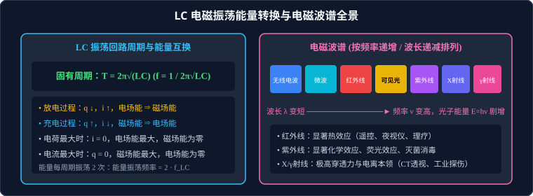

# 04 · 电磁振荡、电磁波与传感器

## 核心物理概念与内涵

> [!NOTE]
> 本节严格遵循人教版物理选择性必修第二册体系，结合麦克斯韦统一场论与近代近代信息传感技术，系统梳理电磁波的理论预言、实验证实、全谱应用与现代信息感知基础。

### 1. 麦克斯韦电磁场理论的两大核心支柱

19 世纪中叶，英国物理学家麦克斯韦（James Clerk Maxwell）在总结库仑定律、安培定律和法拉第电磁感应定律的基础上，建立了经典的麦克斯韦方程组，统一了电、磁、光现象。其理论的两大核心假说为：

1. **第一支柱：变化的磁场产生电场（感生涡旋电场）**
   * 法拉第发现磁通量变化在线圈中激发出感应电动势。麦克斯韦进一步断言：**无论空间中是否存在导体，只要磁场随时间发生变化，就会在周围空间激发出一种闭合环状的电场（感生电场或涡旋电场）**。
   * 若磁场均匀变化（$\dfrac{\Delta B}{\Delta t} = \text{常数}$），则激发的电场是**恒定稳定**的；
   * 若磁场周期性非均匀振荡（如按正弦规律振荡），则激发的电场也是**同频率周期性振荡**的。
2. **第二支柱：变化的电场产生磁场（位移电流假说）**
   * 麦克斯韦从对称性与电荷守恒出发提出大胆预言：**随时间变化的电场同样会在周围空间激发出闭合的磁场**！
   * 若电场均匀变化，激发出恒定的磁场；
   * 若电场周期性振荡，激发出同频率周期性振荡的磁场。
3. **电磁波的形成与本质（Electromagnetic Waves）**：
   * 变化的电场激发变化的磁场，变化的磁场又在稍远的空间激发出新的变化的电场……
   * 这种相互激发的交变电磁场，由近及远在空间以有限速度向外传播，就形成了**电磁波**！
4. **赫兹实验的伟大证实（1887年）**：
   * 德国物理学家赫兹（Heinrich Hertz）利用火花放电振荡器，首次在实验中成功发射并接收到了电磁波，测出其波速精确等于光速，无可辩驳地证实了光就是一种电磁波！

---

## LC 电磁振荡回路与能量周期转换

LC 振荡回路是由电感线圈 $L$ 和电容器 $C$ 组成的最基础的电磁振荡系统。

### 1. 振荡周期与固有频率（汤姆孙公式）

LC 振荡回路的固有振荡周期 $T$ 与固有频率 $f$ 仅由回路本身的电感 $L$ 和电容 $C$ 决定：
$$T = 2\pi \sqrt{L C}$$
$$f = \frac{1}{T} = \frac{1}{2\pi \sqrt{L C}}$$

* **增大周期的途径**：增大自感系数 $L$（如在线圈中插入铁芯、增加线圈匝数）或增大电容 $C$（如减小电容极板间距、插入电介质）。

---

### 2. 电磁振荡的微观能量互换演化链

在无电阻的理想 LC 回路中，总电磁能量保持守恒：
$$E_{\text{总}} = E_{\text{电}} + E_{\text{磁}} = \frac{q^2}{2C} + \frac{1}{2} L i^2 = \text{常数}$$

| 时间区间 / 关键时刻 | 充放电状态 | 极板电荷量 $q$ 与两极板电压 $u$ | 回路瞬时电流 $i$ | 电场能 $E_E$ 与磁场能 $E_B$ 转化状态 |
| :--- | :--- | :--- | :--- | :--- |
| **$t = 0$ 初始态** | 充电完毕 | **最大值**：$q = Q_m$，$u = U_m$ | **为零**：$i = 0$ | 电场能达到最大值，磁场能为零 |
| **$0 \to \dfrac{1}{4}T$** | **电容器放电** | $q \downarrow$，$u \downarrow$（电场减弱） | $i \uparrow$（感抗阻碍电流缓慢增大） | **电场能转化为磁场能** |
| **$t = \dfrac{1}{4}T$** | 放电完毕瞬间 | **为零**：$q = 0$，$u = 0$ | **达到正向峰值**：$i = I_m$ | 磁场能达到最大值，电场能为零 |
| **$\dfrac{1}{4}T \to \dfrac{1}{2}T$** | **反向充电** | 反向反极性 $q \uparrow$，$u \uparrow$ | $i \downarrow$（自感电动势维持原电流） | **磁场能转化为电场能** |
| **$t = \dfrac{1}{2}T$** | 反向充饱瞬间 | **达到反向最大值**：$q = -Q_m$ | **为零**：$i = 0$ | 反向电场能达到最大值，磁场能为零 |
| **$\dfrac{1}{2}T \to \dfrac{3}{4}T$** | **反向放电** | 反向电量 $q \downarrow$ | 反向电流 $i \uparrow$ | 电场能再次转化为磁场能 |
| **$t = \dfrac{3}{4}T$** | 反向放电完毕 | **为零**：$q = 0$ | **反向电流达到峰值**：$i = -I_m$ | 磁场能达到最大值 |
| **$\dfrac{3}{4}T \to T$** | **正向充电** | 正向电量 $q \uparrow$ 恢复初始 | 电流 $i \downarrow$ 衰减至零 | 恢复到 $t = 0$ 初始电场储能状态 |

> [!TIP]
> **可汗学院直观思考：频率“双倍效应”**
> 注意到在一个完整的电流振荡周期 $T$ 内，电场能经历了**两次达到最大、两次变为零**；磁场能同样经历了**两次达到最大、两次变为零**！
> 因此，**LC 振荡回路中电场能与磁场能的能量振荡频率是电流与电荷振荡频率的 2 倍**：
> $$f_{\text{能量}} = 2 \cdot f_{\text{LC}}$$

---

## 电磁波的发射、传播与接收

### 1. 有效向外辐射电磁波的两大必要物理条件
普通的闭合 LC 回路电磁场几乎全部禁锢在电容极板间和线圈内部，无法有效向外部空间辐射能量。要发射电磁波，必须满足：
1. **足够高的振荡频率**：电磁波的辐射功率与振荡频率的四次方成正比（$P \propto f^4$），低频交变电流几乎不产生任何辐射；
2. **开放电路（Open Circuit）**：将电容器的两极板拉开、把线圈拉长拉直，使得电力线和磁感线充分伸展、暴露并扩散到整个外部空间。

### 2. 调制、调谐与解调

* **调制（Modulation）**：将低频声音、图像信号“装载”到高频电磁波（载波）上的过程。
  * **调幅（AM，Amplitude Modulation）**：高频载波的**振幅**随音频信号变化；
  * **调频（FM，Frequency Modulation）**：高频载波的**频率**随音频信号变化（音质保真度高，抗干扰能力强）。
* **调谐（Tuning / 电谐振）**：接收端调节可变电容 $C$ 或线圈 $L$，使接收回路的固有频率等于外界某一电台发射波的频率（$f_{\text{回}} = f_{\text{台}}$），回路产生最大的共振感应电流。
* **解调（Demodulation / 检波）**：从高频调制波中将原来携带的低频音频或视频信号重新分离提取出来的逆向过程。

### 3. 电磁波的本质物理特征
* **横波性（Transverse Wave）**：电场强度矢量 $\vec{E}$、磁感应强度矢量 $\vec{B}$ 与波的传播速度方向 $\vec{v}$ 三者两两垂直，且满足右手螺旋关系 $\vec{v} \parallel \vec{E} \times \vec{B}$。因此，电磁波能够产生明显的**偏振（Polarization）**现象。
* **无需介质**：电磁波可在真空中自由传播，真空中的波速恒等于光速：
  $$c \approx 3.0 \times 10^8\,\text{m/s}$$
* **波动基本方程**：
  $$c = \lambda \cdot f = \frac{\lambda}{T}$$

---

## 电磁波谱（Electromagnetic Spectrum）全景梳理

按波长由长到短（频率由低到高，光子能量 $E=hf$ 由小到大）系统排列：

| 波段名称 | 波长范围 | 产生机理 | 核心物理效应与典型应用 |
| :--- | :--- | :--- | :--- |
| **无线电波（长波、短波、微波）** | $> 1\,\text{mm}$ | 导体中交变高频振荡电流 | 远距离无线电广播、雷达探测定位、5G移动通信、微波炉加热 |
| **红外线（Infrared）** | $760\,\text{nm} \sim 1\,\text{mm}$ | 分子和原子的热振动激发 | **最显著特征：显著的热效应**。红外遥控器、红外夜视仪、医用热释电红外体温计、理疗烤灯 |
| **可见光（Visible Light）** | $380\,\text{nm} \sim 760\,\text{nm}$（红橙黄绿青蓝紫） | 原子外层电子跃迁 | 人眼视觉感光、植物光合作用 |
| **紫外线（Ultraviolet）** | $10\,\text{nm} \sim 380\,\text{nm}$ | 原子外层电子受激发跃迁 | **显著特征：化学效应与荧光效应**。荧光防伪验钞、杀菌消毒灭菌、促进人体合成维生素D |
| **X射线（伦琴射线）** | $0.01\,\text{nm} \sim 10\,\text{nm}$ | 高能电子轰击重金属阳极（内层电子跃迁） | **显著特征：极强的空间穿透本领**。医用 X 光机透视拍片、工业无损探伤、机场安检行李扫描 |
| **$\gamma$ 射线（Gamma Ray）** | $< 0.01\,\text{nm}$ | 放射性原子核能级跃迁 | **极高能量与极强电离贯穿本领**。医学立体定向放疗（$\gamma$ 刀肿瘤切除）、工业辐射保鲜育种 |

---

## 常见传感器（Sensors）核心工作原理

传感器是信息时代将“非电学量”（温度、光强、压力、磁场等）转换为“电学量”（电压、电流、电阻）的换能装置。

1. **光敏电阻（Photoresistor）**：
   * 原理：由硫化镉等半导体材料制成。光照时，价带电子受光子激发跃迁至导带，载流子浓度急剧飙升；
   * **核心物理特性**：**光照越强，电阻越小**；无光照时呈现超大暗电阻。
2. **热敏电阻（Thermistor）**：
   * 负温度系数热敏电阻（NTC）：半导体材料随温度升高激发出海量自由载流子；
   * **核心物理特性**：**温度越高，电阻越小**；灵敏度远超普通金属电阻。
3. **霍尔元件（Hall Element）**：
   * 原理：电流 $I$ 垂直穿过处于匀强磁场 $B$ 中的薄半导体片，载流子受洛伦兹力偏转在两侧积累电荷；
   * 产生的霍尔电压：
     $$U_H = k \frac{I B}{d}$$
   * 应用：磁强计、无刷电机转速检测、汽车电子防抱死系统（ABS）。

---

## 高频易错盲区与避坑指南

* [×] **误区 1**：认为只要有变化的电场或磁场，就一定能产生电磁波。
  > [√] **正解**：若电场或磁场是**均匀变化**的（如 $E = kt$），激发的磁场是**恒定恒稳**的，恒定的磁场周围不会再产生电场，电磁场就此终止，**无法向外辐射传播形成电磁波**！产生电磁波必须要求**周期性变化的电磁场**。

* [×] **误区 2**：在 LC 振荡回路中，电容器放电完毕瞬间，回路能量为零。
  > [√] **正解**：放电完毕瞬间虽然极板电量 $q=0$、电场能为零，但此时**回路电流达到最大值** $I_m$，线圈内部的**磁场能达到最大值**！总能量始终守恒。
