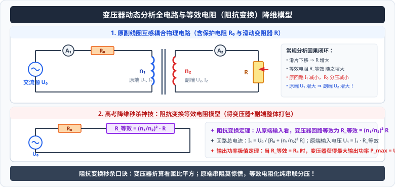

# 考点 · 变压器动态分析与等效电阻模型

## 考点模型深度解析

> [!IMPORTANT]
> 理想变压器的动态分析与功率极值计算，是历年高考物理卷中考查频率极高的必考题型。
> 常规变压器问题通过因果链即可解决，但当**原线圈回路串联有定值保护电阻或内阻**时，原线圈两端电压不再恒定，常规分析方法极易陷入死循环。此时引入大学电路分析中的**“等效电阻阻抗变换法”**，可将复杂的电磁感应耦合电路瞬间降维为初中欧姆定律串联分压模型！

---

## 常规动态电路分析的标准化因果程序

当原线圈两端直接接在恒定理想交流电源上（$U_1$ 恒定不变）时，遵循以下两类因果推演：

### 题型 1：匝数比不变，负载电阻 $R$ 发生改变

```
[原端电压] U₁ 恒定，匝数比 n₁:n₂ 不变
   │
   ▼
[副端电压] U₂ = (n₂ / n₁) · U₁  (绝对恒定不变！)
   │
   ▼
[负载电阻] R 增大 (用电器减少)
   │
   ▼
[副端电流] I₂ = U₂ / R 减小
   │
   ▼
[输出功率] P_出 = U₂ · I₂ 减小
   │
   ▼
[原端功率] P_入 = P_出 减小
   │
   ▼
[原端电流] I₁ = (n₂ / n₁) · I₂ 减小
```

### 题型 2：负载电阻 $R$ 不变，匝数比发生改变

1. **若副线圈滑片移动，副线圈匝数 $n_2$ 增大**：
   $$n_2 \uparrow \implies U_2 = \frac{n_2}{n_1} U_1 \uparrow \implies I_2 = \frac{U_2}{R} \uparrow \implies P_{\text{出}} = \frac{U_2^2}{R} \uparrow \implies P_{\text{入}} \uparrow \implies I_1 \uparrow$$
2. **若原线圈滑片移动，原线圈匝数 $n_1$ 增大**：
   $$n_1 \uparrow \implies U_2 = \frac{n_2}{n_1} U_1 \downarrow \implies I_2 \downarrow \implies P_{\text{出}} \downarrow \implies P_{\text{入}} \downarrow \implies I_1 \downarrow$$

---

## 高考降维大杀器：等效电阻模型（阻抗变换法）

### 1. 严格数学公式推导

设理想变压器原线圈匝数为 $n_1$，副线圈匝数为 $n_2$，副线圈所接外负载电阻为 $R$。

<div style="text-align: center; margin: 20px 0;">
  
</div>

* 副线圈回路满足欧姆定律：
  $$U_2 = I_2 R$$
* 代入理想变压器基本关系：
  $$U_2 = \frac{n_2}{n_1} U_1, \quad I_2 = \frac{n_1}{n_2} I_1$$
* 联立上式代入：
  $$\frac{n_2}{n_1} U_1 = \left(\frac{n_1}{n_2} I_1\right) R$$
* 移项整理求得原线圈输入电压与输入电流的比值：
  $$\frac{U_1}{I_1} = \left(\frac{n_1}{n_2}\right)^2 R$$

> [!IMPORTANT]
> **变压器等效电阻定理（Impedance Transformation Theorem）**：
> 从原线圈输入端看进去，**整个理想变压器以及副线圈所接的负载电阻 $R$，在电学功能上完全等效于一个纯定值电阻 $R_{\text{等效}}$**！
> $$R_{\text{等效}} = \left(\frac{n_1}{n_2}\right)^2 R$$
> * **变压器的阻抗变换功能**：变压器不仅能改变电压与电流，还能将副线圈的电阻“折算”放大到原线圈，放大倍数为**匝数比的二次方**！

---

## 原线圈串联定值电阻难题的秒杀应用

**【经典高考题型】**
交流发电机输出恒定电压 $U_0$，通过原线圈串联电阻 $R_0$ 后接入理想变压器原线圈（匝数 $n_1$），副线圈（匝数 $n_2$）接有可变滑动变阻器 $R$。求回路中的各参量及功率极值。

```
       ──[ 交流源 U₀ ]───[ 定值电阻 R₀ ]───[ 原线圈 n₁ ]──
                                              ║
                                           [ 副线圈 n₂ ]───[ 负载 R ]───
```

### 1. 电路降维秒杀转化
利用等效电阻模型，将变压器及副线圈整体打包替换为一个等效电阻 $R_{\text{等效}} = \left(\dfrac{n_1}{n_2}\right)^2 R$。
整个原线圈回路直接退化为一个**纯初中串联分压电路**：

```
       ──[ 交流源 U₀ ]───[ 定值电阻 R₀ ]───[ 等效电阻 R_等效 ]───
```

* **原线圈电流 $I_1$**：
  $$I_1 = \frac{U_0}{R_0 + R_{\text{等效}}} = \frac{U_0}{R_0 + \left(\frac{n_1}{n_2}\right)^2 R}$$
* **原线圈实际输入电压 $U_1$**：
  $$U_1 = U_0 - I_1 R_0 = \frac{R_{\text{等效}}}{R_0 + R_{\text{等效}}} U_0$$
* **副线圈输出电压 $U_2$**：
  $$U_2 = \frac{n_2}{n_1} U_1 = \frac{n_2}{n_1} \left( \frac{\left(\frac{n_1}{n_2}\right)^2 R}{R_0 + \left(\frac{n_1}{n_2}\right)^2 R} \right) U_0$$

### 2. 负载 $R$ 消耗的最大输出功率极值推导
副线圈消耗的输出功率等于等效电阻消耗的电功率：
$$P_{\text{出}} = P_{\text{等效}} = I_1^2 R_{\text{等效}} = \left(\frac{U_0}{R_0 + R_{\text{等效}}}\right)^2 R_{\text{等效}}$$

由恒定电流电源最大输出功率定理（阻抗匹配极值）：
* 当且仅当 **$R_{\text{等效}} = R_0$** 时，$R_{\text{等效}}$（即副线圈负载）获得**最大功率**！
  $$\left(\frac{n_1}{n_2}\right)^2 R = R_0 \implies R = \left(\frac{n_2}{n_1}\right)^2 R_0$$
* **副线圈能获得的最大极限功率**：
  $$P_{\text{出 max}} = \frac{U_0^2}{4 R_0}$$

---

## 电气测量安全仪表：互感器的规范接入

在电力系统中，测量高电压和大电流必须使用互感器，以实现人身仪表与高压线路的电气隔离。

| 仪表类型 | 作用对象与接法 | 匝数特征与变比 | 核心安全操作规范 |
| :--- | :--- | :--- | :--- |
| **电压互感器（PT）** | **并联**接入高压输电线两端，用来测量高压交流电的电压值 | 原线圈匝数极多（$n_1 \gg n_2$），降压为 $100\,\text{V}$ 标准仪表电压；$U_1 = \dfrac{n_1}{n_2} U_2$ | **副线圈与铁芯必须可靠接地**！严禁副线圈短路（否则烧毁仪表） |
| **电流互感器（CT）** | **串联**接入单相高压输电导线中，用来测量超大交流电流 | 原线圈匝数极少（仅 1 匝或几匝，导线粗），副线圈匝数极多（$n_2 \gg n_1$），变小电流为 $5\,\text{A}$ 标准电流 | **副线圈绝对严禁开路（断开）**！若开路，巨大安匝反向去磁消失，铁芯磁通剧增产生数千伏致命高压并导致铁芯严重过热！ |

---

## 高频易错盲区与避坑指南

* [×] **误区 1**：在原线圈串联电阻 $R_0$ 的电路中，认为调节副线圈滑片增大负载 $R$，副线圈输出电压 $U_2$ 会保持不变。
  > [√] **正解**：原线圈串有电阻时，$U_1$ 不再是定值！$R \uparrow \implies R_{\text{等效}} \uparrow \implies I_1 \downarrow \implies U_1 = U_0 - I_1 R_0$ **增大**！因此副线圈两端实际电压 $U_2$ 也会随之增大。

* [×] **误区 2**：在电流互感器工作时，随意拔下交流电流表进行更换维修。
  > [√] **正解**：电流互感器副线圈严禁开路！拔下电流表前必须先将副线圈两端短接，否则会产生致命的数千伏高压电弧，危及人身生命安全。
