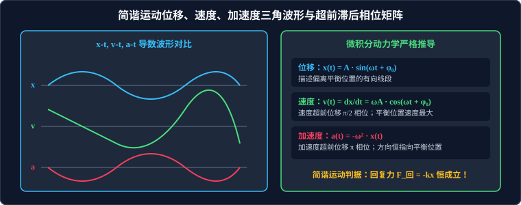

# 01 · 简谐运动与描述

## 核心物理概念与内涵

> [!NOTE]
> 本节严格遵循人教版物理选择性必修第一册体系，引入微积分导数与旋转矢量（Phasor）空间投影视角，全面解析简谐运动的运动学参量、时空演化规律与三角函数物理内涵。

### 1. 机械振动与简谐运动（Simple Harmonic Motion, SHM）

* **机械振动**：物体（或质点）在某一中心位置（平衡位置）附近所做的往复循环运动，简称振动。
* **简谐运动的运动学唯美判据**：
  > **核心定义**：如果质点的位移与时间的关系遵从**正弦（或余弦）函数规律**，即：
  > $$x(t) = A \sin(\omega t + \varphi_0) \quad \text{或} \quad x(t) = A \cos(\omega t + \varphi_0)$$
  > 这样的运动就称为**简谐运动**。

简谐运动是自然界中最基本、最简单、最纯粹的周期性振动，一切复杂的非简谐振动均可由傅里叶分析分解为一系列不同频率正弦简谐运动的叠加。

---

## 描述简谐运动的核心物理量

### 1. 振幅（Amplitude, $A$）
* **定义**：振动物体离开平衡位置的**最大距离**。
* **性质**：标量，**恒取正值（$A > 0$）**，没有正负号；在国际单位制中单位为米（$\text{m}$）。
* **物理内涵**：振幅反映了振动的剧烈程度和振动系统的总机械能量大小（系统总能量正比于振幅的平方：$E \propto A^2$）。
* **极重要高考辨析：振幅与位移、路程的定量关系**：
  * **位移 $x$**：是矢量，以平衡位置为参考原点，有正有负，$-A \le x \le +A$；
  * **路程 $s$ 的严格换算铁律**：
    1. 质点在**一个完整周期 $1T$ 内**通过的路程**恒等于 4 倍振幅**：
       $$s_{1T} = 4A \quad (\text{无论从何处开始计时恒成立})$$
    2. 质点在**半个周期 $\dfrac{1}{2}T$ 内**通过的路程**恒等于 2 倍振幅**：
       $$s_{\frac{1}{2}T} = 2A \quad (\text{无论从何处开始计时恒成立})$$
    3. **陷阱警示**：质点在**四分之一周期 $\dfrac{1}{4}T$ 内**通过的路程**不一定等于 $A$**！
       * 只有当质点恰好从平衡位置（$x=0$）或最大位移处（$x = \pm A$）开始计时，在 $\dfrac{1}{4}T$ 内的路程才严格为 $A$；
       * 若从其他任意位置出发，由于越靠近平衡位置速度越快、越靠近端点速度越慢，路程可能大于 $A$，也可能小于 $A$！

---

### 2. 周期（Period, $T$）与频率（Frequency, $f$）
* **周期 $T$**：做简谐运动的质点完成一次全振动所经历的时间；单位为秒（$\text{s}$）。
* **频率 $f$**：单位时间内完成全振动的次数，描述振动快慢的物理量：
  $$f = \frac{1}{T} \quad (\text{单位：赫兹 } \text{Hz})$$
* **圆频率（角速度）$\omega$**：
  $$\omega = 2\pi f = \frac{2\pi}{T} \quad (\text{单位：}\text{rad/s})$$
* **固有周期与固有频率**：
  由振动系统本身的质量、劲度系数、摆长等物理构造参数唯一决定的周期与频率称为**固有周期 $T_0$** 与**固有频率 $f_0$**。在小振幅范围内，固有周期与振幅 $A$ 的大小完全无关（**简谐运动的等时性**）。

---

### 3. 相位（Phase）与初相（Initial Phase）
在表达式 $x = A \sin(\omega t + \varphi_0)$ 中：
* **相位 $\Phi(t) = \omega t + \varphi_0$**：描述质点在某一具体时刻所处的振动状态（瞬时位置与瞬时速度方向的全部信息）；
* **初相 $\varphi_0$**：$t = 0$ 初始时刻的相位，由初始位移和初始速度方向决定；
* **同相与反相（相位差 $\Delta \varphi = \varphi_2 - \varphi_1$）**：
  * **同相（In Phase）**：$\Delta \varphi = 2k\pi$（$k \in \mathbb{Z}$），两质点振动步调完全一致，同时到达正向最大位移，同时经过平衡位置；
  * **反相（Anti-Phase）**：$\Delta \varphi = (2k+1)\pi$（$k \in \mathbb{Z}$），两质点振动步调完全相反，一个在正向最大位移时，另一个恰处于负向最大位移。

---

## 简谐运动运动学微积分推导与相位超前滞后矩阵

设质点的位移方程为：
$$x(t) = A \sin(\omega t + \varphi_0)$$

### 1. 速度方程（位移对时间的一阶导数）
$$v(t) = \frac{dx}{dt} = \omega A \cos(\omega t + \varphi_0) = \omega A \sin\left(\omega t + \varphi_0 + \frac{\pi}{2}\right)$$
* **速度超前位移 $\dfrac{\pi}{2}$ 相位**（正交四分之一周期）；
* **极值特征**：
  * 当质点经过**平衡位置（$x = 0$）**时，速度达到峰值：$v_{\text{max}} = \omega A$；
  * 当质点到达**最大位移处（$x = \pm A$）**时，瞬时速度为零：$v = 0$。

### 2. 加速度方程（速度对时间的一阶导数 / 位移的二阶导数）
$$a(t) = \frac{dv}{dt} = \frac{d^2x}{dt^2} = -\omega^2 A \sin(\omega t + \varphi_0) = \omega^2 A \sin(\omega t + \varphi_0 + \pi)$$
利用位移定义 $x(t) = A \sin(\omega t + \varphi_0)$ 代入：
$$a(t) = -\omega^2 x(t)$$
* **加速度超前位移 $\pi$ 相位（与位移严格反相）**；
* **核心物理内涵**：
  * **加速度大小与位移大小成正比**；
  * **加速度方向与位移方向始终严格相反**（由负号体现，即加速度恒指向平衡位置）！
  * 当质点在**平衡位置（$x=0$）**时，加速度为零：$a = 0$；
  * 当质点在**最大位移处（$x = \pm A$）**时，加速度达到峰值：$a_{\text{max}} = \omega^2 A$。

---

## 简谐运动振动图像（$x-t$ 图）的信息读取法宝

简谐运动的 $x-t$ 图像是描述**单一质点的位移随时间历程演变的正弦波形曲线**：

1. **直接读取振幅 $A$ 与周期 $T$**：波峰对应的纵坐标即为振幅 $A$，相邻两个波峰或相邻两个波谷之间的横坐标跨度即为一个完整周期 $T$；
2. **切线斜率即为瞬时速度**：由 $v = \dfrac{dx}{dt}$ 知，图线上任意一点的**切线斜率 $k$ 即为该时刻质点的瞬时速度**：
   * 斜率为正 $\implies$ 质点沿正方向运动；
   * 斜率为负 $\implies$ 质点沿负方向运动；
   * 割线斜率或切线水平（波峰/波谷处）$\implies$ 速度为零；
   * 穿过时间轴（平衡位置）时切线最陡 $\implies$ 速度达到最大值；
3. **根据位移正负判定加速度与合外力**：
   * 只要图线在时间轴上方（$x > 0$），加速度必然沿负方向（$a < 0$）；
   * 只要图线在时间轴下方（$x < 0$），加速度必然沿正方向（$a > 0$）。

---

## 高频易错盲区与避坑指南

* [×] **误区 1**：认为质点在任意 $\dfrac{1}{4}T$ 的时间内，走过的路程一定等于一个振幅 $A$。
  > [√] **正解**：只有从平衡位置或最大位移处出发的 $\dfrac{1}{4}T$，路程才等于 $A$！若从 $x = \dfrac{1}{2}A$ 出发向波峰运动，经过 $\dfrac{1}{4}T$ 的路程仅为 $(\sqrt{3}-1)A \approx 0.732A \neq A$。

* [×] **误区 2**：在描述简谐运动质点运动方向时，认为“加速度增大的方向就是运动方向”。
  > [√] **正解**：运动方向取决于**速度的方向**，与加速度方向无关！质点远离平衡位置时速度与加速度反向（做减速运动，但加速度大小增大）；质点靠近平衡位置时速度与加速度同向（做加速运动，加速度大小减小）。
