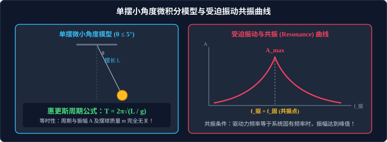

# 03 · 单摆与共振

## 核心物理概念与内涵

> [!NOTE]
> 本节严格遵循人教版物理选择性必修第一册体系，运用微小量泰勒级数近似推导惠更斯单摆周期公式，建立等效场模型，系统解析受迫振动频率选择机制与共振破坏/利用物理本质。

### 1. 单摆（Simple Pendulum）的理想化物理模型

单摆是研究重力场中重力势能与动能往复转换的理想化物理模型。

* **理想单摆的三大构成要素**：
  1. **不可伸长的轻细线**：悬线质量忽略不计，且在运动过程中不发生弹性伸长；
  2. **高密度小球（质点）**：摆球质量较大，体积极小，球的半径 $r$ 远小于摆线长度 $l$（$r \ll l$）；
  3. **阻力忽略不计**：摆动过程中空气粘滞阻力和摩擦力可忽略。
* **摆长 $L$ 的严格测量规范**：
  摆长是指**从悬挂点到摆球球心的几何直线距离**！
  $$L = l_{\text{线}} + \frac{1}{2} d_{\text{球}} = l_{\text{线}} + r_{\text{球}}$$
  （实验中若直接测量悬线长度作为摆长，将导致系统性负误差！）。

---

## 单摆做简谐运动的小角度严格推导

设摆线长为 $L$，小球质量为 $m$。将摆球拉开微小角度 $\theta$ 后自由释放。

### 1. 受力分解与回复力的产生
摆球在运动过程中受到重力 $G = mg$ 和悬绳拉力 $F_T$ 两个力。沿切向和法向建立自然坐标系：
* **法向分量（指向悬挂点）**：
  拉力与重力法向分量的合力充当向心力：
  $$F_T - mg \cos\theta = m \frac{v^2}{L}$$
  （此力只改变速度方向，不改变速率，不提供回复力）。
* **切向分量（沿运动轨迹切线）**：
  切向合力完全由重力沿切线的重力分力提供，方向指向最低平衡位置 $O$：
  $$F_t = -mg \sin\theta$$
  （负号表示与角位移方向相反）。故切向合力充当了单摆的**回复力**：
  $$F_{\text{回}} = -mg \sin\theta$$

### 2. 小角度泰勒展开极限近似（$\theta \le 5^\circ$）
根据高等数学正弦函数的麦克劳林级数展开：
$$\sin\theta = \theta - \frac{\theta^3}{3!} + \frac{\theta^5}{5!} - \dots$$
当摆角非常微小时（通常取 **$\theta \le 5^\circ$ 或 $\theta < 10^\circ$**），高阶微小量可以安全忽略，具有高精度的极限近似：
$$\sin\theta \approx \theta \quad (\theta \text{ 采用弧度制 } \text{rad})$$
设摆球偏离平衡位置的弧长位移为 $x$，由几何关系 $\theta = \dfrac{x}{L}$：
$$F_{\text{回}} = -mg \sin\theta \approx -mg \theta = -\left(\frac{mg}{L}\right) x$$

> [!IMPORTANT]
> **单摆简谐运动定理**：
> 在**摆角很小（$\theta \le 5^\circ$）**的条件下，单摆所受的回复力与偏离平衡位置的位移 $x$ 严格成正比，且方向始终指向平衡位置：
> $$F_{\text{回}} = -k x \quad \left(k = \frac{mg}{L}\right)$$
> **因此，小角度单摆的振动是严格的简谐运动！**

---

## 惠更斯单摆周期公式与秒摆

### 1. 惠更斯公式（Huygens' Formula）推导
将单摆的回复力常数 $k = \dfrac{mg}{L}$ 直接代入弹簧振子通用周期公式 $T = 2\pi\sqrt{\dfrac{m}{k}}$：
$$T = 2\pi \sqrt{\frac{m}{\frac{mg}{L}}} = 2\pi \sqrt{\frac{L}{g}}$$
$$f = \frac{1}{T} = \frac{1}{2\pi} \sqrt{\frac{g}{L}}$$

* **三大物理铁律**：
  1. **等时性（Isochronism）**：单摆周期与摆球的质量 $m$ 毫无关系，与振动幅度（小角度范围内的最大摆角）毫无关系；
  2. **摆长正比性**：周期与摆长的平方根成正比（$T \propto \sqrt{L}$）；
  3. **重力加速度反比性**：周期与当地重力加速度的平方根成反比（$T \propto \dfrac{1}{\sqrt{g}}$），因此单摆是**高精度测量地表重力加速度 $g = \dfrac{4\pi^2 L}{T^2}$ 的经典物理仪器**！

### 2. 秒摆（Seconds Pendulum）
* **定义**：周期严格等于 $2\,\text{s}$ 的单摆（半个周期摆动一次为 $1\,\text{s}$，“滴答”一声代表一秒）。
* **标准秒摆的摆长计算**：
  在海平面标准重力加速度 $g = 9.80\,\text{m/s}^2$ 处：
  $$L = \frac{g T^2}{4\pi^2} = \frac{9.80 \times 2^2}{4 \times \pi^2} \approx 0.993\,\text{m} \approx 1\,\text{m}$$

---

## 等效单摆模型：等效摆长 $L'$ 与等效重力加速度 $g'$

高考常通过物理情境变形考查等效单摆模型：

### 1. 等效重力加速度 $g'$（超重、失重与复合场）
物体在非惯性系或复合场中所受到的“非绳张力其他恒力的合力”为 $F_{\text{合}}$，则等效重力加速度定义为：
$$g' = \frac{F_{\text{合}}}{m}$$
* **超重系统（升降机以加速度 $a$ 竖直加速上升）**：
  $$g' = g + a \implies T = 2\pi \sqrt{\frac{L}{g + a}} \quad (\text{周期减小})$$
* **失重系统（升降机以加速度 $a$ 竖直加速下降）**：
  $$g' = g - a \implies T = 2\pi \sqrt{\frac{L}{g - a}} \quad (\text{周期变大})$$
* **完全失重环境（空间站轨道绕行或自由落体）**：
  $$g' = 0 \implies T \to \infty$$
  摆球不受任何回复力，单摆停止摆动！
* **电场与重力复合场**：
  带电小球在竖直匀强电场中，受电场力 $qE$。若电场力向下：$g' = g + \dfrac{qE}{m}$；若电场力向上：$g' = g - \dfrac{qE}{m}$。

### 2. 双线摆与等效摆长 $L'$
摆球用两根等长细线悬挂在天花板两点，在纸面内摆动与垂直纸面摆动具有不同的等效摆长，必须分别计算两个互相正交平面的独立周期。

---

## 受迫振动与共振（Resonance）

### 1. 受迫振动（Forced Vibration）及其频率规律

系统在外部周期性外力（称为**驱动力**，Driving Force）持续作用下发生的振动称为**受迫振动**。

> [!IMPORTANT]
> **受迫振动的绝对频率规律**：
> 当受迫振动达到稳态后，**系统的振动频率恒等于驱动力的频率 $f_{\text{驱}}$，与系统自身的固有频率 $f_0$ 完全无关！**
> （即使系统的固有频率是 $10\,\text{Hz}$，若驱动力以 $2\,\text{Hz}$ 推动它，它就必须严格以 $2\,\text{Hz}$ 振动）。

### 2. 共振（Resonance）现象与共振条件

虽然受迫振动的频率由驱动力决定，但**振幅 $A$ 的大小却由驱动力频率 $f_{\text{驱}}$ 与系统固有频率 $f_0$ 的接近程度决定**！

* **共振条件**：
  $$f_{\text{驱}} = f_0 \quad (\text{驱动力频率严格等于系统固有频率})$$
* **共振曲线的物理特征**：
  * 当 $f_{\text{驱}} = f_0$ 时，外界驱动力输入的能量与系统的振动节奏完全同步同相，驱动力始终对振子做正功，系统的机械能迅速累积，**振幅达到最大峰值 $A_{\text{max}}$**！
  * $f_{\text{驱}}$ 越偏离 $f_0$，系统的振幅越小；
  * 介质阻尼越小，共振峰越陡峭尖锐；阻尼越大，共振峰越平缓钝化。

### 3. 共振的利用与防范工程
* **共振的利用**：微波炉加热（微波频率 $2.45\,\text{GHz}$ 精准匹配水分子固有振动频率）、乐器共鸣箱、无线电谐振收音机调谐；
* **共振的防范**：军队过桥必须便步走（严禁齐步走，防止整齐脚步步伐频率与桥梁固有频率吻合引发共振垮塌，如 1850 年法国昂热大桥垮塌悲剧）、高速列车轨道与车身减震阻尼设计。

---

## 高频易错盲区与避坑指南

* [×] **误区 1**：认为单摆做受迫振动时，只要驱动力很大，振动频率就会变大。
  > [√] **正解**：受迫振动的频率完全由驱动力的**频率**决定，与驱动力的大小强弱毫无关系。

* [×] **误区 2**：在测量单摆周期时，以摆球到达最大位移处的时刻作为计时起点。
  > [√] **正解**：最大位移处小球速度为零，小球在该处停留时间模糊，人工肉眼判断误差极大！**必须以摆球通过最低平衡位置作为计时起点和终点**，因为平衡位置速度最大，小球瞬间掠过，计时标记最精确敏锐！
