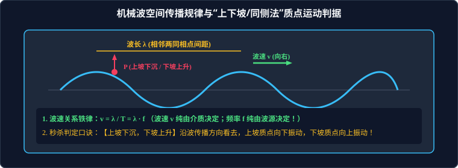

# 04 · 机械波的产生与波的描述

## 核心物理概念与内涵

> [!NOTE]
> 本节严格遵循人教版物理选择性必修第一册体系，引入连续介质力学与空间相位延迟图景，系统解构机械波的生成机理、空间传播几何特征与多维判定法则。

### 1. 机械波的产生条件与四大物理铁律

* **机械波（Mechanical Wave）**：机械振动在介质中的传播过程称为机械波。
* **产生机械波的两大必要条件**：
  1. **波源（Wave Source）**：能够持续做机械振动的物体；
  2. **弹性介质（Elastic Medium）**：由相互联系、存在相互弹性作用力的微观分子/质点构成的物质空间（**机械波绝不能在真空中传播！**）。

```
  [波源 O] ──弹性力带动──► [质点 1] ──弹性力带动──► [质点 2] ──► ... ──► [质点 n]
 (先振动)                (相位滞后)              (相位更滞后)
```

> [!IMPORTANT]
> **高考必须刻进骨髓的“机械波四大铁律”**：
> 1. **质点“随波不逐流”**：介质中的每一个质点**仅仅在各自的平衡位置附近做往复振动，质点本身绝对不随波向前迁移**！
> 2. **波传递的是“能量、动量与振动形式”**：波向前传播的是波源的振动状态和能量信息；
> 3. **前带后、后跟前**：离波源近的“前质点”依次带动离波源远的“后质点”振动，后振动质点的振动步调必然落后于前质点（相位滞后）；
> 4. **源停波不停**：波源一旦停止振动，已经发射出去的波列仍将在介质中按照原波速继续向前传播，直至被介质吸收耗散。

---

## 横波与纵波的本质区别

根据质点的振动方向与波的传播方向的空间几何关系，机械波分为两大类：

| 波动类型 | 振动方向与传播方向关系 | 空间波形特征 | 介质传播条件与实例 |
| :--- | :--- | :--- | :--- |
| **横波（Transverse Wave）** | **相互垂直**：$\vec{v}_{\text{振}} \perp \vec{v}_{\text{波}}$ | 形成**波峰（Crest）**与**波谷（Trough）** | **只能在固体中传播**（因为流体无剪切弹性，无法抵抗剪切形变）。绳波、地震 S 波（次波） |
| **纵波（Longitudinal Wave）** | **在同一直线上**：$\vec{v}_{\text{振}} \parallel \vec{v}_{\text{波}}$ | 形成**密部（Compression）**与**疏部（Rarefaction）** | **能在固体、液体和气体中传播**（一切介质均能承受体积压缩弹性）。声波（空气中）、弹簧纵波、地震 P 波（初波） |

* **地震波的应用**：地震发生时，由于纵波（P 波）波速快（约 $6 \sim 7\,\text{km/s}$），先到达地表，人感觉**上下颠簸**；随后横波（S 波，约 $3 \sim 4\,\text{km/s}$）到达，人感觉**左右剧烈摇晃**（横波破坏力是纵波的数倍）。

---

## 描述机械波的核心物理量与基本方程



### 1. 波长（Wavelength, $\lambda$）
* **定义**：在波的传播方向上，**振动相位始终相同的相邻两个质点之间的空间直线距离**；
* 在横波中，相邻两个波峰或相邻两个波谷之间的水平间距等于一个波长 $\lambda$；在纵波中，相邻两个密部中心或相邻两个疏部中心之间的距离等于一个波长。

### 2. 周期（Period, $T$）与频率（Frequency, $f$）
* **波的周期与频率完全由波源决定**！
* **跨介质频率守恒铁律**：当一列波从一种介质进入另一种介质传播时（如声波从空气传入水中），**波的频率 $f$ 和周期 $T$ 保持绝对恒定不变**！

### 3. 波速（Wave Speed, $v$）
* **定义**：振动状态或波形在介质中向前推进的速度；
* **决定因素（极度关键）**：
  > **波速只由介质自身的物理性质（介质密度、弹性模量）和温度决定，与波的频率 $f$ 及振幅大小毫无关系！**
  > （在同一温度的均匀空气中，无论是低音男中音还是尖锐女高音，声波在空气中的传播速度完全相等，均约为 $340\,\text{m/s}$）。

### 4. 波动基本方程
由于波在一个周期 $T$ 内向前匀速传播的距离恰好为一个波长 $\lambda$：
$$v = \frac{\lambda}{T} = \lambda \cdot f$$

---

## 质点振动方向与波传播方向互推三大秒杀技法

高考中给出波形图，要求判断某一质点的振动方向（或已知质点振动方向反推波的传播方向），必须熟练掌握以下三大技法：

### 技法 1：【上下坡法（沿波看坡，上坡下沉，下坡上升）】—— 高度推荐
* **操作规范**：**顺着波的传播方向（“人往波速方向走”）**审视正弦波形：
  * 凡是处于**“上坡路段”**的质点，该时刻的振动速度方向必然**向下（下沉）**；
  * 凡是处于**“下坡路段”**的质点，该时刻的振动速度方向必然**向上（上升）**！
* **口诀记忆**：**“上坡下，下坡上”**！

### 技法 2：【微平移波形法】
* **操作规范**：
  1. 将当前时刻 $t$ 的波形图，沿着波的传播方向平行向前平移一个微小的位移 $\Delta x$（即画出 $t + \Delta t$ 时刻的虚线波形）；
  2. 观察目标质点在该虚线上对应的新纵坐标：若新位置在原位置上方，则质点当前向上振动；若在下方，则向下振动。

### 技法 3：【同侧法（立杆成环法）】
* **操作规范**：
  在波形图的目标质点处，画一根垂直于平衡位置的线段表示振动方向箭头，在上方画出波速推进箭头：
  * **质点的振动箭头与波的传播箭头必然位于波形曲线的同侧！**

---

## 波动图像（$y-x$ 图像）的物理本质

机械波在某时刻的 $y-x$ 图像，反映了**某一特定瞬间介质中所有质点在空间的空间位置分布快照（全班的集体合影照）**：

1. **直接读取波长 $\lambda$ 与振幅 $A$**：波峰纵坐标为振幅 $A$，相邻两波峰的横坐标跨度为波长 $\lambda$；
2. **质点加速度与受力判据**：
   * 质点处于波峰时，位移正向最大，加速度**竖直向下达到最大**；
   * 质点处于波谷时，位移负向最大，加速度**竖直向上达到最大**；
   * 质点处于平衡位置时，加速度为零，回复力为零。

---

## 高频易错盲区与避坑指南

* [×] **误区 1**：认为水波中漂浮的树叶会随着水波一直向前被冲到岸边。
  > [√] **正解**：质点“随波不逐流”！水面的水波只是波形向前推进，树叶只会在原来的位置附近上下沉浮往复振动，绝不随波向前水平迁移。

* [×] **误区 2**：声波从空气传入水中，波速增大，频率也随之增大。
  > [√] **正解**：频率由声源决定，跨介质**频率 $f$ 绝对守恒不变**！声波在水中波速 $v$ 显著变大（约 $1500\,\text{m/s}$），根据 $\lambda = \dfrac{v}{f}$，导致波长 $\lambda$ 显著变长。
