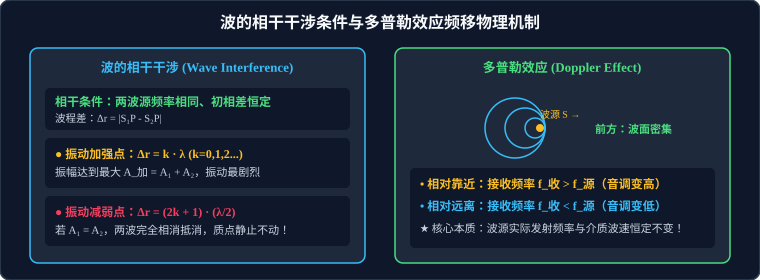

# 05 · 波的干涉、衍射与多普勒效应

## 核心物理概念与内涵

> [!NOTE]
> 本节严格遵循人教版物理选择性必修第一册体系，结合惠更斯-菲涅耳原理与空间波程差微积分推导，全面解析波特有的波动特征——衍射、干涉与多普勒效应的发生条件与定量判据。

### 1. 波的叠加原理与独立传播特性

* **波的独立传播原理**：几列波在同一介质中传播并相遇重叠时，各列波能够保持各自原有的波长、频率、振幅和传播方向不变，继续各自向前独立传播，彼此互不干扰。
* **波的叠加原理（Principle of Superposition）**：
  在几列波相遇重叠的区域内，介质中任一质点的振动位移，**严格等于各个波单独传播在该点所引起的位移的矢量和**：
  $$\vec{y} = \vec{y}_1 + \vec{y}_2$$
  如果两列波在某质点引起的振动方向在同一条直线上，则质点的净位移等于两列波位移的代数和：$y = y_1 + y_2$。

---

## 波的衍射（Wave Diffraction）

波绕过障碍物或孔隙，偏离直线传播路径而继续向前传播的现象称为**波的衍射**。

* **一切波都能发生衍射**：衍射是波的一种固有内禀属性。
* **产生明显衍射现象的充要条件**：
  > **核心判据**：**缝、孔的宽度或障碍物的几何尺寸 $d$ 能够跟波长 $\lambda$ 差不多，或者比波长更小（$d \le \lambda$）！**
* **物理现象深度辨析（“闻其声不见其人”）**：
  * **人说话的声波**：声波频率在 $100 \sim 2000\,\text{Hz}$ 之间，空气中波长为 $\lambda = \dfrac{v}{f} \approx 0.17\,\text{m} \sim 3.4\,\text{m}$，这与普通门窗孔隙的尺寸（约 $1\,\text{m}$）完全相当，因此声波能发生极其强烈的明显衍射绕过墙角传播（**闻其声**）；
  * **可见光光波**：可见光是波长极短的电磁波（$\lambda \approx 400 \sim 700\,\text{nm} \approx 10^{-7}\,\text{m}$），远小于普通宏观障碍物的尺寸（相差数百万倍），因此光的衍射极其微弱，宏观上表现为严格的直线传播，无法绕过墙壁（**不见其人**）。

---

## 波的干涉（Wave Interference）

两列或多列波在介质中相遇叠加，使某些区域的振动始终加强、某些区域的振动始终减弱，并在空间形成具有稳定强弱分布的图样，这种现象称为**波的干涉**。干涉是波所特有的标志性现象。

### 1. 产生稳定干涉图样的“相干条件”
并不是任意两列波相遇都能产生稳定的干涉图样！两列波产生稳定干涉必须满足以下**相干条件（Coherence Condition）**：
1. **两波源的振动频率必须完全相同（$f_1 = f_2$）**；
2. **两波源的振动方向相同**；
3. **两波源具有恒定不变的初相位差（$\Delta \varphi = \text{常数}$）**。

### 2. 加强区与减弱区的空间波程差定量判据

设空间中存在两个振动步调完全相同的同相波源 $S_1$ 和 $S_2$（初相差为零），它们发出的相干波波长均为 $\lambda$。
空间中任意一点 $P$ 到两波源的几何直线距离分别为 $r_1 = |S_1 P|$ 和 $r_2 = |S_2 P|$，定义其**波程差（Path Difference）**为：
$$\Delta r = |r_1 - r_2|$$

#### A. 振动加强点（Constructive Interference）
* **数学判据**：当波程差等于波长的**整数倍**时：
  $$\Delta r = k \cdot \lambda \quad (k = 0, 1, 2, \dots)$$
* **物理表现**：两列波到达该点时振动步调完全同相，波峰与波峰相遇、波谷与波谷相遇。
* **合成振幅达到最大峰值**：
  $$A_{\text{加}} = A_1 + A_2$$

#### B. 振动减弱点（Destructive Interference）
* **数学判据**：当波程差等于半波长的**奇数倍**时：
  $$\Delta r = (2k + 1) \frac{\lambda}{2} \quad (k = 0, 1, 2, \dots)$$
* **物理表现**：两列波到达该点时振动步调恰好反相，波峰与波谷相遇，相互削弱抵消。
* **合成振幅达到最小极小值**：
  $$A_{\text{减}} = |A_1 - A_2|$$
  （特别地，若两列波振幅完全相同 $A_1 = A_2$，则振幅完全抵消为零 $A_{\text{减}} = 0$，该处的介质质点**始终处于静止不动状态**！）。

> [!WARNING]
> **高考极高频认知误区辨析**：
> * 误区：“振动加强点的位移始终处于最大值。”
> * [√] **科学正解**：加强点只是**振幅最大（$A = A_1 + A_2$）**，它依然在以平衡位置为中心做简谐振动！在经过平衡位置的瞬间，其位移同样为零，但此时振动速度达到全空间最大值；
> * 只要该点是加强点，它就**永远是加强点**（振幅始终为 $A_1 + A_2$）；减弱点也**永远是减弱点**，干涉图样在空间是稳定驻立分布的！

---

## 多普勒效应（Doppler Effect）

奥地利物理学家多普勒于 1842 年发现：波源和观察者之间发生相对运动时，观察者接收到的波的频率发生改变的现象称为**多普勒效应**。

### 1. 多普勒效应的物理本质

* **波源发射频率 $f_{\text{源}}$ 绝对不变**（波源自身振动快慢未变）；
* **介质中的波速 $v$ 绝对不变**（介质性质与温度未变）；
* **变化的是单位时间内观察者接收到的完整波的个数**（空间波面被相对运动压缩或拉疏）：
  1. **相对靠近（波源向观察者靠近，或观察者向波源靠近）**：
     * 空间波面被压缩变密，观察者单位时间内迎面接收到的波面数增多；
     * **接收频率大于发射频率**：
       $$f_{\text{收}} > f_{\text{源}} \quad (\text{音调听起来变高，频率升高})$$
  2. **相对远离（波源远离观察者，或观察者远离波源）**：
     * 空间波面被拉开变稀疏，单位时间内接收到的波面数减少；
     * **接收频率小于发射频率**：
       $$f_{\text{收}} < f_{\text{源}} \quad (\text{音调听起来变低，频率降低})$$

### 2. 现代科学与工程应用
1. **交通雷达测速仪**：交警雷达向疾驰车辆发射微波，反射波产生多普勒频移，仪器根据 $\Delta f$ 毫秒级高精度测定车速；
2. **医学彩超（Color Doppler Ultrasound）**：超声波射入人体血管，利用红细胞移动引起的多普勒频移，精确计算血流速度、方向并检测心血管病变；
3. **宇宙学光谱红移（Redshift）与大爆炸理论**：
   * 天文学家哈勃发现绝大多数远方星系发出的可见光光谱均向长波红端移动（红移），根据多普勒效应证实宇宙各星系正在加速远离我们，奠定了**宇宙膨胀论与大爆炸宇宙学**的实验基石！

---

## 高频易错盲区与避坑指南

* [×] **误区 1**：认为发生干涉时，振动减弱点的质点永远没有动能。
  > [√] **正解**：只有在两相干波**振幅完全相等（$A_1 = A_2$）**时，减弱点振幅抵消为零，质点才始终静止无动能；若两列波振幅不等（$A_1 \neq A_2$），减弱点依然具有合振幅 $A = |A_1 - A_2| > 0$，依然在以小振幅微弱振动。

* [×] **误区 2**：汽车驶过鸣笛时，鸣笛人听到的声音音调也会变高变低。
  > [√] **正解**：司机与鸣笛声源相对静止，司机听到的声音频率始终是**声源的原生频率 $f_0$**，音调完全不变。只有路旁相对运动的行人才能听到音调先高后低的变化！
