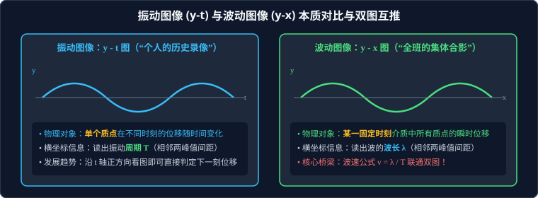

# 考点 · 振动图像与波动图像的综合求解

## 考点模型深度解析

> [!IMPORTANT]
> 振动图像与波动图像的综合考查，是高考物理选择题与中档计算题中区分度极高的常客。
> 许多考生之所以在此处失分，根源在于未能彻底厘清“单个质点的历时运动（时间演化）”与“全体质点的瞬时分布（空间快照）”的本质差异，以及忽视了波的“双向性、时间周期性与空间周期性”引发的多解性。



---

## 振动图像（$y-t$）与波动图像（$y-x$）的本质对比

| 对比维度 | 振动图像（$y - t$ 图像） | 波动图像（$y - x$ 图像） |
| :--- | :--- | :--- |
| **生动形象比喻** | **“某个人的成长录像带”**（追踪单一质点） | **“全班同学在某瞬间的集体合影”**（全体质点） |
| **研究物理对象** | **介质中某一个固定质点**在不同时刻的位移 | **某一特定固定时刻**介质中所有质点的瞬时位移 |
| **横坐标物理量** | **时间 $t$**（单位：$\text{s}$） | **空间坐标 $x$**（单位：$\text{m}$） |
| **波形横向跨度** | 相邻两个极大值之间的间距等于**周期 $T$** | 相邻两个波峰之间的水平间距等于**波长 $\lambda$** |
| **质点速度方向判定** | **看图线切线斜率**：斜率为正向 $+y$ 运动，斜率为负向 $-y$ 运动；或顺着时间轴看下一刻位置 | **上下坡法 / 微平移法**：沿波速方向看，“上坡下沉，下坡上升” |
| **图线随时间演化** | 质点继续振动，**原图线形状保持不动**，只是随时间向前延伸 | 随时间推移，**整个波形曲线沿波速传播方向整体刚体平移**！ |

### 联通双图的“黄金绝对桥梁”
$$v = \frac{\lambda}{T} = \lambda \cdot f \iff \lambda = v \cdot T \iff T = \frac{\lambda}{v}$$
无论试题给出何种综合构型，**波速公式 $v = \dfrac{\lambda}{T}$ 是打破时空壁垒、实现双图数据互通的唯一纽带！**

---

## 双图互推标准化破题步骤

### 题型 1：由波动图像（$y-x$）画出某质点的振动图像（$y-t$）

```
[步骤 1: 读空间] 在 y-x 图上找到该质点的横坐标 x_P，读取该时刻质点的位移 y_P
   │
   ▼
[步骤 2: 判速度] 结合波的传播方向，用“上下坡法”判定该质点当前的振动速度方向 (向上还是向下)
   │
   ▼
[步骤 3: 连桥梁] 从 y-x 图读取波长 λ，结合已知波速 v 计算振动周期 T = λ / v
   │
   ▼
[步骤 4: 绘制图] 在 y-t 坐标系中标出 t=0 时的初始位移 y_P，以此为起点，按照判定的初速度方向
                 画出一个完整周期为 T、振幅为 A 的正弦曲线
```

---

### 题型 2：由某质点的振动图像（$y-t$）推导波的传播与波动图像（$y-x$）

1. **从振动图像读取时间信息**：读出振动周期 $T$ 和振幅 $A$；
2. **分析特定时刻质点状态**：找到题干所问时刻 $t_0$ 时该质点的瞬时位移 $y$ 与振动方向；
3. **空间还原计算波长**：由 $\lambda = v T$ 计算出空间波长；
4. **定位波形走向**：以已知质点在空间的位置和振动方向为基准，利用“同侧法”反向绘制全空间的波动正弦图。

---

## 高考机械波大题“多解性（Multi-solution）”成因与通解范式

机械波计算题之所以能作为压轴考题，核心在于题目往往未给出唯一的限定条件，导致出现双解乃至无穷多解。

### 1. 多解性的三大根本物理成因

1. **传播方向不确定（双向多解性）**：
   题干仅说明波沿 $x$ 轴传播，未说明是沿 $+x$ 方向还是沿 $-x$ 方向，必须分别讨论求解！
2. **时间周期性不确定（时间多解性）**：
   相隔时间 $\Delta t$ 内，质点振动可能已经经历了完整的整数倍周期：
   $$\Delta t = n T + t_0 \quad (n = 0, 1, 2, 3, \dots)$$
3. **空间周期性不确定（空间多解性）**：
   相隔距离 $\Delta x$ 内，波形传播可能已经越过了完整的整数倍波长：
   $$\Delta x = n \lambda + x_0 \quad (n = 0, 1, 2, 3, \dots)$$

---

### 2. 机械波多解题的标准通解范式

**【经典高考设问范式】**
一列简谐横波在 $t_1 = 0$ 时刻的波形如图中实线所示，在 $t_2 = \Delta t$ 时的波形如图中虚线所示。求该波的可能传播速度 $v$。

#### 严密分类解析步骤：

#### 第一种情况：若波向右（沿 $+x$ 方向）传播
波形向右移动的微小最小距离为 $\Delta x_1$（实线波峰到右侧第一个虚线波峰的距离）：
* **波形移动的总空间距离通式**：
  $$\Delta x = n \lambda + \Delta x_1 \quad (n = 0, 1, 2, \dots)$$
* **传播时间与周期通式**：
  $$\Delta t = n T + \frac{\Delta x_1}{\lambda} T \quad (n = 0, 1, 2, \dots)$$
* **波速的通解表达式**：
  $$v_{\text{右}} = \frac{\Delta x}{\Delta t} = \frac{n \lambda + \Delta x_1}{\Delta t} \quad (n = 0, 1, 2, \dots)$$

#### 第二种情况：若波向左（沿 $-x$ 方向）传播
波形向左移动的微小最小距离为 $\Delta x_2$（实线波峰到左侧第一个虚线波峰的距离，且 $\Delta x_1 + \Delta x_2 = \lambda$）：
* **波形移动的总空间距离通式**：
  $$\Delta x = n \lambda + \Delta x_2 \quad (n = 0, 1, 2, \dots)$$
* **波速的通解表达式**：
  $$v_{\text{左}} = \frac{\Delta x}{\Delta t} = \frac{n \lambda + \Delta x_2}{\Delta t} \quad (n = 0, 1, 2, \dots)$$

#### 第三种情况：根据附加限定条件“去多解化”
题目往往会附带约束条件，以此锁定具体的整数 $n$：
* 若附加条件为 **“波速 $v \le 10\,\text{m/s}$”**：将通式代入不等式，解出整数 $n$ 的允许取值；
* 若附加条件为 **“已知时间跨度满足 $T < \Delta t < 2T$”**：说明周期倍数只能取 $n = 1$，直接代入确定唯一的特解！

---

## 高频易错盲区与避坑指南

* [×] **误区 1**：看到波形图上质点 $P$ 位于波峰，就认为该质点速度方向向上。
  > [√] **正解**：处于波峰或波谷的质点，瞬时速度**严格为零（$v = 0$）**！它的加速度达到最大（指向平衡位置），下一瞬间必然向平衡位置运动。

* [×] **误区 2**：在解答波形移动题目时，只写一种向右传播的特解，漏掉向左传播以及周期性 $n$。
  > [√] **正解**：只要题干未明确注明“波沿正方向传播”或未排除多周期可能，**必须主动分向（向右与向左）并引入整数 $n$ 书写通式**，否则将被扣除一半以上的分数。
