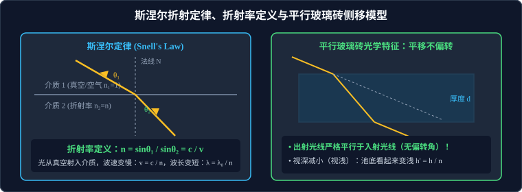

# 01 · 光的折射与折射率

## 核心物理概念与内涵

> [!NOTE]
> 本节严格遵循人教版物理选择性必修第一册体系，引入费马原理（Fermat's Principle of Least Time）与微积分几何光学光路追踪，全面解析折射定律、折射率物理本质及经典光学元件成像规律。

### 1. 光的折射定律（斯涅尔定律，Snell's Law）

当光从一种介质斜射入另一种介质时，传播方向发生偏折的现象称为光的折射。

* **定律三大要素**：
  1. **共面性**：折射光线、入射光线与法线都在**同一个平面内**（入射面）；
  2. **异侧性**：折射光线与入射光线分别位于**法线的两侧**；
  3. **正弦定量比值关系**：入射角的正弦值与折射角的正弦值成正比：
     $$\frac{\sin\theta_1}{\sin\theta_2} = \text{常数}$$
     式中 $\theta_1$ 为入射光线与法线的夹角（入射角），$\theta_2$ 为折射光线与法线的夹角（折射角）。

---

## 介质的绝对折射率（Refractive Index, $n$）

### 1. 物理定义与光速关联

* **比值定义式**：光从**真空中**射入某种介质发生折射时，真空中角（入射角 $\theta_1$）的正弦与介质中角（折射角 $\theta_2$）的正弦之比，定义为该介质的**绝对折射率**，简称**折射率**，用符号 $n$ 表示：
  $$n = \frac{\sin\theta_1}{\sin\theta_2} \quad (\theta_1 \text{ 必须是真空中的光线夹角})$$
* **光速物理本质公式（费马最短光程原理导出）**：
  折射率是表征介质对光波传播阻碍减速程度的物理常数，等于真空中光速 $c$ 与介质中光速 $v$ 之比：
  $$n = \frac{c}{v}$$
  * 真空中的光速为自然界极限波速 $c \approx 3.0 \times 10^8\,\text{m/s}$；
  * 因为光在任何物质介质中的传播速度 $v$ 必然小于真空光速（$v < c$），所以**任何物质介质的折射率必然严格大于 1**：
    $$n > 1$$
  * 真空的折射率严格规定为 $n_{\text{真空}} = 1$；标准状态下空气的折射率约为 $n_{\text{空气}} \approx 1.00028$，在高考中通常近似认为 $n_{\text{空气}} \approx 1$。

### 2. 波长、频率与波速的变化规律
当频率为 $f$ 的光从真空射入折射率为 $n$ 的介质中时：
1. **频率守恒铁律**：光的颜色和频率由光源本身的电子能级跃迁唯一决定，**进入介质后光的频率 $f$ 保持绝对恒定不变**！
2. **波速变慢**：$v = \dfrac{c}{n} < c$；
3. **波长被压缩变短**：
   $$\lambda_{\text{介质}} = \frac{v}{f} = \frac{c / n}{f} = \frac{\lambda_0}{n}$$
   （式中 $\lambda_0$ 为光在真空中的原生波长）。

### 3. 光疏介质与光密介质的相对性
* **光疏介质（Optically Rarer Medium）**：两种介质相比，**折射率较小**的介质称为光疏介质（光在其中传播速度较快）；
* **光密介质（Optically Denser Medium）**：两种介质相比，**折射率较大**的介质称为光密介质（光在其中传播速度较慢）；
* **偏折规律**：
  * 光从光疏介质射入光密介质（如空气到玻璃）：折射角**小于**入射角（$\theta_2 < \theta_1$），折射光线**偏向法线**；
  * 光从光密介质射入光疏介质（如水到空气）：折射角**大于**入射角（$\theta_2 > \theta_1$），折射光线**偏离法线**。

---

## 平行玻璃砖的几何光学特性

设有一块厚度为 $d$、折射率为 $n$ 的两面平行的平面玻璃砖置于空气中。光线以入射角 $\theta_1$ 射入上表面，经两次折射后从下表面射出。

### 1. 平行出射定理
* 在上表面折射：$\dfrac{\sin\theta_1}{\sin\theta_2} = n$；
* 由两平行界面的内错角几何关系，光线到达下表面时的入射角恰等于上表面的折射角 $\theta_2$；
* 在下表面折射：由光路可逆性原理，出射角 $\theta_3$ 必定严格满足：
  $$\theta_3 = \theta_1$$
* **核心物理结论**：
  1. **光线穿过平行玻璃砖后，出射光线与入射光线严格保持平行，偏转角为零（$\Delta \theta = 0$）！**
  2. 出射光线相对原入射光线发生了一段侧向平移位移 $\Delta x$：
     $$\Delta x = d \frac{\sin(\theta_1 - \theta_2)}{\cos\theta_2}$$
     （平移距离与玻璃砖厚度 $d$ 成正比）。

### 2. 水下“视深变浅”微元模型
人从水面外近乎垂直俯视水底深为 $h$ 的静止物体 $P$ 时，由于光的折射，水底物体看起来向上抬高了，其**视在深度（视深）$h'$** 为：
$$h' = \frac{h}{n}$$

* **可汗学院生活物理警示**：
  水对可见光的折射率约为 $n = 1.33 = \dfrac{4}{3}$。水深为 $4\,\text{m}$ 的深水池，从水面上垂直看下去，感觉水深只有 $h' = \dfrac{4}{1.33} \approx 3\,\text{m}$！这种光学视浅效应极易让人误判水深，是引发野外戏水溺亡的核心物理隐患。

---

## 三棱镜折射与牛顿白光色散全景对比

当一束白光通过三棱镜时，由于不同单色光的波长不同，介质对各单色光的折射率各不相同，白光被分解为红、橙、黄、绿、青、蓝、紫七色光谱，这种现象称为**光的色散（Dispersion）**。

### 七色光物理参量单调演变矩阵（高考必背全景图）

| 物理量 / 单色光 | 红光（Red） $\longrightarrow$ 紫光（Violet） | 物理规律机理 |
| :--- | :--- | :--- |
| **振动频率 $f$** | **低 $\longrightarrow$ 高**（$f_{\text{红}} < f_{\text{紫}}$） | 由光源原子核外电子跃迁的能级跃迁差决定 |
| **光子能量 $E$** | **小 $\longrightarrow$ 大**（$E_{\text{红}} < E_{\text{紫}}$） | 爱因斯坦光量子能量公式 $E = hf$ |
| **真空波长 $\lambda_0$** | **长 $\longrightarrow$ 短**（$\lambda_{\text{红}} \approx 700\,\text{nm} > \lambda_{\text{紫}} \approx 400\,\text{nm}$） | $\lambda_0 = \dfrac{c}{f}$，频率越高波长越短 |
| **介质折射率 $n$** | **小 $\longrightarrow$ 大**（$n_{\text{红}} < n_{\text{紫}}$） | 柯西色散经验公式，介质对高频光阻碍更强 |
| **介质中光速 $v$** | **大 $\longrightarrow$ 小**（$v_{\text{红}} > v_{\text{紫}}$） | $v = \dfrac{c}{n}$，紫光在玻璃中跑得最慢 |
| **通过三棱镜偏折角 $\theta$** | **小 $\longrightarrow$ 大**（红光偏折最小，紫光偏折最大） | 斯涅尔定律，折射率大偏折剧烈 |
| **全反射临界角 $C$** | **大 $\longrightarrow$ 小**（$C_{\text{红}} > C_{\text{紫}}$） | $\sin C = \dfrac{1}{n}$，**紫光最容易发生全反射**！ |
| **双缝干涉条纹间距 $\Delta x$** | **大 $\longrightarrow$ 小**（红光条纹最宽，紫光条纹最窄） | $\Delta x = \dfrac{L}{d}\lambda$，间距正比于波长 |

---

## 高频易错盲区与避坑指南

* [×] **误区 1**：根据公式 $n = \dfrac{\sin\theta_1}{\sin\theta_2}$，认为折射率 $n$ 与入射角成正比，与折射角成反比。
  > [√] **正解**：折射率是介质本身的固有光学物理量，由介质材料和入射光的频率决定，与入射角 $\theta_1$ 的大小毫无关系！入射角增大，折射角必等比例增大，比值保持严格恒定。

* [×] **误区 2**：光从水中射入空气时，仍然用水中角除以空气角计算折射率。
  > [√] **正解**：绝对折射率公式中，**分子必须永远是真空中（或空气中）的角度正弦**！若光从介质射向空气，$n = \dfrac{\sin\theta_{\text{空气}}}{\sin\theta_{\text{介质}}}$。
