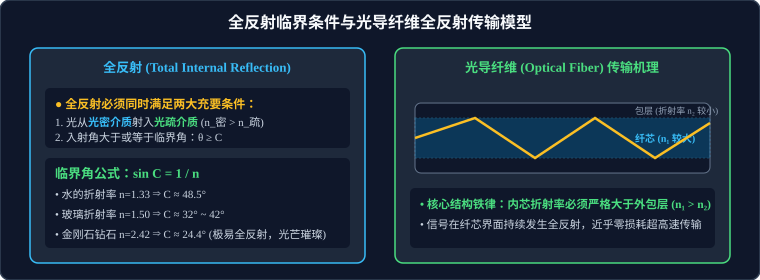

# 02 · 全反射与光导纤维

## 核心物理概念与内涵

> [!NOTE]
> 本节严格遵循人教版物理选择性必修第一册体系，引入能量透射反射系数与波导（Waveguide）电磁场理论，系统解构全反射现象的临界跃迁条件与现代光通信物理基石。

### 1. 全反射（Total Internal Reflection, TIR）现象

当光从水中或玻璃等光密介质射向空气等光疏介质的分界面时：

- 随着入射角 $\theta$ 的逐渐增大，折射角 $\theta'$ 增大得更快（$\theta' > \theta$），且折射光线的能量越来越弱，反射光线越来越强；
- 当折射角增大到极限 $90^\circ$ 时，折射光线完全贴着分界面掠射并随之彻底消失；
- 入射角进一步增大时，**全部光线都被反射回原光密介质内部，没有任何光线透射折射进入第二种介质**，这种极端光学现象称为**全反射**。



::: tip 🪐 动态交互实验：光的折射定律与全反射临界角光纤光路
拖动调节介质折射率 $n$ 与入射角 $i$，实时动态演算入射光、反射光与折射光路；当 $i \ge C = \arcsin(1/n)$ 时折射光消失并触发全反射光纤通信模式：
<ClientOnly>
<CCPhysicsSimulator model="optics" :height="380" />
</ClientOnly>
:::

---

## 发生全反射的两大充要条件与临界角推导

> [!IMPORTANT]
> **全反射发生的绝对充要条件（必须同时成立）**：
>
> 1. **光线必须从光密介质射向光疏介质（$n_{\text{密}} > n_{\text{疏}}$）**；
> 2. **入射角必须大于或等于临界角（$\theta \ge C$）**。

### 1. 临界角（Critical Angle, $C$）的严格数学推导

- **定义**：折射角恰好达到极限 $90^\circ$ 时所对应的**入射角**，称为**临界角**，用符号 $C$ 表示。
- **推导过程**：
  设光密介质折射率为 $n_1$，光疏介质折射率为 $n_2$（$n_1 > n_2$）。
  根据斯涅尔折射定律：
  $$n_1 \sin C = n_2 \sin 90^\circ$$
  由于 $\sin 90^\circ = 1$，直接解出临界角正弦：
  $$\sin C = \frac{n_2}{n_1}$$
- **介质对真空/空气的临界角公式**：
  当第二种光疏介质为真空中或空气（$n_2 = 1$），第一种光密介质折射率为 $n$ 时：
  $$\sin C = \frac{1}{n} \implies C = \arcsin\left(\frac{1}{n}\right)$$

### 2. 常见介质的临界角特征数据

| 介质材料           | 绝对折射率 $n$        | 对空气的临界角 $C$ | 物理效应与典型特征                                                         |
| :----------------- | :-------------------- | :----------------- | :------------------------------------------------------------------------- |
| **水（Water）**    | $1.33 = \dfrac{4}{3}$ | **$48.5^\circ$**   | 水下光源在水面上方形成一个半顶角为 $48.5^\circ$ 的圆形透光圆孔（斯涅尔窗） |
| **普通冕牌玻璃**   | $1.50$                | **$41.8^\circ$**   | 临界角小于 $45^\circ$，可用于制作等腰直角全反射棱镜                        |
| **重火石玻璃**     | $1.65$                | **$37.3^\circ$**   | 广泛用于高档光学镜头与棱镜潜望镜                                           |
| **金刚石（钻石）** | **$2.42$**            | **$24.4^\circ$**   | **自然界折射率最高的天然宝石之一，临界角极小（仅 $24.4^\circ$）**！        |

> [!TIP]
> **可汗学院物理洞见：钻石璀璨火彩的奥秘**
> 金刚石由于折射率极高（$n=2.42$），其临界角奇小（仅 $24.4^\circ$）。经过现代精密对称几何切工切磨的钻石，从顶部台面射入的外部光线，在钻石底部和侧部刻面几乎**百分之百满足入射角大于 $24.4^\circ$ 的全反射条件**！光线在内部经历多次全反射后无法从底部漏出，全部被汇聚并从顶部台面喷薄而出，加之钻石对不同色光色散极强，呈现出流光溢彩、耀眼夺目的“火彩（Fire）”。

---

## 全反射棱镜（Total Reflection Prism）

截面为等腰直角三角形的玻璃棱镜称为**全反射棱镜**。由于普通光学玻璃的折射率 $n \ge 1.50$，其临界角 $C \approx 41.8^\circ < 45^\circ$。

```
     【光路 1: 改变光路 90°】               【光路 2: 改变光路 180°】
           /|                                      ▲
          / |                                     /|\
         /  |                                    / | \
   ──►  / 45°                                   /  |  \
        |   | ──► 垂直射出                ──►  / 45°45°\  ◄──
        └───┘                                  └───────┘
```

1. **改变光路 $90^\circ$**：光线垂直直角边射入，入射角为 $0^\circ$ 不发生偏折；到达斜边时入射角为 $45^\circ > C$，在斜边发生 $100\%$ 全反射，从另一条直角边垂直射出；
2. **改变光路 $180^\circ$（逆反射器）**：光线垂直斜边射入，在两条直角边连续发生两次 $45^\circ$ 全反射，最终沿反方向平行射回（如自行车尾灯、地质激光测距月球反光镜）；
3. **与普通镀银平面镜相比的压倒性优势**：
   - 普通平面镜依靠金属银膜反射，反射率最多只有 $85\% \sim 90\%$，且玻璃前后表面会有微弱多重反射产生重影虚像；
   - 全反射棱镜反射率达到**理论上的 $100\%$**，不损失光能、反射成像极其清晰、永不氧化磨损失效，广泛应用于潜望镜、双筒双目望远镜和单反相机五棱镜中。

---

## 光导纤维（Optical Fiber）传输机理

2009 年，诺贝尔物理学奖授予被誉为“光纤之父”的华裔物理学家高锟（Charles K. Kao），以表彰他在光通信光纤传输理论上的开创性突破。

### 1. 双层同轴圆柱结构

- **纤芯（Core）**：中心圆柱介质，由高纯度二氧化硅石英玻璃制成，折射率为 $n_1$；
- **包层（Cladding）**：包裹在纤芯外围的保护套层，折射率为 $n_2$；
- **结构核心铁律**：**纤芯的折射率必须严格大于外包层的折射率（$n_1 > n_2$）！** 确保光在纤芯内部传播时始终处于“从光密射向光疏”的全反射临界环境。

### 2. 端面最大入射角的数学推导（数值孔径）

设一束光线在空气中以入射角 $\theta$ 射向光纤端面：

- 在端面发生折射，由斯涅尔定律：
  $$\sin\theta = n_1 \sin\alpha \quad (\alpha \text{ 为折射角})$$
- 折射光线射向侧壁纤芯-包层界面，其在侧壁的入射角为 $\beta = 90^\circ - \alpha$；
- 要使光线在侧壁发生全反射，必须满足：
  $$\sin\beta \ge \sin C = \frac{n_2}{n_1} \implies \cos\alpha \ge \frac{n_2}{n_1}$$
- 利用三角函数恒等式 $\sin\alpha = \sqrt{1 - \cos^2\alpha} \le \sqrt{1 - \left(\dfrac{n_2}{n_1}\right)^2}$；
- 代入端面折射公式，导出**光线能被光纤无损全反射捕获的最大允许端面入射角**：
  $$\sin\theta \le n_1 \sqrt{1 - \frac{n_2^2}{n_1^2}} = \sqrt{n_1^2 - n_2^2}$$

- **裸光纤特殊结论**：
  若光纤没有包层（直接暴露于空气中，$n_2 = 1$），只要纤芯折射率满足 $n_1 \ge \sqrt{2} \approx 1.414$，则无论以多大的角度 $\theta$ 从端面入射，光线进入光纤后**在侧壁必定全部发生全反射**，光线永远无法从侧壁逸出！

---

## 自然界中的全反射奇观：海市蜃楼（Mirage）

海市蜃楼是光在大气密度和折射率出现剧烈垂直梯度分布时发生连续折射与全反射形成的自然奇观。

1. **下现蜃景（沙漠蜃景 / 夏天柏油路“积水”幻影）**：
   - 酷暑烈日暴晒下，贴近地表的空气温度极高、密度极稀薄、折射率小（光疏介质）；高处空气冷、密度大、折射率大（光密介质）；
   - 天空斜射向地面的光线不断由光密层折向光疏层，入射角越来越大，在地面附近发生全反射向上翘起折入人眼；
   - 人眼逆着光线看去，看到了天空在地面形成的倒立虚像，波光粼粼如水洼水面。
2. **上现蜃景（海面蜃景 / 极地冰原蜃景）**：
   - 严寒海面上贴近水面的冷空气折射率极高，上方暖空气折射率低；
   - 远方船只的光线上行时从光密射入光疏发生全反射向下弯曲折回人眼，人看到悬浮在半空中的高空浮楼幻景。

---

## 高频易错盲区与避坑指南

- [×] **误区 1**：认为光从真空射入玻璃也能发生全反射。

  > [√] **正解**：全反射的第一前提是**从光密射入光疏**！真空格外光疏（$n=1$），从真空射向任何介质都绝对不可能发生全反射。

- [×] **误区 2**：光纤通信中，为了减少光线泄露，应该将外包层的折射率做得比内芯大。
  > [√] **正解**：若外包层折射率大于内芯（$n_2 > n_1$），内芯就变成了光疏介质，侧壁绝无发生全反射的可能，光线将大量折射泄露耗散殆尽！内芯折射率必须**严格大于**外包层（$n_1 > n_2$）。
