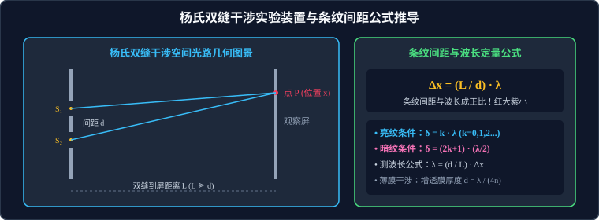

# 03 · 光的干涉

## 核心物理概念与内涵

> [!NOTE]
> 本节严格遵循人教版物理选择性必修第一册体系，结合空间光程差微积分推导与波前分割/振幅分割范式，系统解析光的波动性最有力证据——杨氏双缝干涉与薄膜干涉的定量规律与工业测量应用。

### 1. 光的相干条件与相干光获取

光是一种电磁波，普通独立光源（如白炽灯、烛光）由于原子自发辐射的随机性，发射的光波列长度极短且初相位频繁随机跃变，两独立光源发出的光**绝对无法产生干涉**。

* **光的相干条件**：两束光的**频率必须严格相同**、**振动方向相同**且**相位差恒定**；
* **经典获取相干光束的两大途径**：
  1. **分波前法（Wavefront Splitting）**：利用单缝或小孔，把同一个点光源发射出的同一个波前在空间分割为两部分（如**杨氏双缝干涉**）；
  2. **分振幅法（Amplitude Splitting）**：利用薄膜或半透半反分束镜，把同一列入射光波的能量振幅分解为反射光和折射光（如**薄膜干涉**、迈克耳孙干涉仪）。



---

## 杨氏双缝干涉实验（Young's Double-Slit Experiment）

1801 年，英国物理学家托马斯·杨（Thomas Young）成功完成了著名的双缝干涉实验，打破了牛顿微粒说长达百年的统治地位，无可辩驳地证实了光的波动本性。

### 1. 实验装置结构与光路功能
* **单色光源 $\to$ 滤光片**：获得单一波长 $\lambda$ 的单色光；
* **单缝 $S$**：获得线状相干波前，保证到达双缝的光波具有完全相同的初相；
* **双缝 $S_1, S_2$**：相距极近（间距 $d \approx 0.1 \sim 0.5\,\text{mm}$），充当一对空间对称的相干子光源；
* **遮光筒与测量观察屏**：双缝到光屏的距离为 $L$（$L \approx 0.5 \sim 1.5\,\text{m}$，满足几何条件 $L \gg d$）。

### 2. 光程差方程与条纹位置严格数学推导

在光屏上任取一点 $P$，其到中央对称轴线的空间坐标为 $x$。
从双缝 $S_1$ 和 $S_2$ 发出的两束光到达点 $P$ 的几何距离分别为 $r_1$ 和 $r_2$。
由于屏距 $L$ 远大于双缝间距 $d$（$L \gg d$），光线 $S_1 P$ 与 $S_2 P$ 近似平行，两光线的**光程差 $\delta$** 为：
$$\delta = r_2 - r_1 = d \sin\theta$$
式中 $\theta$ 为偏折角。由直角三角形几何关系，当 $\theta$ 极小时：$\sin\theta \approx \tan\theta = \dfrac{x}{L}$，代入得：
$$\delta = d \frac{x}{L}$$

#### A. 明条纹（亮条纹）位置条件
当光程差等于波长 $\lambda$ 的**整数倍**时，两列光波同相相干叠加增强：
$$\delta = d \frac{x}{L} = k \lambda \quad (k = 0, \pm 1, \pm 2, \dots)$$
解出各级明条纹在屏上的位置坐标：
$$x_k = k \frac{L}{d} \lambda$$
* $k = 0$ 时：$x_0 = 0$，对应光屏中央对称轴处的**中央零级明条纹**；
* $k = \pm 1$ 时：对应第一级明条纹；$k = \pm 2$ 对应第二级明条纹。

#### B. 暗条纹位置条件
当光程差等于半波长 $\dfrac{\lambda}{2}$ 的**奇数倍**时，两列光波反相相互抵消：
$$\delta = d \frac{x}{L} = (2k + 1) \frac{\lambda}{2} \quad (k = 0, \pm 1, \dots)$$
解出各级暗条纹的位置坐标：
$$x_k' = \left(k + \frac{1}{2}\right) \frac{L}{d} \lambda$$

---

### 3. 相邻条纹间距公式（高考绝对核心大招）

相邻两条明条纹（或相邻两条暗条纹）之间的中心间距 $\Delta x$ 为：
$$\Delta x = x_{k+1} - x_k = \frac{L}{d} \lambda$$

> [!IMPORTANT]
> **双缝干涉间距公式四大决定关系**：
> 1. **等间距特性**：在整块观察屏上，**条纹宽度与条纹间距是完全均匀等间距的**！
> 2. **波长正比性（红大紫小）**：$\Delta x \propto \lambda$。在相同装置下，**红光的干涉条纹间距最大，紫光的干涉条纹间距最小**！
> 3. **双缝间距反比性**：$\Delta x \propto \dfrac{1}{d}$。双缝靠得越近（$d$ 越小），屏上的条纹展开得越宽，越容易观察；
> 4. **屏距正比性**：$\Delta x \propto L$。光屏拉得越远，条纹展得越开。

* **白光双缝干涉现象**：
  若用白光作为光源，由于所有色光在中央的光程差均为零（$k=0$ 时 $\delta = 0$），故**中央零级条纹为纯白色明亮光带**；两侧各级条纹因波长不同发生分散重叠，形成由内向外**“内紫（波长短间距小）外红（波长长间距大）”的彩色对称干涉条纹**。

---

## 薄膜干涉（Thin Film Interference）及工业应用

利用光照射在透明薄膜上，由**薄膜的前表面反射光**与**后表面反射光**相互叠加产生的干涉现象称为薄膜干涉。

### 1. 照相机镜头“增透膜（Anti-Reflective Coating）”

现代高端摄影镜头表面均镀有一层高精度的透明薄膜（如氟化镁 $\text{MgF}_2$），其主要功能是消除镜片表面的有害反射，极大提升透光率。

* **理论设计与膜厚公式推导**：
  设薄膜材料的折射率为 $n$（通常满足 $1 < n < n_{\text{玻璃}}$）。
  光从空气垂直射向薄膜，在薄膜上表面和下表面分别发生反射。
  下表面反射光比上表面反射光在薄膜内部多走了两倍薄膜厚度的光程（$\Delta s = 2d$），对应的**等效光程差**为：
  $$\delta = 2 n d$$
  为了使两束反射光干涉相消（彻底消除反射）：
  $$\delta = 2 n d = \frac{\lambda}{2}$$
  解出**增透膜的最小理论物理厚度**：
  $$d = \frac{\lambda}{4 n}$$
* **为什么镀膜镜头常呈淡紫色？**
  人眼对可见光光谱中间的**黄绿光（波长约 $550\,\text{nm}$）最为敏感**，增透膜厚度 $d$ 专门针对黄绿光设计消除反射，使黄绿光透射率超过 $99\%$；而光谱两端的红光和蓝紫光反射未能完全相消，微弱反射叠加在一起呈现在镜头表面，形成标志性的优雅蓝紫色高档镀膜反光！

---

### 2. 精密工程检测：检查光学平面的平整度（等厚劈尖干涉）

将标准高精度平面平晶压在待测工件表面上，一端用薄垫片垫起，在两平面之间形成一个厚度线性递增的微小**空气劈尖（Air Wedge）**。

```
     标准平晶 ───────────────────────────────────────
                      空气薄层 (从左到右厚度 d 均匀增大)
     待测工件 ───────────────────────────────────────
```

* **条纹特征**：
  * 反射光在空气劈尖上下表面产生干涉，同一条条纹对应劈尖内部厚度 $d$ 相同的各点的连线，故称**等厚干涉条纹**；
  * 若被测工件表面绝对平整，屏上观察到的将是一组**严格平行且等间距的直条纹**；
* **缺陷弯曲判别法则（“凸向薄、凹向厚”）**：
  * **若工件表面有微小凸起**：凸起处空气层厚度提前变薄，该处相同的厚度提前出现在左侧薄处，故**干涉条纹向劈棱（薄的一端）发生弯曲**；
  * **若工件表面有微小凹坑**：凹陷处空气层变厚，相同的厚度滞后出现在右侧厚处，故**干涉条纹向厚的一端发生弯曲**！
  * 利用此法可轻松检出亚微米级（$0.01\,\mu\text{m}$）的机械表面划痕与微小形变！

---

## 高频易错盲区与避坑指南

* [×] **误区 1**：在计算增透膜厚度时，忽略介质折射率，直接写 $d = \dfrac{\lambda}{4}$。
  > [√] **正解**：光在薄膜介质中传播时波长被压缩变短为 $\lambda' = \dfrac{\lambda_0}{n}$，厚度公式分母必须带折射率 $n$，即 $d = \dfrac{\lambda_0}{4n}$。

* [×] **误区 2**：认为双缝干涉测波长实验中，测得一条暗纹到相邻明纹的距离就是条纹间距 $\Delta x$。
  > [√] **正解**：条纹间距 $\Delta x$ 是指**相邻两条同性质条纹（明条纹与明条纹，或暗条纹与暗条纹）之间的中心距离**！明纹与相邻暗纹的中心距离只有 $\dfrac{1}{2}\Delta x$。
