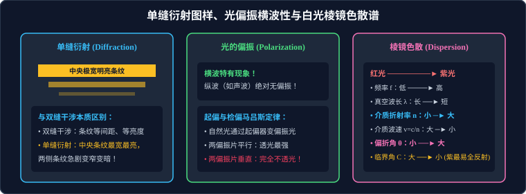

# 04 · 光的衍射、偏振与激光

## 核心物理概念与内涵

> [!NOTE]
> 本节严格遵循人教版物理选择性必修第一册体系，结合麦克斯韦电磁横波偏振分析与爱因斯坦受激辐射量子假说，全面解析光的衍射、偏振与现代激光科技的物理本质。

### 1. 光的衍射（Light Diffraction）

光在传播过程中遇到障碍物或小孔时，偏离直线传播路径绕过障碍物边缘、进入几何阴影区域并在屏上形成明暗相间花纹的现象，称为**光的衍射**。

* **明显衍射的物理尺度**：只有当缝、孔的宽度或障碍物的几何尺寸与光的波长相当（约数百纳米 $\sim$ 几微米），或者比波长更小时，才能观察到极其显著的光的衍射图样。

---

## 单缝衍射与双缝干涉的本质特征区别（高考必考）

高考极高频在选择题中考查单缝衍射图样与双缝干涉图样的波形图像辨识：

| 光学图样对比维度 | 杨氏双缝干涉图样 | 单缝衍射图样 |
| :--- | :--- | :--- |
| **物理机制** | 两个独立相干子光源发出光波的空间叠加 | 同一条狭缝内各个不同部位次波源相干衍射叠加 |
| **条纹宽度分布** | **严格等宽度、等间距**（$\Delta x = \dfrac{L}{d}\lambda$） | **极其不均匀**：**中央明条纹最宽**（宽度是两侧亮纹的 2 倍），两侧明条纹急剧变窄 |
| **条纹亮度分布** | **各级明条纹亮度基本均匀相等** | **断崖式衰减**：中央明条纹集中了 $85\%$ 以上的光能，极度明亮，两侧亮纹亮度迅速衰减变暗 |
| **缝宽变化效应** | 双缝间距 $d$ 越小，条纹展得越宽 | 狭缝宽度越小，中央明条纹越宽、亮度越分散，衍射越显著；缝越宽，条纹越窄，直至退化为直线光影 |

---

## 著名的物理学公案：圆孔衍射与“泊松亮斑”

在圆孔或圆屏衍射中，光线表现出令人震撼的波动干涉特征：

### 1. 圆孔衍射与艾里斑（Airy Disk）
* 当平行单色光穿过极小的圆孔时，在光屏上观察到的是一组**明暗相间的同心同轴圆环**，中央是一个明亮的圆斑（艾里斑）；
* **光学分辨率极限（瑞利判据）**：任何望远镜或显微镜镜头（相当于一个圆孔）的成像本质都是艾里斑的衍射叠加。物镜口径越大，衍射越微弱，艾里斑越小，光学分辨率越高（这就是为什么大型天文望远镜口径要做到数米乃至十米级的物理原因！）。

### 2. 泊松亮斑（Poisson's Spot / Arago Spot）
* **历史背景**：1818 年法国科学院光学大奖赛上，波动光学奠基人菲涅耳提交了圆盘衍射数学论文。评委兼微粒说坚决捍卫者泊松（Poisson）依据菲涅耳公式推导出一个自认为荒谬绝伦的推论：**如果波动说正确，在不透光的微小圆盘阴影正中央，必然会出现一个亮点！** 泊松据此宣称波动说在荒唐中不攻自破。
* **阿拉果实验的世纪逆转**：评委阿拉果（Arago）立刻在暗室中进行了精确实验：当用点光源照射不透光的小圆板（直径约几毫米）时，在光屏中心不透光的几何阴影正中央，**赫然出现了一个清清楚楚、极其明亮的微小光点——泊松亮斑！**
* **物理机制**：从圆盘圆周边缘各个方向绕射过去的次波，到达圆屏几何中心轴线上的各点光程完全相等（$\delta = 0$），同相叠加形成干涉增强极大值。这一著名的科学事件不仅没有击垮波动说，反而成了证明光的波动理论最辉煌、最经典的里程碑！

---

## 光的偏振（Polarization）：证明光是横波的终极铁证！

在机械波中，声波是纵波，绳波是横波。光究竟是横波还是纵波？**偏振现象是揭示这一世纪谜题的唯一终极判据！**

> [!IMPORTANT]
> **高考核心公理**：
> **偏振是横波所独有的特有属性！一切纵波（如声波、超声波）由于振动方向与波速方向共线平行，绝对不可能发生偏振现象！**

### 1. 自然光与线偏振光
* **自然光（Natural Light）**：太阳光、白炽灯光、蜡烛光等普通光源，其微观原子辐射取向完全随机，在垂直于光传播方向的平面内，**沿各个方向振动的光矢量的振幅完全均匀对称，没有任何一个方向占据优势**。
* **线偏振光（Linearly Polarized Light）**：电场强度矢量 $\vec{E}$ 仅仅沿着**某一特定直线方向振动**的光，称为偏振光。

### 2. 起偏、检偏与马吕斯定律（Malus's Law）
* **偏振片（Polarizer）**：由人工拉伸并含有定向排列碘化高聚物分子链的薄膜制成，具有特定的**透振方向（Transmission Axis）**，只允许振动方向平行于该轴的光波无阻通过。
* **起偏器与检偏器联动规律**：
  1. 自然光垂直穿过第一个偏振片（**起偏器**）：透射光变为线偏振光，光强衰减为原来的一半：
     $$I_1 = \frac{1}{2} I_0$$
  2. 该偏振光穿过第二个偏振片（**检偏器**）：设检偏器的透振方向与起偏器的透振方向夹角为 $\alpha$。
     由**马吕斯定律**，透射光强为：
     $$I_2 = I_1 \cos^2\alpha$$
  3. **两大极端取向**：
     * 若两偏振片透振方向**相互平行（$\alpha = 0^\circ$）**：$\cos 0^\circ = 1$，**透光最强**（$I_2 = I_1$）；
     * 若两偏振片透振方向**相互垂直（$\alpha = 90^\circ$，正交偏振）**：$\cos 90^\circ = 0$，**光线完全被阻断屏蔽，透射光强严格为零！**

### 3. 偏振现象的现代前沿应用
1. **3D 立体电影技术**：左、右放映机分别投射出透振方向相互正交（垂直）的偏振光画面，观众佩戴的 3D 眼镜左右镜片透振方向恰与两机器一一对应，使左右眼分别接收具有视差的独立图像，在大脑视皮层融合成极具沉浸感的立体纵深视觉；
2. **液晶显示器（LCD）**：利用两块正交偏振片之间夹入向列相液晶分子，在电压驱动下调控液晶分子的分子偏转角，实现对像素点光强透过率的毫秒级高精度灰度调制；
3. **摄影偏振镜（CPL）**：滤除水面、玻璃表面的眩光反射光（反射光绝大部分是偏振光），拍摄出清澈见底的水下生物与隔着橱窗的清晰展品。

---

## 激光（Laser）：神奇的人造相干光源

激光（Laser）是 20 世纪人类科技史上与原子能、半导体、计算机齐名的四大伟大发明之一，英文全称为 **L**ight **A**mplification by **S**timulated **E**mission of **R**adiation（受激辐射光放大）。

### 激光的四大超越一切普通光源的超强物理特性

1. **高度的单色性（High Monochromaticity）**：
   * 普通单色光源谱线宽度较大；激光发射时由相同原子能级精准跃迁激发，谱线极窄，波长偏差在万分之一纳米以内；
   * 应用：高保真光纤通信载波、超精密激光干涉光谱仪。
2. **极高的空间相干性（High Spatial Coherence）**：
   * 激光腔内受激辐射产生的光子不仅频率相同，而且相位、振动方向分毫不差完全一致；
   * 应用：**全息照相（Holography）**（记录光波的振幅与相位全部三维信息，重构逼真 3D 光场）。
3. **卓越的方向准直性（High Directionality）**：
   * 激光束发散角极小，射向数公里外光斑扩散极其微弱；
   * 应用：**地月激光测距**（从地球射向月球表面阿波罗反光镜并折返，测量误差小于 $1\,\text{cm}$）、车载激光雷达（LiDAR）自动驾驶环境感知。
4. **超高亮度的空间能量聚集（High Brightness / High Power Density）**：
   * 脉冲激光能在飞秒（$10^{-15}\,\text{s}$）时间内将数万焦耳能量聚焦在头发丝粗细的微米空间点上，瞬间产生比太阳中心还要高数千倍的温度和数亿个大气压的超强光辐射压；
   * 应用：工业精密激光切割焊接、医用眼科激光飞秒准分子近视手术、可控热核聚变“神光”大型激光惯性约束点火装置。

---

## 高频易错盲区与避坑指南

* [×] **误区 1**：认为双缝干涉和单缝衍射在观察屏上形成的都是均匀等间距的明暗条纹。
  > [√] **正解**：双缝干涉是**严格等间距、等宽度**的；单缝衍射则是**中央亮纹最宽最亮、两侧急剧变窄变暗**的不等间距条纹！

* [×] **误区 2**：认为只要是波，就一定具有偏振现象。
  > [√] **正解**：只有**横波**才能发生偏振！纵波（如空气中的声波、弹簧纵波）振动方向与传播方向在同一条直线上，没有任何方向上的不对称性，**纵波绝对不可能发生偏振**。
