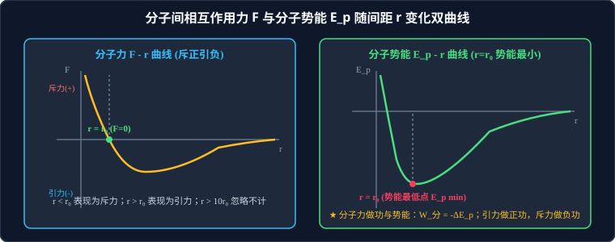

# 01 · 分子动理论与微观量估算

## 核心物理概念与内涵

> [!NOTE]
> 本节严格遵循人教版物理选择性必修第三册体系，结合微观统计物理学与势阱（Potential Well）能量模型，系统解析分子热运动的统计本质、微观量量纲估算及温度内能的微观唯物画像。

### 1. 分子动理论的三大基本观点

热力学现象是微观粒子大量随机热运动的宏观宏观统计表现。分子动理论建立在以下三个基石观点之上：

#### 观点 1：物体是由海量微观分子组成的
* **分子微小尺度**：除某些有机高分子（如 DNA、蛋白质分子量达数万至数百万）外，绝大多数普通分子、原子的直径数量级约为 **$10^{-10}\,\text{m}$（$0.1\,\text{nm} = 1\,\text{\AA}$）**；
* **阿伏加德罗常数（Avogadro's Constant, $N_A$）**：
  $$N_A \approx 6.02 \times 10^{23}\,\text{mol}^{-1}$$
  $N_A$ 是联通宏观物理世界（质量 $M$、体积 $V_m$、物质的量 $n$）与微观物理世界（单个分子质量 $m_0$、单个分子体积 $v_0$、分子间距 $d$）的核心纽带！

#### 观点 2：分子都在永不停息地做无规则热运动
* **扩散现象（Diffusion）**：不同物质在相互接触时彼此进入对方的现象。气体、液体、固体中均能发生扩散（温度越高，分子热运动越剧烈，扩散越快）。
* **布朗运动（Brownian Motion，高考绝对必考核心）**：
  1827 年英国植物学家布朗用显微镜观察悬浮在水中的花粉微粒，发现了微粒的永不停息、无规则折线运动。

> [!IMPORTANT]
> **高考布朗运动失分陷阱避坑指南**：
> 1. **运动的主体是谁？**：布朗运动**绝不是液体分子的运动，也绝不是花粉分子的运动**，而是**悬浮在液体中的宏观微小固体颗粒（花粉小颗粒）的机械运动**！
> 2. **布朗运动产生的原因**：悬浮微粒极其微小，在某一瞬间，来自周围液体分子各个方向的撞击力量极不平衡；随着时间的推移，这种不平衡撞击方向剧烈随机变化，推动固体微粒做出杂乱无章的折线运动；
> 3. **运动影响因素**：**固体微粒越小、液体温度越高**，撞击越不平衡且越剧烈，布朗运动越显著；
> 4. **物理意义**：布朗运动本身是固体颗粒的机械运动，但它**直接而有力地间接反映了液体分子热运动的无规则性！**

#### 观点 3：分子之间同时存在着相互作用的引力和斥力

---

## 分子力与分子势能随分子间距变化的双曲线规律

分子间的相互作用力起源于原子核外电子云的静电排斥与原子核和电子云之间的相互电磁吸引。

### 1. 分子力 $F - r$ 曲线与四大临界区间

分子间**同时存在引力 $F_{\text{引}}$ 和斥力 $F_{\text{斥}}$**，且引力和斥力都随着分子间距 $r$ 的增大而减小，**但斥力比引力随间距增大减小得更加迅猛剧烈**（理论上 $F_{\text{斥}} \propto \dfrac{1}{r^{12}}$，$F_{\text{引}} \propto \dfrac{1}{r^6}$）。

* **平衡位置（$r = r_0$）**：
  * 间距 $r_0 \approx 10^{-10}\,\text{m}$，此时分子引力与分子斥力大小相等：$F_{\text{引}} = F_{\text{斥}}$；
  * **分子合力为零（$F = 0$）**！
* **斥力区（$r < r_0$）**：
  * 斥力随间距减小急剧暴增，远超过引力（$F_{\text{斥}} > F_{\text{引}}$）；
  * **分子合力表现为极大的排斥力**，表现为固体和液体极难被压缩。
* **引力区（$r > r_0$）**：
  * 斥力衰减比引力更快，导致引力占据优势（$F_{\text{引}} > F_{\text{斥}}$）；
  * **分子合力表现为引力**。随着 $r$ 从 $r_0$ 逐渐增大，合引力先增大后减小，在某一距离达到极大值；
* **忽略区（$r > 10r_0 \approx 10^{-9}\,\text{m}$）**：
  * 引力和斥力均衰减到极其微弱，分子力可近似**忽略不计为零**。

---

### 2. 分子势能 $E_p - r$ 曲线与做功关系

由保守力与势能定理：**分子力所做的功等于分子势能增量的负值**！
$$W_{\text{分}} = -\Delta E_p$$

1. **若分子间距 $r$ 从小于 $r_0$ 增大到 $r_0$**：分子力表现为斥力，分子力做正功（$W > 0$），**分子势能减小**；
2. **若分子间距 $r$ 从 $r_0$ 继续增大到无穷远**：分子力表现为引力，分子间距增大克服引力做负功（$W < 0$），**分子势能增大**；
3. **极值定理**：
   > **核心结论**：当分子间距**恰好等于平衡位置距离 $r = r_0$ 时，分子势能取得全空间全局极小值（$E_{p \text{ min}}$）！**
   > 若规定无穷远 $r \to \infty$ 处分子势能为零（$E_p(\infty) = 0$），则平衡位置处的分子势能为负值（势阱深度）。

---

## 微观物理量的估算模型（球体与立方体模型）

### 1. 核心纽带方程式矩阵
设宏观物质摩尔质量为 $M$、摩尔体积为 $V_m$、物质密度为 $\rho$（满足 $M = \rho V_m$）。
* 单个分子的微观质量：
  $$m_0 = \frac{M}{N_A} = \frac{\rho V_m}{N_A}$$
* 单个分子所占有的微观体积空间：
  $$v_0 = \frac{V_m}{N_A} = \frac{M}{\rho N_A}$$

### 2. 两大经典几何模型与分子直径计算

| 物质聚集态 | 微观空间排布假设 | 几何空间模型公式 | 分子直径 / 平均间距 $d$ |
| :--- | :--- | :--- | :--- |
| **固体与液体** | 分子间紧密接触排布，缝隙极小，单个分子所占空间近似等于分子自身体积 | **球体模型**：$v_0 = \dfrac{4}{3}\pi \left(\dfrac{d}{2}\right)^3 = \dfrac{1}{6}\pi d^3$ | $d = \sqrt[3]{\dfrac{6v_0}{\pi}} = \sqrt[3]{\dfrac{6M}{\pi \rho N_A}}$ |
| **固体与液体** | 紧密贴合的立方体紧挨排列 | **立方体模型**：$v_0 = d^3$ | $d = \sqrt[3]{v_0} = \sqrt[3]{\dfrac{M}{\rho N_A}}$ |
| **气体** | 分子间距极大（约是分子自身直径的 10 倍以上），分子自身体积远小于气体体积 | **分子活动立方体空间模型**：$v_0 = d^3$ | $d = \sqrt[3]{\dfrac{V_{\text{气}}}{N}} = \sqrt[3]{\dfrac{V_m}{N_A}}$（**此时 $d$ 为气体分子间的平均自由间距，绝非分子本身直径！**） |

---

## 温度与内能的微观唯物本质

### 1. 温度的微观本质
* **宏观表现**：表征物体的冷热程度；
* **微观物理定义**：**温度是物体内部所有分子做热运动的平均动能（$\bar{E}_k$）的唯一标志！**
  $$\bar{E}_k = \frac{3}{2} k_B T \quad (k_B \text{ 为玻尔兹曼常数})$$
  * 温度升高 $\iff$ 分子热运动的平均动能必然增大；
  * **统计学警示**：温度只对**大量分子组成的统计宏观系统**有意义，对单个分子谈“温度”毫无物理意义；温度升高时，虽然平均动能增大，但根据麦克斯韦速率分布律，仍有极少数个别分子的动能可能减小甚至为零。

### 2. 物体的内能（Internal Energy）
* **宏观定义**：物体中**所有分子热运动的动能与所有分子势能的总和**，称为物体的内能。
* **决定因素**：
  1. **温度 $T$**：决定分子的平均动能；
  2. **体积 $V$**：改变分子间距 $r$，决定分子的势能；
  3. **物质的量 $n$（分子总数 $N$）**：决定参与构成的分子基数；
  4. **物态**（如 $0^\circ\text{C}$ 的水融化为 $0^\circ\text{C}$ 的冰，温度相同平均动能相同，但吸收潜热克服分子力做功，分子势能增大，内能增大！）。
* **理想气体的内能铁律**：
  > **核心物理公理**：因为理想气体分子间没有相互作用力（$F=0$），故理想气体**分子势能严格为零**！因此，**一定质量理想气体的内能完全且仅仅由其温度 $T$ 唯一决定，与气体的体积 $V$ 和压强 $p$ 绝对毫无关系！**

---

## 高频易错盲区与避坑指南

* [×] **误区 1**：显微镜下看到花粉颗粒在剧烈折线移动，说明液体分子在做布朗运动。
  > [√] **正解**：做布朗运动的是花粉颗粒，绝不是液体分子！显微镜根本无法直接看到纳米尺度的单个水分子。

* [×] **误区 2**：分子间距离增大，分子势能一定增大。
  > [√] **正解**：只有当 $r > r_0$ 时，间距增大克服引力做功，分子势能才增大；当 $r < r_0$ 时，间距增大分子斥力做正功，分子势能反而减小！分子势能以 $r_0$ 为分界点。
