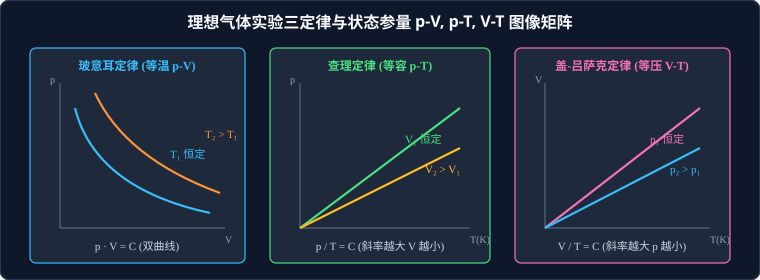

# 02 · 气体实验三定律与状态方程

## 核心物理概念与内涵

> [!NOTE]
> 本节严格遵循人教版物理选择性必修第三册体系，结合理想气体微观动力学分子碰撞模型，全面推导气体三大实验定律，构建全状态参量演化图像，阐明绝对温标与微观压强本质。

### 1. 描述气体的三个基本宏观状态参量

气体的宏观物理状态由压强、体积和温度三个状态参量完全唯一确定：

1. **压强（Pressure, $p$）**：
   * 单位面积上所受的气体垂直碰撞压力，国际单位为帕斯卡（$\text{Pa}$），$1\,\text{Pa} = 1\,\text{N/m}^2$；
   * 常用辅助单位：标准大气压（$1\,\text{atm} = 1.013 \times 10^5\,\text{Pa}$）、毫米汞柱（$1\,\text{mmHg} = 133.3\,\text{Pa}$，且 $76\,\text{cmHg} \approx 1.013 \times 10^5\,\text{Pa}$）。
2. **体积（Volume, $V$）**：
   * 气体分子能够自由运动达到的整个容器容积；
   * 单位换算：$1\,\text{m}^3 = 10^3\,\text{dm}^3 = 10^3\,\text{L} = 10^6\,\text{cm}^3 = 10^6\,\text{mL}$。
3. **热力学温度（Thermodynamic Temperature, $T$）**：
   * 国际单位制中采用开尔文（$\text{K}$），与摄氏温度 $t$（$^\circ\text{C}$）的严格换算关系：
     $$T = t + 273.15\,\text{K} \approx t + 273\,\text{K}$$
   * **绝对温差守恒**：两种温标的单位刻度增量完全等值，即**温差严格相等**：
     $$\Delta T = \Delta t$$
   * **绝对零度（$0\,\text{K} = -273.15^\circ\text{C}$）**：物质分子热运动停止的理论极限温度。由热力学第三定律知，绝对零度只能无限逼近，绝不可能通过有限步骤真正达到。



---

## 气体实验三定律（一定质量某种理想气体）

### 1. 玻意耳定律（Boyle's Law，等温过程）
* **实验条件**：气体的**质量 $m$ 一定**且**温度 $T$ 保持恒定**（等温过程，Isothermal Process）。
* **定律内容**：在温度不变的情况下，一定质量气体的压强跟它的体积成反比：
  $$p \cdot V = C \quad (\text{常数}) \implies p_1 V_1 = p_2 V_2$$
* **图像几何特征**：
  * $p - V$ 图线为**双曲线的一支**（等温线）；离原点越远的双曲线，对应的温度 $T$ 越高（$T_2 > T_1$）；
  * $p - \dfrac{1}{V}$ 图线为**过坐标原点的正比例倾斜直线**，斜率 $k = C \propto T$。

---

### 2. 查理定律（Charles's Law，等容过程）
* **实验条件**：气体的**质量 $m$ 一定**且**体积 $V$ 保持恒定**（等容过程，Isochoric Process）。
* **定律内容**：在体积不变的情况下，一定质量气体的压强跟它的热力学温度成正比：
  $$\frac{p}{T} = C \quad (\text{常数}) \implies \frac{p_1}{T_1} = \frac{p_2}{T_2}$$
* **图像几何特征**：
  * $p - T$ 图线为**过坐标原点的正比例射线**（反向延长线必须精确穿过绝对零度 $0\,\text{K}$）；
  * **图线斜率的物理意义**：图线斜率 $k = \dfrac{p}{T} \propto \dfrac{1}{V}$，**斜率越大的图线对应的体积 $V$ 越小**（$V_1 < V_2$）！

---

### 3. 盖-吕萨克定律（Gay-Lussac's Law，等压过程）
* **实验条件**：气体的**质量 $m$ 一定**且**压强 $p$ 保持恒定**（等压过程，Isobaric Process）。
* **定律内容**：在压强不变的情况下，一定质量气体的体积跟它的热力学温度成正比：
  $$\frac{V}{T} = C \quad (\text{常数}) \implies \frac{V_1}{T_1} = \frac{V_2}{T_2}$$
* **图像几何特征**：
  * $V - T$ 图线为**过坐标原点的正比例射线**（反向延长线精确过 $0\,\text{K}$）；
  * **图线斜率的物理意义**：图线斜率 $k = \dfrac{V}{T} \propto \dfrac{1}{p}$，**斜率越大的图线对应的压强 $p$ 越小**（$p_1 < p_2$）！

---

## 理想气体状态方程（Ideal Gas Law）

将玻意耳定律、查理定律和盖-吕萨克定律综合联立，推导出普遍适用的**理想气体状态方程**：

对于一定质量的某种理想气体，无论其状态经历何种复杂变化，初末状态恒满足：
$$\frac{p_1 V_1}{T_1} = \frac{p_2 V_2}{T_2} = \text{恒定常数}$$

### 克拉珀龙方程（Clapeyron Equation）
若引入气体的物质的量 $n$（摩尔数 $n = \dfrac{m}{M}$），普适方程写为：
$$p V = n R T = \frac{m}{M} R T$$
* 式中 $R$ 为普适摩尔气体常数（Molar Gas Constant）：
  $$R \approx 8.314\,\text{J}/(\text{mol}\cdot\text{K})$$

---

## 气体压强的微观物理机理

为什么气体能够对容器壁产生持续稳定的压强？从微观统计物理审视：

```
       容器壁  │   ← (v₁)
               │ 碰撞器壁产生冲量 Δp = 2mv
               │   ← (v₂)
```

### 1. 微观动量冲量模型
气体分子以极高的速率（数百米每秒）在容器内无规则飞驰。大量分子以极其频繁的频次撞击器壁，每次分子被器壁弹性反弹，动量发生改变（$\Delta p = 2m_0 v$），器壁对分子施加撞击力，根据牛顿第三定律，分子同时对器壁施加反作用冲力。
每秒钟有数以百亿亿计的微观碰撞持续轰击器壁，在宏观上就表现为**均匀、恒定且持续的压力与压强**！

### 2. 决定气体压强的两大微观决定因素

> [!IMPORTANT]
> **气体压强的两大微观判据（宏观微观映射表）**：
> 1. **气体分子的平均动能 $\bar{E}_k$**：**由宏观温度 $T$ 唯一决定**！温度越高，分子热运动平均速率越大，单个分子撞击器壁时的动量改变量越大，平均每次冲撞的瞬时冲击力越强；
> 2. **单位体积内的分子数密度 $n = \dfrac{N}{V}$**：**由宏观体积 $V$ 决定**！气体体积越小，单位空间内的分子越密集，单位时间内撞击在单位面积器壁上的分子碰撞频次越多。

* **宏微观综合解析**：
  * **等温压缩（$T$ 不变，$V$ 减小）**：分子平均动能不变，但分子数密度 $n$ 增大，撞击频次激增，故宏观压强 $p$ 增大（玻意耳定律）；
  * **等容升温（$V$ 不变，$T$ 升高）**：分子数密度不变，但分子平均动能增大，每次撞击力度增大，故宏观压强 $p$ 增大（查理定律）。

---

## 高频易错盲区与避坑指南

* [×] **误区 1**：在套用查理定律或状态方程计算时，直接将摄氏温度 $t$ 代入公式，如写 $\dfrac{p_1}{t_1} = \dfrac{p_2}{t_2}$。
  > [√] **正解**：三大定律和状态方程中的温度必须**无条件全部使用开尔文绝对温度 $T = t + 273\,\text{K}$**！使用摄氏度代入计算是彻底的零分错误。

* [×] **误区 2**：认为在任何温度和压强下，所有真实气体都严格满足理想气体状态方程。
  > [√] **正解**：理想气体是忽略分子间作用力与分子自身体积的理想模型。真实气体（如氮气、氧气）只有在**高温、低压（稀薄）**的极限条件下，分子间距极大且动能远超势能，才能近似看作理想气体。在低温高压下，真实气体与状态方程偏差显著。
