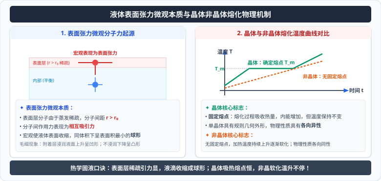

# 03 · 固体、液体与物态变化

<div style="text-align: center; margin: 20px 0;">
  
</div>

## 核心物理概念与内涵

> [!NOTE]
> 本节严格遵循人教版物理选择性必修第三册体系，结合微观晶格点阵取向、表面分子势能微观力场与动态相平衡理论，全面解构固态晶格对称性、液体界面张力与气液相变规律。

### 1. 固体的分类与微观结构

宏观固体通常分为**晶体**和**非晶体**两大类，晶体又细分为单晶体和多晶体：

| 物质类别 | 天然几何外形 | 熔点特征 | 物理性质各向异性 / 各向同性 | 微观晶格空间结构 | 典型代表物质 |
| :--- | :--- | :--- | :--- | :--- | :--- |
| **单晶体（Single Crystal）** | **具有规则的天然对称多面体外形** | **具有确定恒定的熔点** | **各向异性（Anisotropy）**（在导电、导热、机械硬度、光的折射率等方向上性质不同） | 内部微观分子、原子或离子按严格空间点阵周期性空间平移对称排列 | 食盐（氯化钠方块晶体）、石英水晶、单晶硅、云母片 |
| **多晶体（Polycrystal）** | **没有规则的天然外形** | **具有确定恒定的熔点** | **各向同性（Isotropy）**（微观晶粒取向杂乱无章，宏观平均抵消） | 由海量微小的单晶体杂乱无章、无序拼合聚集而成 | 绝大多数金属（铁、铜、铝合金块）、多晶硅电池片 |
| **非晶体（Amorphous Solid）** | **没有规则的天然外形** | **没有固定的熔点**（随温度升高逐渐变软稀释，连续过渡） | **各向同性（Isotropy）** | 内部微观质点排列完全杂乱无序（短程有序，长程完全无序） | 普通玻璃、石蜡、沥青、塑料、松香 |

* **各向异性的微观本质（以云母片受热为例）**：
  在云母片表面涂一层薄石蜡，用烧热的细铁针针尖接触背面，石蜡融化形成的熔化斑呈现**椭圆形**（表明在不同方向上导热性能不同）；而玻璃板上熔化斑呈现**正圆形**（各向同性）。这直接证明了晶体内部在不同轴线方向上的原子排列间距和键合强度具有方向依赖性。

---

## 液体的表面张力与微观机理

液体具有流动性，微观上呈现“短程有序、长程无序”的结构特征。

### 1. 表面张力（Surface Tension）的微观形成机理

在液体与气体接触的自由分界面处，存在着一层极薄的液体层（厚度约为分子有效引力范围 $10^{-9}\,\text{m}$），称为**液体表面层**。

```
     【空气/气体空间】
     ──────────────────────── 液体表面层 (分子较稀疏，间距 r > r₀)
      (•)       (•)       (•)  ──► 分子合力表现为强烈吸引力 F_引！
     ────────────────────────
     【液体内部】 (分子排列紧密，间距 r = r₀，受各方向分子吸引力对称平衡 F=0)
```

1. **分子数密度稀疏**：由于液体表面上方的气体分子密度远低于液体内部，表面层液体分子受到向外的吸引力极弱，导致表面层分子密度小于液体内部；
2. **分子间距大于平衡间距**：表面层分子间的平均间距**大于分子力平衡距离 $r_0$**（即 $r > r_0$）；
3. **合力表现为强烈引力**：根据分子力曲线，当 $r > r_0$ 时，分子力表现为**相互吸引力**；
4. **宏观收缩效果**：
   > **表面张力宏观表现**：表面张力沿着液体的表面切线方向分布，使液体表面就像一张**处于紧绷张力状态的弹性膜**，促使液体表面具有**自动收缩至最小可能表面积的内禀趋势**！

### 2. 经典生活与工程物理现象
* **水滴和肥皂泡自发收缩为球形**：在几何拓扑学中，在体积相同的条件下，**正球体的表面积最小**！因此在失重环境下的水滴、微小水银珠及空中飘浮的肥皂泡，在表面张力的自发收缩驱动下，全部呈现极其圆润的正球体；
* **水黾在水面行走**：轻质水黾的脚爪涂有油脂，踏在紧绷的水面表面层薄膜上压出微小凹面，表面张力的竖直向上分力稳稳托举住其身体体重。

---

## 浸润、不浸润与毛细现象

当液体与固体容器壁接触时，在固-液-气三相接触处展现出截然不同的界面物理现象：

### 1. 浸润与不浸润的分子力判据
* **附着层**：贴近固体表面的极薄液体层；
* **浸润（Wetting）**：
  * **微观判据**：固体分子对液体分子的吸引力（**附着力**）**大于**液体自身分子间的**内聚力**；
  * 附着层分子较液体内部更密集（$r < r_0$），产生向外的排斥斥力，使附着层面积扩展蔓延；
  * **宏观特征**：液体润湿固体表面铺展开来；在毛细玻璃管壁处液面**向上爬升边缘形成凹月面**，接触角 $\theta < 90^\circ$（如水浸润玻璃）。
* **不浸润（Non-wetting）**：
  * **微观判据**：固体分子对液体分子的**附着力小于内聚力**；
  * 附着层分子稀疏（$r > r_0$），产生表面收缩引力；
  * **宏观特征**：液体在固体表面凝结成球状滚落；在玻璃管壁处**向下弯曲形成凸月面**，接触角 $\theta > 90^\circ$（如水银不浸润玻璃，水不浸润荷叶）。

### 2. 毛细现象（Capillarity）
* 浸润液体在极细的毛细管中**自发向上攀升**，管径越细，液面上升高度越高；
* 不浸润液体在毛细管中**自发向下降低**；
* **工程与农业应用**：植物根茎依靠木质部导管微小毛细管将水分养分运送至数十米高的树梢叶片；毛巾吸水、粉笔吸墨水；农业春耕“松土保墒”（利用锄头翻松地表土壤，破坏土壤形成的天然细密毛细管通道，阻断地下深层水分向上蒸发流失）。

---

## 饱和汽、饱和汽压与空气相对湿度

### 1. 饱和汽与动态相平衡
在密闭容器中，液体分子不断从自由液面逃逸飞出（**蒸发**），同时上方蒸汽中的分子又不断撞击液面被液体捕获重新拉回（**凝结**）。
* **动态相平衡（Dynamic Equilibrium）**：当单位时间内飞出液面的分子数恰好等于回到液体内部的分子数时，汽化与液化达到动态平衡；
* 处于动态平衡状态下的蒸汽称为**饱和汽（Saturated Vapor）**；未达到动态平衡的蒸汽称为**未饱和汽**。

### 2. 饱和汽压（Saturated Vapor Pressure）的绝对决定因素

饱和汽分子碰撞产生的压强称为**饱和汽压**。

> [!IMPORTANT]
> **高考饱和汽压核心铁律**：
> 某种液体的饱和汽压**仅仅且完全由该液体的温度 $T$ 和物质本身种类唯一决定，与饱和汽的体积大小绝对无关，与容器内是否存在空气等其他气体绝对无关！**

* **温度对饱和汽压的剧烈影响**：温度升高时，液体分子平均热运动动能激增，单位时间飞出液面的分子数急剧飙升，必须建立在更高数密度的气相空间才能恢复动态平衡，因此**饱和汽压随温度升高呈指数级剧烈增大**！
* **沸腾的物理本质**：当液体的饱和汽压升高到**等于外界大气的环境压强**时，液体不仅在表面蒸发，在液体内部也自发剧烈形成大量气泡向上翻滚爆裂，此时发生的剧烈汽化即为**沸腾**（高原气压低，水的沸点低于 $100^\circ\text{C}$；高压锅提高气压，水的沸点超过 $120^\circ\text{C}$）。

### 3. 绝对湿度与相对湿度（Relative Humidity, RH）
* **绝对湿度**：空气中水蒸气的实际压强 $p$；
* **相对湿度（Relative Humidity）**：空气中水蒸气的实际压强 $p$ 与**同温度下水的饱和汽压 $p_s$** 的百分比：
  $$\text{RH} = \frac{p}{p_s(T)} \times 100\%$$
* **人体舒适度判据**：
  人体对空气潮湿或干燥的体感感觉，**完全取决于相对湿度，而不是绝对湿度**！
  * 夏季尽管实际绝对含水量 $p$ 很大，但由于气温极高、饱和汽压 $p_s$ 更大，若相对湿度很低（如仅 $30\%$），人体排汗蒸发极快，依然感觉空气干燥；
  * 冬季尽管实际绝对水汽压 $p$ 很小，但因温度极低、饱和汽压 $p_s$ 极小，相对湿度可高达 $90\%$，人会感觉湿冷难耐。

---

## 高频易错盲区与避坑指南

* [×] **误区 1**：认为多晶体既然是晶体，就一定具有各向异性。
  > [√] **正解**：只有**单晶体**才具有各向异性！多晶体由海量微晶粒杂乱组合而成，各微晶粒的取向随机均摊，宏观统计上表现为完全的**各向同性**。

* [×] **误区 2**：密闭容器中盛有水和饱和水蒸气，在保持恒温的情况下，将活塞向上拉开使容器体积翻倍，认为水蒸气压强减半。
  > [√] **正解**：恒温下液体的饱和汽压只由温度决定，与体积无关！拉大体积瞬间未饱和，水会继续蒸发直至重新恢复该温度下的原饱和汽压 $p_s$，压强保持恒定不变（直到水完全蒸发殆尽才退化为理想气体状态）。
