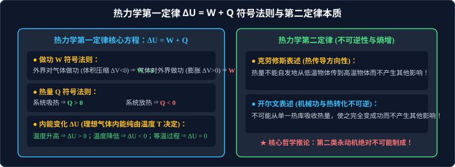

# 04 · 热力学定律与能量守恒

## 核心物理概念与内涵

> [!NOTE]
> 本节严格遵循人教版物理选择性必修第三册体系，引入统计物理微观多重度与克劳修斯熵增视角，系统解析能量守恒在宏观热学中的体现（热一律）以及宏观自发演化过程的方向性与极限（热二律）。

### 1. 改变物体内能的两种物理途径

内能是系统内部所有分子动能和分子势能的总和。改变物体内能有两种截然不同的物理方式：

1. **做功（Work）**：
   * **能量本质**：其他形式的能量（如机械能、电能、化学能）与内能之间的**相互转化**；
   * **力学做功过程**：外界压缩气体对气体做功，机械能转化为内能，气体内能增加；气体膨胀推活塞对外做功，内能转化为机械能，气体内能减小。
2. **热传递（Heat Transfer）**：
   * **能量本质**：内能从高温物体转移到低温物体，或从物体的高温部分转移到低温部分的**内能直接转移**；
   * **热量（Heat, $Q$）**：热传递过程中转移内能多少的量度（单位为焦耳 $\text{J}$）。物体本身**只有内能，没有热量**！热量只存在于热传递的动态过程之中。
3. **等效性铁律（焦耳热功当量实验）**：
   英国物理学家焦耳通过搅拌水测水温实验证明：**做功和热传递在改变物体内能的效果上是完全等效的**！
   $$1\,\text{cal} \approx 4.184\,\text{J} \quad (\text{热功当量})$$

---

## 热力学第一定律（First Law of Thermodynamics）

热力学第一定律是**能量守恒与转化定律在热现象领域的精准代数表达**。

* **定律内容**：一个热力学系统的内能增量，等于外界对系统做的功与系统从外界吸收的热量之和。
* **核心数学方程**：
  $$\Delta U = W + Q$$

### 高考黄金生命线：三大物理量的正负号法则

在应用 $\Delta U = W + Q$ 解题时，必须无条件服从以下正负符号规范：

| 物理量 | 正号（$+$）物理判定 | 负号（$-$）物理判定 | 典型特殊零值热力学过程 |
| :--- | :--- | :--- | :--- |
| **做功 $W$** | **外界对系统做功**（体积被压缩：$\Delta V < 0$） $\implies W > 0$ | **系统对外界做功**（体积膨胀推开外界：$\Delta V > 0$） $\implies W < 0$ | **等容过程（$\Delta V = 0$）**：气体不膨胀不收缩，外界不做功：$W = 0$ |
| **热量 $Q$** | **系统从外界吸收热量**（吸热） $\implies Q > 0$ | **系统向外界释放热量**（放热） $\implies Q < 0$ | **绝热过程（Adiabatic Process）**：与外界完全绝热无热交换：$Q = 0$ |
| **内能变化 $\Delta U$** | **系统内能增加**（对于理想气体，**温度升高 $T \uparrow$**） $\implies \Delta U > 0$ | **系统内能减少**（对于理想气体，**温度降低 $T \downarrow$**） $\implies \Delta U < 0$ | **等温过程（$\Delta T = 0$）**：理想气体内能不变：$\Delta U = 0 \implies Q = -W$ |

---

## 典型热力学过程的综合能量判据

1. **绝热压缩（如迅速向下按压活塞点燃棉花）**：
   * 动作极其迅速，来不及向外散热：$Q = 0$；
   * 活塞压缩气体，外界对气体做正功：$W > 0$；
   * 由 $\Delta U = W + Q = W > 0 \implies$ 气体内能暴增，温度剧烈上升达到棉花燃点，棉花自发剧烈燃烧！
2. **绝热膨胀（如高压开香槟喷气白雾）**：
   * 气体迅速对外膨胀喷出：$W < 0$；
   * 绝热条件：$Q = 0$；
   * 由 $\Delta U = W < 0 \implies$ 气体温度急剧骤降，周围水蒸气瞬间液化形成白色冷凝雾滴！

---

## 热力学第二定律（Second Law of Thermodynamics）

热力学第一定律解决了“能量守恒”问题，但自然界的一切能量转化过程并非只要守恒就能任意双向自发进行！

> **宏观不可逆性原理**：
> **一切与热现象有关的宏观自然过程，都具有不可逆的方向性（Directionality of Nature）！**

### 1. 两大经典权威表述形式

#### A. 克劳修斯表述（Clausius Statement，揭示热传导的方向性）
> **定律表述**：**热量不能自发地从低温物体传到高温物体，而不产生其他影响。**
* **深度哲学辨析**：
  * 热量可以**自发**地从高温物体传到低温物体（无需外界施加任何补偿功）；
  * 热量**也可以**从低温传到高温（如家用空调、冰箱将冷冻室低温热量泵入室外高温空气），但这是**非自发过程**，必须以**外界压缩机消耗电功做功为不可或缺的代价**（产生了“消耗电能”的其他影响）！

#### B. 开尔文表述（Kelvin Statement，揭示机械功与热能转换的方向性）
> **定律表述**：**不可能从单一热库吸收热量，使之完全变成功，而不产生其他影响。**
* **深度哲学辨析**：
  * 机械功可以**自发且 $100\%$ 完全转化为热量**（如刹车摩擦生热）；
  * 但热量**绝不可能在没有冷源排放废热的前提下 $100\%$ 转化为机械有用功**！
  * **热机效率极限（卡诺定理）**：任何热机工作必须在高温热源（温度 $T_{\text{高}}$）吸收热量 $Q_1$，向低温冷库（温度 $T_{\text{低}}$）排放废热 $Q_2$，输出净功 $W = Q_1 - Q_2$。热机极限效率恒满足：
    $$\eta = \frac{W}{Q_1} = 1 - \frac{Q_2}{Q_1} \le 1 - \frac{T_{\text{低}}}{T_{\text{高}}} < 100\%$$

---

## 永动机神话的彻底破灭：第一类 vs 第二类永动机

| 永动机类别 | 制造企图与运作设想 | 违背的物理定律 | 科学结论判据 |
| :--- | :--- | :--- | :--- |
| **第一类永动机** | 不消耗任何外界能量，却能源源不断、无休止地对外输出机械有用功 | **违背热力学第一定律（能量守恒定律）** | **绝对不可能制成**！无中不能生有 |
| **第二类永动机** | **完全遵守能量守恒定律**！企图设计一台热机，直接从浩瀚的海洋或大气单一恒温热库吸取巨大内能，将内能 $100\%$ 转化为有用功驱动轮船或飞机航行 | **违背热力学第二定律（违背宏观热现象过程的不可逆性）** | **绝对不可能制成**！热量不能无损变成功 |

---

## 微观统计物理与玻尔兹曼“熵增加原理”

奥地利物理学家玻尔兹曼（Ludwig Boltzmann）从统计力学揭示了热力学第二定律的微观本质：

* **玻尔兹曼熵公式（刻在玻尔兹曼墓碑上的伟大公式）**：
  $$S = k_B \ln \Omega$$
  式中 $k_B$ 为玻尔兹曼常数，$\Omega$ 为系统对应的**微观微观状态数（多重度）**；
* **熵（Entropy, $S$）的物理内涵**：衡量系统内部微观无规则混乱程度的物理量。微观状态数越多，分子排布越混乱，系统的熵值越大；
* **孤立系统的熵增加原理**：
  在与外界没有能量和物质交换的**孤立系统内部**，一切自发的不可逆宏观过程，必然朝着微观状态数更多、无序度更高的方向演变，即**孤立系统的熵恒单调递增**：
  $$\Delta S_{\text{孤立}} \ge 0$$
  （整齐有序的墨水滴入水中自发扩散成混乱均匀的墨水溶液；打碎的玻璃杯绝不可能自发恢复如初，这就是“时间之箭”单向流淌的宇宙热力学根基！）。

---

## 高频易错盲区与避坑指南

* [×] **误区 1**：认为第二类永动机违反了能量守恒定律。
  > [√] **正解**：第二类永动机在能量代数计算上**完全符合能量守恒**！它违反的是热现象的**方向性规律（热力学第二定律）**。

* [×] **误区 2**：气体对外膨胀时，内能一定减小。
  > [√] **正解**：根据 $\Delta U = W + Q$，虽然对外膨胀做功使 $W < 0$，但如果在此过程中外界向气体大量加热吸热（$Q > |W|$），气体的内能不仅不减小，反而会大幅增加！
