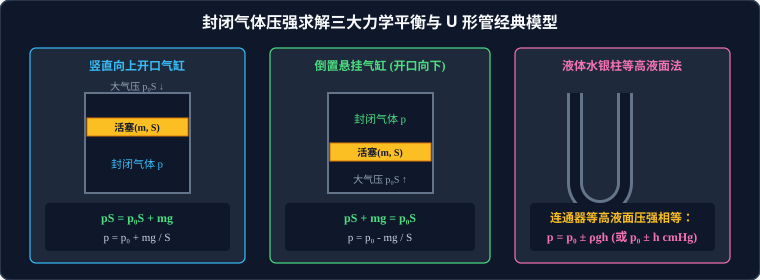

# 考点 · 封闭气体压强计算与活塞气缸热力学循环

## 考点模型深度解析

> [!IMPORTANT]
> 封闭气体压强计算、活塞气缸力热综合与热力学循环做功，是历年高考物理全国卷和各省新高考卷压轴计算题的兵家必争之地。
> 此类试题的解题关键在于**“力学受力平衡与热学状态方程的无缝咬合”**，不仅要求熟练列出活塞的牛顿平衡方程或水银柱的压强平衡式，还需结合热力学第一定律 $\Delta U = W + Q$ 和 $p-V$ 图线面积，对气体的做功、吸放热及内能进行全景定量求解。



---

## 封闭气体压强的两大经典算法体系

求解被活塞、水银柱封闭的气体压强，必须根据边界介质属性选择对应的物理模型：

### 体系 1：固体活塞/气缸力学平衡分析法（隔离受力法）

将处于静止或匀速运动状态的**轻活塞（或重活塞、气缸壁）**作为隔离分析对象，沿运动方向建立坐标轴列出力学平衡方程：

#### 1. 竖直向上开口气缸（活塞质量 $m$、截面积 $S$，大气压 $p_0$）
* 活塞受力：外界大气压力 $p_0 S$ 竖直向下、活塞自重 $mg$ 竖直向下、气缸内部气体压力 $p S$ 竖直向上；
* 平衡方程：
  $$p S = p_0 S + m g \implies p = p_0 + \frac{m g}{S}$$

#### 2. 竖直倒扣开口向下气缸（活塞悬挂封闭气体）
* 活塞受力：内部气体压力 $p S$ 向下、活塞重力 $mg$ 向下、外界大气压力 $p_0 S$ 向上；
* 平衡方程：
  $$p S + m g = p_0 S \implies p = p_0 - \frac{m g}{S}$$

#### 3. 倾斜光滑导轨气缸（与水平面夹角为 $\theta$）
* 沿斜面方向受力平衡：
  $$p S = p_0 S + m g \sin\theta \implies p = p_0 + \frac{m g \sin\theta}{S}$$

#### 4. 加速度为 $a$ 的动力学非平衡气缸（牛顿第二定律）
若气缸随升降机以加速度 $a$ 向上加速运动，由牛顿第二定律：
$$p S - (p_0 S + m g) = m a \implies p = p_0 + \frac{m (g + a)}{S}$$
（超重状态气压增大；若完全失重 $a = -g$，则 $p = p_0$）。

---

### 体系 2：水银液体柱平衡与“等高液面法”（连通器原理）

对于封闭有水银柱的玻璃弯管、U 型管或水银槽：

> **流体力学等高液面定理**：
> 在**同一种连续静止的液体内部**，处于**同一水平高度的各点压强必定严格相等！**

* **求解规范步骤**：
  1. 在左右两管中寻找连通的同种液体最低分界面，作水平参考基准线；
  2. 列出左侧参考液面压强 $p_{\text{左}}$ 与右侧参考液面压强 $p_{\text{右}}$；
  3. 由 $p_{\text{左}} = p_{\text{右}}$ 建立代数方程。
* **单位极速速算技巧**：
  在高考答题中，若水银柱高度差为 $h\,\text{cm}$，外界大气压表示为 $p_0 = 76\,\text{cmHg}$：
  * 直接采用“$\text{cmHg}$”作为压强单位运算，无需反复乘以水银密度 $\rho$ 和 $g$：
    $$p = p_0 + h \quad (\text{单位：}\text{cmHg}) \quad \text{或} \quad p = p_0 - h \quad (\text{单位：}\text{cmHg})$$
  * 只有在代入能量公式 $W = p \Delta V$ 或状态方程求摩尔数时，才统一换算回国际单位制帕斯卡（$1\,\text{cmHg} \approx 1.33 \times 10^3\,\text{Pa}$）。

---

## 气缸活塞力热综合题“四步标准化破题范式”

面对复杂多状态变化的气缸大题，严格遵循以下四步：

```
[第一步：明对象] 锁定被密封的目标理想气体，确认其质量守恒 (未发生漏气、抽气)
        │
[第二步：列状态] 规整列出初末态全部状态参量：
                 • 初始状态 1：压强 p₁、体积 V₁ = S · L₁、热力学温度 T₁ = t₁ + 273 K
                 • 最终状态 2：压强 p₂、体积 V₂ = S · L₂、热力学温度 T₂ = t₂ + 273 K
        │
[第三步：选方程] 根据物理过程性质选用对应定律，若三参量全变则列综合方程：
                 (p₁ · V₁) / T₁ = (p₂ · V₂) / T₂
        │
[第四步：联闭环] 联立活塞几何位移约束与热力学第一定律方程：
                 • 位移关联：ΔV = S · Δx
                 • 功能关系：ΔU = W + Q  (等压膨胀时对外做功 W = -p · ΔV)
```

---

## 气体热力学循环与 $p-V$ 面积定理

在工程热力学中，工质气体常经历一系列吸热、膨胀做功、放热压缩的闭合周期性循环（如卡诺循环、奥托内燃机循环）。

### 1. 过程微元做功几何意义
当气体在压强为 $p$ 下发生微小体积变化 $dV$ 时，气体对外做的微元机械功为：
$$dW = F dx = (p S) dx = p (S dx) = p dV$$
在 $p - V$ 坐标系中，从状态 $A$ 到状态 $B$ 的总功等于图线下方微元矩形面积的积分：
$$W_{\text{对外界}} = \int_{V_A}^{V_B} p dV$$
> **做功正负的几何判据**：
> * 沿图线向右进行（膨胀 $V_B > V_A$）：气体对外做**正功**，对应面积为正；
> * 沿图线向左进行（压缩 $V_B < V_A$）：外界对气体做正功（气体对外做**负功**），对应面积为负。

### 2. 闭合热力学循环“净功面积定理”
对于一个封闭完整的顺时针热力学循环（热机正循环）：
* 上方膨胀过程气体对外做正功（大面积）；
* 下方压缩过程外界对气体做功（小面积）；
* **核心推论**：
  > **闭合曲线所包围的封闭几何图形的代数面积，精确等于系统在这一完整循环中对外输出的净机械有用功 $W_{\text{净}}$！**
  > $$W_{\text{净}} = S_{\text{闭合图形}}$$

---

## 变质量气体模型三大拆解转化法

当遇到打气、抽气或两个气缸混合连通问题时，气体质量不再守恒，不能直接套用状态方程，必须运用**“转化等效法”**：

### 1. 打气模型（充气问题）
* **转化思路**：把每次打入的外部气体，连同容器内原有的气体，**整体打包合并为一个单一的庞大等质量系统**！
* 设打气筒每次能打入压强为 $p_0$、体积为 $V_0$ 的气体，打气 $n$ 次后充入容器（容积为 $V$）。
* 等温过程列玻意耳方程：
  $$p_{\text{原}} V + n p_0 V_0 = p_{\text{末}} V$$

### 2. 抽气模型（真空泵问题）
* **转化思路**：设容器容积为 $V$，抽气筒每次能抽出体积为 $\Delta V$ 的气体。
* 每次抽气本质是让原气体等温膨胀到 $V + \Delta V$ 的空间，然后再将 $\Delta V$ 切除丢弃：
  * 第 1 次抽气：$p_1 (V + \Delta V) = p_0 V \implies p_1 = \left(\dfrac{V}{V + \Delta V}\right) p_0$；
  * 第 $n$ 次抽气后的剩余压强通项公式：
    $$p_n = \left(\frac{V}{V + \Delta V}\right)^n p_0$$

---

## 高考答题防失分守则

1. **状态参量标注必须规范**：在解题卷开头必须明确写出“设初态压强为 $p_1$、体积为 $V_1$、温度为 $T_1$；末态为 $p_2, V_2, T_2$”，并逐一交代数值与单位；
2. **压强求解必须交代受力平衡方程**：严禁直接写出 $p = 1.2 \times 10^5\,\text{Pa}$，必须先写出活塞受力平衡式 $p_1 S = p_0 S + mg$，再代入数值；
3. **严格区分热力学第一定律的符号**：体积膨胀对外做功必须在方程中写作 $W = -p \Delta V$，吸热写 $Q > 0$，不可混淆。
