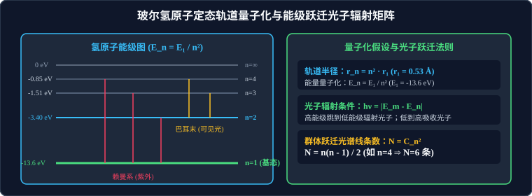

# 02 · 玻尔原子模型与能级跃迁

## 核心物理概念与内涵

> [!NOTE]
> 本节严格遵循人教版物理选择性必修第三册体系，引入微观角动量量子化与库仑向心力平衡推导，全面解构卢瑟福核式模型、玻尔三大原子假设及氢原子能级跃迁规律。

### 1. 卢瑟福 $\alpha$ 粒子散射实验与原子核式结构

在 20 世纪初，汤姆孙提出的“枣糕模型”（正电荷均匀分布，电子如葡萄干镶嵌其中）占据主导。1909 年，英国物理学家卢瑟福（Ernest Rutherford）指导盖革和马斯登进行了著名的 **$\alpha$ 粒子散射实验**。

* **实验装置与现象**：
  用高速 $\alpha$ 粒子束（氦核，带 $+2e$ 电荷）轰击极薄的金箔：
  1. **绝大多数** $\alpha$ 粒子穿过金箔后，几乎沿原方向前进，偏转角极小；
  2. **少数** $\alpha$ 粒子发生了较大角度的偏转；
  3. **极少数（约八千分之一）** $\alpha$ 粒子发生了超过 $90^\circ$ 的大角度偏转，甚至个别粒子被原路反弹回来！
* **卢瑟福的惊世结论：原子的核式结构模型（1911年）**：
  * 如果是枣糕模型，正电荷均匀稀疏，绝对不可能提供足以弹回高能 $\alpha$ 粒子的超强电场！
  * **核式模型内容**：在原子的中心有一个极小的核心——**原子核（Nucleus）**，原子的**全部正电荷和几乎全部质量都集中在原子核里**，带负电的电子在核外广阔的空间里绕核旋转。
  * **原子尺度的极致悬殊**：原子整体直径数量级约为 **$10^{-10}\,\text{m}$**，而原子核直径仅约为 **$10^{-15} \sim 10^{-14}\,\text{m}$**（体积只占原子的万亿分之一，原子内部极其空旷！）。

### 2. 经典电磁理论在原子结构上的两大“死穴”
卢瑟福模型极其直观，但遭遇了经典麦克斯韦电磁理论的致命阻击：
1. **原子稳定性危机**：电子绕核旋转具有向心加速度。按经典理论，做加速运动的电荷必然持续不断向外辐射电磁波，电子能量持续衰减，轨道半径将在一瞬间（约 $10^{-10}\,\text{s}$）螺旋坍缩坠入原子核，世界上的一切物质原子根本不可能稳定存在！
2. **连续光谱危机**：电子轨道连续衰减，辐射出的电磁波频率应该连续分布，但实验测得的所有气态原子的光谱都是**分立、断续的明锐线状谱**！

---

## 玻尔原子模型的三大基本假设（Bohr's Postulates）

1913 年，丹麦物理学家尼尔斯·玻尔（Niels Bohr）大胆将普朗克和爱因斯坦的量子化概念引入原子理论，建立了量子化原子模型：

### 1. 定态假设（Stationary States）
* 原子只能处于一系列不连续的能量状态中，这些确定的能量状态称为**定态（Stationary States）**；
* **核心物理突破**：在这些定态中，电子虽然在库仑引力下绕核做加速圆周运动，但**绝对不向外界辐射能量**！因此原子能够稳定存在。

### 2. 跃迁假设（Frequency Condition）
* 当电子从一个定态（能量为 $E_m$）跃迁到另一个定态（能量为 $E_n$）时，才会辐射或吸收一定频率的光子；
* 光子的能量严格等于两定态能级的能量差，即**玻尔频率条件**：
  $$h \nu = |E_m - E_n|$$
  * **向下跃迁（$E_m > E_n$）**：电子从高能级跃迁到低能级，系统能量减小，向外界**辐射光子**；
  * **向上跃迁（$E_n < E_m$）**：电子从低能级跃迁到高能级，吸收外界能量，**吸收光子**。

### 3. 轨道量子化假设（Quantized Orbits）
* 电子绕核运动的轨道半径不是任意连续的，只能取某些分立的数值；
* 电子在轨道上运动的轨道角动量必须是 $\dfrac{h}{2\pi}$ 的整数倍：
  $$L = m v r = n \frac{h}{2\pi} \quad (n = 1, 2, 3, \dots)$$
  （式中正整数 $n$ 称为**主量子数**）。

---

## 氢原子轨道半径与能级公式推导

根据经典库仑力充当向心力：
$$\frac{k e^2}{r^2} = m \frac{v^2}{r} \implies m v^2 r = k e^2$$
联立角动量量子化条件 $m v r = n \dfrac{h}{2\pi}$，消去速度 $v$：

### 1. 轨道半径量子化公式
$$r_n = n^2 r_1 \quad (n = 1, 2, 3, \dots)$$
* **基态轨道半径（玻尔半径）**：
  $$r_1 \approx 0.53 \times 10^{-10}\,\text{m} = 0.53\,\text{\AA}$$
* 各轨道半径成平方级飞跃：$r_2 = 4r_1$、$r_3 = 9r_1$、$r_4 = 16r_1 \dots$

### 2. 能量量子化公式（能级公式）
系统的总机械能等于电子绕核运动动能与电势能之和：
$$E = E_k + E_p = \frac{1}{2} m v^2 - \frac{k e^2}{r} = \frac{1}{2}\left(\frac{k e^2}{r}\right) - \frac{k e^2}{r} = -\frac{k e^2}{2r}$$
代入轨道半径 $r_n = n^2 r_1$：
$$E_n = \frac{1}{n^2} E_1 \quad (n = 1, 2, 3, \dots)$$

* **基态能级（Ground State，稳定性最高）**：
  $$E_1 = -13.6\,\text{eV}$$
* 各激发态能级值（Excited States）：
  * $n = 2$（第 1 激发态）：$E_2 = \dfrac{-13.6}{4} = -3.40\,\text{eV}$
  * $n = 3$（第 2 激发态）：$E_3 = \dfrac{-13.6}{9} \approx -1.51\,\text{eV}$
  * $n = 4$（第 3 激发态）：$E_4 = \dfrac{-13.6}{16} \approx -0.85\,\text{eV}$
  * $n \to \infty$（电离态，自由电子与原子核彻底分离）：$E_{\infty} = 0\,\text{eV}$。
* **氢原子的电离能**：将处于基态（$n=1$）的氢原子完全电离为自由质子和自由电子所需输入的最小能量为 **$13.6\,\text{eV}$**。

---

## 光子吸收 vs 实物粒子碰撞激发机制辨析

在高考中，考查氢原子从低能级跃迁到高能级时，对于“吸收光子”与“实物电子碰撞”有本质区别：

| 能量供给方式 | 能量吸收规则要求 | 物理机理剖析 |
| :--- | :--- | :--- |
| **入射光子激发** | **必须精确严格等于两能级差！**（$h\nu = E_m - E_n$） | 光子是量子化能量包，电子吸收光子是“全额吞没吸收”，能量多一点不行、少一点不行（**谐振共振吸收**）；只有当入射光子能量 $h\nu \ge 13.6\,\text{eV}$ 时，才能任意连续吸收并电离！ |
| **实物粒子碰撞激发（如电子轰击）** | **只需动能大于或等于两能级差即可！**（$E_k \ge E_m - E_n$） | 入射实物电子与原子发生**非弹性碰撞**，实物粒子只需将其携带的动能中刚好等于 $E_m - E_n$ 的一部分传递给核外电子，碰撞后实物粒子带走剩余动能飞离！ |

---

## 激发态原子跃迁辐射光谱线条数：组合数法宝

当一群处于高能级 $n$ 激发态的氢原子向低能级自发跃迁时，由于各个原子自发跃迁路径各不相同，可能向外辐射出多种不同频率的光子：

### 1. 大量（群体）氢原子的谱线条数
由排列组合知识，在 $n$ 个能级之间任意两两配对均能产生一条分立谱线：
$$N = C_n^2 = \frac{n(n - 1)}{2}$$

* **典型题型速查**：
  * 处于 $n = 3$ 激发态的大量氢原子跃迁：$N = C_3^2 = \dfrac{3 \times 2}{2} = 3$ 种；
  * 处于 $n = 4$ 激发态的大量氢原子跃迁：$N = C_4^2 = \dfrac{4 \times 3}{2} = 6$ 种；
  * 处于 $n = 5$ 激发态的大量氢原子跃迁：$N = C_5^2 = \dfrac{5 \times 4}{2} = 10$ 种。

### 2. 单个（单一）氢原子的谱线条数陷阱
> [!WARNING]
> **高考极高频审题陷阱**：
> 若题干明确注明是**“一个处于 $n=4$ 激发态的孤立氢原子”**：
> 单个原子每次只能选择一条特定的下落阶梯路径（如 $4 \to 3 \to 2 \to 1$ 或 $4 \to 2 \to 1$ 或 $4 \to 1$）！
> **单个氢原子最多只能辐射出 $n - 1$ 种不同波长的光子**（对于 $n=4$，最多只有 $4-1=3$ 种，绝不是 6 种）！

---

## 高频易错盲区与避坑指南

* [×] **误区 1**：认为用能量为 $10.5\,\text{eV}$ 的光子照射基态氢原子，可以使电子跃迁。
  > [√] **正解**：基态跃迁到 $n=2$ 需吸收 $13.6 - 3.40 = 10.2\,\text{eV}$；跃迁到 $n=3$ 需吸收 $13.6 - 1.51 = 12.09\,\text{eV}$。$10.5\,\text{eV}$ 的光子由于不能被原子能级差整除吸收，**原子对其完全透明，根本无法吸收该光子**！

* [×] **误区 2**：在计算波长最长或最短的光谱线时搞反方向。
  > [√] **正解**：光子能量 $\Delta E = h\nu = \dfrac{hc}{\lambda}$。**能级差 $\Delta E$ 最大的跃迁（如 $n=4 \to n=1$），释放的光子频率最高、波长 $\lambda$ 最短**；**能级差 $\Delta E$ 最小的相邻跃迁（如 $n=4 \to n=3$），释放的光子频率最低、波长 $\lambda$ 最长**！
