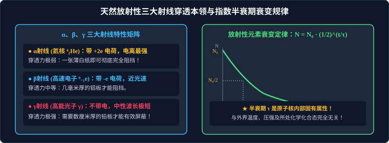

# 03 · 原子核与放射性衰变

## 核心物理概念与内涵

> [!NOTE]
> 本节严格遵循人教版物理选择性必修第三册体系，结合微观弱相互作用与原子核内部动力学转换，系统解析天然放射性发现历程、三大射线物理属性、衰变守恒法则及指数衰减统计半衰期律。

### 1. 天然放射现象与原子核内部结构的揭示

1896 年，法国物理学家贝克勒尔（Henri Becquerel）偶然发现铀盐能够自发发射出一种肉眼看不见、能穿透黑纸使照相底片感光的神秘射线，首次发现了**天然放射现象（Natural Radioactivity）**。随后居里夫妇（Pierre & Marie Curie）相继发现了放射性极强的新元素钋（Po）和镭（Ra）。

> [!IMPORTANT]
> **天然放射现象的划时代科学意义**：
> 电子的发现揭示了“原子是有复杂结构的”；而**天然放射现象的发现，则无可辩驳地揭示了“原子核内部同样具有复杂的微观结构”！**

### 2. 质子与中子的伟大实验发现

1. **质子的发现（卢瑟福，1919年）**：
   卢瑟福用高速 $\alpha$ 粒子轰击氮气分子，从核内部打出了一种新粒子——**质子（Proton, $^1_1\text{H}$）**：
   $$^{14}_7\text{N} + ^4_2\text{He} \longrightarrow ^{17}_8\text{O} + ^1_1\text{H}$$
   （人类历史上首次实现人工原子核转变！）。
2. **中子的发现（查德威克，1932年）**：
   查德威克用 $\alpha$ 粒子轰击铍靶，发现了穿透力极强、在电场磁场中绝不发生偏转的中性射线——**中子（Neutron, $^1_0\text{n}$）**：
   $$^9_4\text{Be} + ^4_2\text{He} \longrightarrow ^{12}_6\text{C} + ^1_0\text{n}$$
3. **原子核的结构符号**：
   原子核由带正电的**质子**和不带电的**中子**（统称**核子**，Nucleon）通过超强核力强相互作用紧密粘合而成：
   $$^A_Z\text{X}$$
   * $Z$ 为**原子序数（核电荷数 / 质子数）**；
   * $A$ 为**质量数（核子总数）**；
   * 中子数满足：$N = A - Z$。

---

## $\alpha$、$\beta$、$\gamma$ 三大射线的物理属性全景对比

天然放射性元素在衰变时自发放射出三种性质截然不同的射线：

| 射线名称与符号 | 粒子物理本质 | 带电量与相对质量 | 运行速率 | 电离本领（电离能力） | 穿透本领（贯穿能力） | 电磁场中偏转表现 |
| :--- | :--- | :--- | :--- | :--- | :--- | :--- |
| **$\alpha$ 射线（$\alpha$ 粒子）** | **高速氦原子核流（$^4_2\text{He}$）** | 带 $+2e$ 正电荷；质量数 $4$ | 约为光速的 $\dfrac{1}{10}$ | **极强**（极易使周围空气分子强烈电离） | **极弱**（在空气中射程仅数厘米，**一张普通打印白纸即可彻底完全阻挡屏蔽**！） | 偏转角较小（由于比荷较小）；向负极偏转 |
| **$\beta$ 射线（$\beta$ 粒子）** | **高速电子流（$^0_{-1}\text{e}$）** | 带 $-e$ 负电荷；质量约为质子的 $\dfrac{1}{1836}$ | 接近光速（$> 0.99c$） | **较弱** | **较强**（能穿透几毫米厚的铝板，穿透人体皮肤） | 偏转角极大（比荷极大）；向正极剧烈偏转 |
| **$\gamma$ 射线（$\gamma$ 光子）** | **高频高能光子电磁波** | 不带电（中性）；静止质量为零 | 严格等于光速 $c$ | **极微弱** | **极强**（能穿透数米厚水泥墙，**需要数十厘米厚的厚铅板或重混凝土才能有效衰减屏蔽**！） | **绝对不偏转**（中性无电荷，沿直线传播） |

---

## 原子核的衰变规律与核反应守恒方程

原子核自发放射出某种粒子而转变为新原子核的过程称为**原子核的衰变（Radioactive Decay）**。

### 1. $\alpha$ 衰变规律
原子核自发放出一个 $\alpha$ 粒子（氦核 $^4_2\text{He}$）：
$$^A_Z\text{X} \longrightarrow ^{A-4}_{Z-2}\text{Y} + ^4_2\text{He}$$
* **位移规律**：新核质量数减少 4，电荷数减少 2，在元素周期表中向左（向前）移动 2 格。
* 典型实例：$^{238}_{92}\text{U} \to ^{234}_{90}\text{Th} + ^4_2\text{He}$。

### 2. $\beta$ 衰变规律与微观物理机理
原子核自发放出一个高速电子（$^0_{-1}\text{e}$）：
$$^A_Z\text{X} \longrightarrow ^A_{Z+1}\text{Y} + ^0_{-1}\text{e}$$

> [!IMPORTANT]
> **高考必须洞悉的微观内核真理**：
> 既然原子核内部只有质子和中子、根本不存在电子，为什么能放射出电子？
> **微观机制**：$\beta$ 衰变中的电子，**是核内的一个中子在弱相互作用下自发转变成一个质子时释放出来的**！
> $$^1_0\text{n} \longrightarrow ^1_1\text{H} + ^0_{-1}\text{e} + \bar{\nu}_e$$
> 转变生成的质子仍留在原子核内部，导致新核的质子数（核电荷数）增加了 1，而产生的高速电子则被原子核瞬间高速喷射飞出！

### 3. $\gamma$ 辐射机制
$\gamma$ 辐射不是独立的衰变类型！它总是伴随着 $\alpha$ 衰变或 $\beta$ 衰变同时发生的。原子核发生 $\alpha$ 或 $\beta$ 衰变后，生成的新核往往处于高能级激发态，新核向低能级基态跃迁时，将多余的能量以极高频的 $\gamma$ 光子形式向外辐射释放（新核核电荷数和质量数完全不变）。

### 4. 连续多次衰变次数的快速计算技巧
设放射性核 $^A_Z\text{X}$ 经过连续 $x$ 次 $\alpha$ 衰变和 $y$ 次 $\beta$ 衰变，蜕变为新核 $^{A'}_{Z'}\text{Y}$：
* 由**质量数守恒**（$\beta$ 粒子质量数为零，只有 $\alpha$ 衰变改变质量数）：
  $$A - 4x = A' \implies x = \frac{A - A'}{4}$$
* 由**电荷数守恒**：
  $$Z - 2x + y = Z' \implies y = Z' - Z + 2x$$

---

## 放射性元素的半衰期（Half-Life, $\tau$）

放射性元素的衰变是极其严密、精确的指数衰减过程。

* **定义**：放射性元素的原子核有**半数发生衰变所需要的时间**，用符号 $\tau$ 表示。
* **指数衰变定律方程**：
  设初始时刻原子核数目为 $N_0$、放射性元素质量为 $m_0$，经过时间 $t$ 之后：
  $$N = N_0 \left(\frac{1}{2}\right)^{\frac{t}{\tau}} = N_0 \cdot 2^{-\frac{t}{\tau}}$$
  $$m = m_0 \left(\frac{1}{2}\right)^{\frac{t}{\tau}} = m_0 \cdot 2^{-\frac{t}{\tau}}$$
  * 已经发生衰变的原子核质量为：$\Delta m = m_0 - m = m_0 \left[1 - \left(\dfrac{1}{2}\right)^{\frac{t}{\tau}}\right]$。

> [!WARNING]
> **半衰期的绝对内禀独立性与统计本质**：
> 1. **环境无关性铁律**：半衰期是**原子核内部弱相互作用主导的固有常数**！它与外界环境的**温度高低、压强大小、电磁场强弱，以及元素处于单质还是剧毒化合态绝对毫无关系！** 哪怕将放射性样品置于绝对零度、或加压至数万大气压、或发生剧烈化学反应烧成氧化物灰烬，其半衰期毫秒不差！
> 2. **统计宏观性法则**：半衰期是一个**统计学宏观规律**，只对**海量原子核（数以亿计）**构成的宏观样本具有精确的预测意义；对于少数几个甚至单个孤立的原子核，何时发生衰变具有纯粹的量子随机性，半衰期概念彻底失效！

---

## 高频易错盲区与避坑指南

* [×] **误区 1**：认为经过两个半衰期（$t = 2\tau$），放射性样品将全部衰变完毕。
  > [√] **正解**：经过一个半衰期剩余 $\dfrac{1}{2}$；经过两个半衰期剩余 $\left(\dfrac{1}{2}\right)^2 = \dfrac{1}{4}$；经过三个半衰期剩余 $\dfrac{1}{8}$，永远以指数曲线渐进衰减，绝不会在 $2\tau$ 时变为零。

* [×] **误区 2**：书写核反应方程时，中间画等号“$=$”。
  > [√] **正解**：核反应方程式中间**必须严格使用单向反应箭头“$\longrightarrow$”**，绝对不能画化学中的等号“$=$”，并且必须严格遵守质量数守恒与电荷数守恒！
