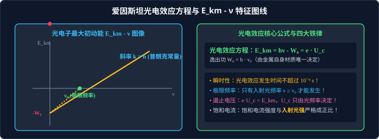
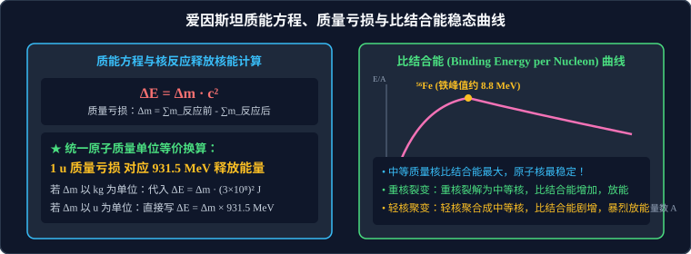

# 考点 · 光电效应图像分析与核能计算模型

## 考点模型深度解析

> [!IMPORTANT]
> 近代物理与量子初步是高考中的必考保分题型（常以选择题或实验小题呈现，近年来新高考新情境也常结合微观粒子动量守恒考查综合计算）。命题聚焦于两大主干：**以函数图线为载体的光电效应综合分析**，以及**以质量亏损与动量守恒为核心的核能释放定量计算**。



---

## 考点一：光电效应四大核心函数图像与特征量解析

在高考命题中，光电效应的物理机制常通过三种直角坐标系图像进行综合考查。理解图像的关键是掌握其对应的解析方程及其**斜率、截距、交点**的物理意义。

### 1. $E_{km} - \nu$ 图像（最大初动能随入射光频率变化曲线）

根据爱因斯坦光电效应方程：
$$E_{km} = h \nu - W_0 = h \nu - h \nu_0$$

| 图像特征量 | 数学表达式 | 物理内涵与高考判据 |
| :--- | :--- | :--- |
| **图线斜率 $k$** | $k = \frac{\Delta E_{km}}{\Delta \nu} = h$ | **普朗克常量**！无论何种金属，其图线斜率严格相等，多条不同金属图线必为**平行直线**。 |
| **横轴截距** | 令 $E_{km}=0 \implies \nu = \nu_0$ | 该金属的**极限频率（截止频率）**。横轴截距越偏右，金属极限频率越高。 |
| **纵轴截距** | 令 $\nu=0 \implies E_{km} = -W_0$ | 金属**逸出功的相反数**（$-W_0$）。纵截距绝对值越大，逸出功越大。 |

> [!TIP]
> **可汗学院直观思考**：
> 为什么斜率一定反映普朗克常数？因为每一个光子是不可分割的离散能量包（$\Delta E = h \Delta \nu$），每提高 $1\,\text{Hz}$ 频率，供给单个电子的能量就恰好多出 $h$ 焦耳，多出来的能量毫无损耗地全部转化为光电子的最大动能，因此斜率必然恒等于 $h$！

---

### 2. 遏止电压 $U_c - \nu$ 图像

由遏止电压与最大初动能关系 $e U_c = E_{km} = h \nu - W_0$，可变形为以 $U_c$ 为因变量的线性方程：
$$U_c = \left(\frac{h}{e}\right) \nu - \frac{W_0}{e}$$

* **图线斜率**：$k = \frac{h}{e}$（普适常量，与金属材质完全无关）。
* **横轴截距**：仍然等于该金属的极限频率 $\nu_0$。
* **纵轴截距**：绝对值为 $\frac{W_0}{e}$（具有电势的量纲，代表逸出电势差）。

> [!NOTE]
> 高考常利用 $U_c - \nu$ 图线求普朗克常量：只要从实验图线中读出斜率 $k$，已知元电荷 $e$，则 $h = k \cdot e$。

---

### 3. 光电管伏安特性曲线（$I - U$ 图像）

在光电管两端加电压 $U$，以光电流 $I$ 为纵坐标、$U$ 为横坐标得到的图像是分析光强、频率与光电子流动状态的综合利器。

```
              I (光电流)
               ▲
               │          ┌─────────────────── 饱和光电流 Is2 (强光，相同频率)
               │         /
               │        / ┌─────────────────── 饱和光电流 Is1 (弱光，相同频率)
               │       / /
               │      / / 
               │     / /  ┌─────────────────── 饱和光电流 Is3 (高频率光，中等强度)
               │    / /  /
               │   / /  /
  ───┼─────────┼──┴─┴──┴──────────────────────► U
   -Uc2       -Uc1 0 (正向电压 ->)
  (高频光)   (低频光)
```

#### 高考判据矩阵：
1. **反向截止点（横轴负截距 $-U_c$）**：
   * 遏止电压 $U_c$ 仅由**入射光的频率 $\nu$** 和**阴极材料逸出功 $W_0$** 决定（$e U_c = h\nu - W_0$），与入射光的照射强度**绝对无关**！
   * 只要入射光的单色光频率相同，无论光强多强或多弱，其伏安特性曲线在横轴上的截止点 $-U_c$ 必然**汇聚于同一点**。
   * 入射光频率越高，$U_c$ 绝对值越大，反向截止点越偏向负轴深处。
2. **饱和光电流 $I_s$ 的高度**：
   * 当正向加速电压增大到一定数值后，光电流不再增大，达到饱和值 $I_s$。
   * 饱和电流正比于**单位时间内逸出的光电子数 $n_e$**。在频率相同时，**光强越强，$I_s$ 越大**。

---

### 4. 饱和光电流与光子数微观定量计算模型

设单色光源发光功率为 $P$，照射在阴极有效受光面积上的比例为 $k_0$，光波波长为 $\lambda$（频率 $\nu = c/\lambda$），阴极的光电转换量子效率为 $\eta$（即每照射 100 个光子平均能激发出 $100\eta$ 个光电子）。

1. **单个光子能量**：$\varepsilon = h \nu = \frac{h c}{\lambda}$
2. **单位时间照射到阴极上的光子总数**：
   $$N = \frac{k_0 P}{\varepsilon} = \frac{k_0 P \lambda}{h c}$$
3. **单位时间内逸出的光电子数**：
   $$n_e = \eta N = \eta \frac{k_0 P \lambda}{h c}$$
4. **形成的饱和光电流强度**：
   $$I_s = \frac{q}{t} = n_e e = \frac{\eta k_0 P \lambda e}{h c}$$

---

## 考点二：原子能级跃迁与光谱线计数模型

### 1. 氢原子自发跃迁产生光谱线条数模型
处于能级 $n$ 的大量氢原子群，向低能级自发跃迁时，最多能辐射出的不同波长光谱线条数为组合数：
$$N = \mathrm{C}_n^2 = \frac{n(n-1)}{2}$$

* 若是一个**孤立的单原子**处于能级 $n$：
  由于单个原子一次只能沿着某一条特定路径阶梯跃迁，跃迁过程最多辐射 **$(n-1)$** 种不同频率的光子。

### 2. 吸收光子 vs 吸收实物粒子碰撞跃迁的临界判据

| 激发方式 | 作用规律 | 跃迁条件 |
| :--- | :--- | :--- |
| **吸收光子** | 光子不可分割，必须整份吸收 | 必须满足：$h \nu = E_m - E_n$（必须严格精准等于两能级能量差，若 $h\nu$ 大于或小于差值均不能被吸收！唯一例外：$h\nu \ge -E_n$ 时发生光电离，多余能量转化为自由电子动能） |
| **实物粒子碰撞**<br>（如自由电子轰击） | 实物电子动能可以部分转移 | 碰撞电子的动能 $E_k \ge E_m - E_n$ 即可！多余动能保留在散射电子中带走 |

---

## 考点三：质量亏损与核能定量计算三大范式



### 1. 范式一：原子质量单位 $\text{u}$ 直接折算法（高考首选）
若已知反应物与生成物各微粒的静止质量（单位为 $\text{u}$）：
1. 计算质量亏损：
   $$\Delta m = \sum m_{\text{反应物}} - \sum m_{\text{生成物}} \quad (\text{单位：}\text{u})$$
2. 根据 $1\,\text{u} = 1.6605 \times 10^{-27}\,\text{kg} \approx 931.5\,\text{MeV}/c^2$：
   $$\Delta E = \Delta m \times 931.5\,\text{MeV}$$

> [!WARNING]
> 高考做题单位大忌：
> - 若 $\Delta m$ 用 $\text{u}$，计算出的 $\Delta E$ 单位是 $\text{MeV}$，公式为 $\Delta E = \Delta m \times 931.5\,\text{MeV}$（**千万不要再乘以 $c^2$**！）；
> - 若 $\Delta m$ 用 $\text{kg}$，才使用 $\Delta E = \Delta m c^2$，计算出的能量单位是焦耳（$\text{J}$）。

---

### 2. 范式二：比结合能（平均结合能）相减法
原子核由核子结合而成，比结合能越大的原子核越稳定。当轻核发生聚变或重核发生裂变时，生成核的比结合能均大于反应核的比结合能。
$$\Delta E = \sum E_{\text{结合能,生成物}} - \sum E_{\text{结合能,反应物}} = \sum (b_2 \cdot A_2) - \sum (b_1 \cdot A_1)$$
其中 $b$ 为该原子核的比结合能，$A$ 为核子数（质量数）。

---

### 3. 范式三：静止核衰变与核反应反冲动能分配模型

典型情境：一个静止的原子核 $M$ 发生 $\alpha$ 衰变，生成新核 $m_Y$ 并释放出 $\alpha$ 粒子（质量 $m_\alpha$），释放核能为 $\Delta E$。

```
              ←── v_Y           v_α ──►
             (新核 m_Y)        (α粒子 m_α)
                 ●                 ○
```

1. **动量守恒**：
   $$0 = m_Y \vec{v}_Y + m_\alpha \vec{v}_\alpha \implies p_Y = p_\alpha = p$$
2. **动能与动量关系**：
   $$E_k = \frac{p^2}{2m}$$
   两反冲碎片动能比严格反比于质量比：
   $$\frac{E_{k\alpha}}{E_{kY}} = \frac{m_Y}{m_\alpha}$$
3. **核能分配**：
   释放的总核能全部转化为两粒子的动能：$\Delta E = E_{k\alpha} + E_{kY}$
   $$\begin{cases}
   E_{k\alpha} = \dfrac{m_Y}{m_Y + m_\alpha} \Delta E \\[1em]
   E_{kY} = \dfrac{m_\alpha}{m_Y + m_\alpha} \Delta E
   \end{cases}$$
   由于 $m_Y \gg m_\alpha$（如铀衰变中钍核质量约为 $\alpha$ 粒子的 58 倍），**$\alpha$ 粒子将获得绝大部分的动能（超过 $98\%$）**。

---

## 典型高考陷阱与避坑防错矩阵

| 常见易错观点 | 纠偏判断 | 命题陷阱与规范物理判据 |
| :--- | :---: | :--- |
| 入射光照射强度越强，逸出的光电子最大初动能越大 | **×** | 强度对应单位时间内光子数，决定饱和电流；最大初动能 $E_{km} = h\nu - W_0$ **完全由频率决定**。 |
| 入射光频率增大，饱和光电流一定增大 | **×** | 若总照射光功率 $P$ 不变，$\nu$ 增大导致单个光子能量增大，总光子数 $N = P/(h\nu)$ 反而减少，饱和电流可能变小！ |
| 比结合能越大的原子核，其总结合能也越大 | **×** | 比结合能是平均到每个核子的结合能。中等质量核比结合能最高（约 $8.6\,\text{MeV}$），但重核核子数极多，总结合能可达 $1800\,\text{MeV}$。 |
| 核反应遵循质量守恒定律，反应物总静质量等于生成物总静质量 | **×** | 核反应中严格守恒的是**电荷数**和**质量数（核子数）**。精确的静止质量必然发生微小亏损 $\Delta m$，转化为释放的辐射能和动能！ |
