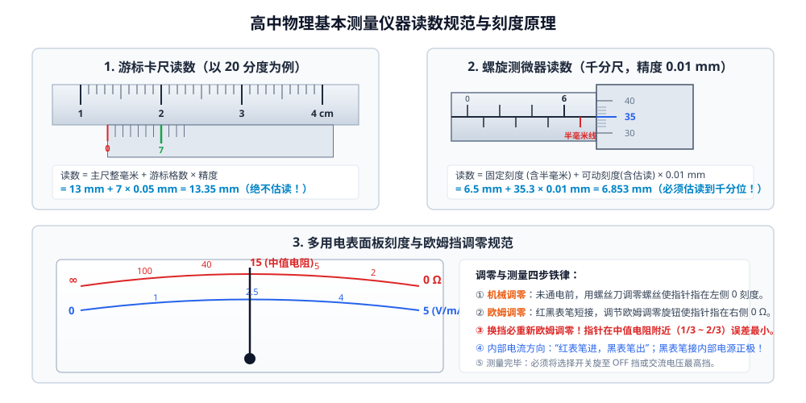

# 01 · 基本仪器使用与读数规范

## 核心物理概念与内涵

> [!NOTE]
> 仪器的读数与规范使用是高考物理实验题的“第一道门槛”。在全国卷及新高考各省统考中，读数填空往往以 2~4 分的权重稳定出现。能否做到**精确判断估读位数、辨析分度机制、规避机械零误差**，直接决定了实验大题能否取得满分。



---

## 一、游标卡尺读数原理与读数规范

游标卡尺（Vernier Caliper）是一种利用主尺与游标尺刻度微小差值实现高精度测量的长度仪器，可用于测量外径、内径、深度（深度尺）及台阶高度。

### 1. 游标设计原理（微差放大思想）
设主尺的最小分度为 $1\,\text{mm}$。游标尺上有 $N$ 个等分格，其总长度等于主尺上的 $(N - 1)\,\text{mm}$。
因此，游标尺上每一个小分度的长度为：
$$l_{\text{游}} = \frac{N - 1}{N}\,\text{mm} = \left(1 - \frac{1}{N}\right)\,\text{mm}$$
主尺与游标尺每小格的差值（即卡尺的**测量精度 / 分度值 $\Delta$**）为：
$$\Delta = 1\,\text{mm} - l_{\text{游}} = \frac{1}{N}\,\text{mm}$$

### 2. 高考常见三种规格对比矩阵

| 游标规格 | 游标总格数 $N$ | 游标总长度 | 每格长度 | 测量精度 $\Delta$ | 读数末位特征与示例 |
| :---: | :---: | :---: | :---: | :---: | :--- |
| **10 分度** | 10 格 | $9\,\text{mm}$ | $0.9\,\text{mm}$ | **$0.1\,\text{mm}$** | 末位为 $0, 1, 2, \dots, 9$<br>如：$13.4\,\text{mm}$ 或 $1.34\,\text{cm}$ |
| **20 分度** | 20 格 | $19\,\text{mm}$ | $0.95\,\text{mm}$ | **$0.05\,\text{mm}$** | **末位必为 0 或 5**！<br>如：$13.35\,\text{mm}$ 或 $1.335\,\text{cm}$ |
| **50 分度** | 50 格 | $49\,\text{mm}$ | $0.98\,\text{mm}$ | **$0.02\,\text{mm}$** | **末位必为偶数（0,2,4,6,8）**！<br>如：$13.36\,\text{mm}$ 或 $1.336\,\text{cm}$ |

### 3. 读数通用公式与操作法则
$$\text{测量读数} = \text{主尺整毫米数} (L_0) + n \times \text{精度} (\Delta)$$
* **第一步看主尺**：观察游标尺的 **0 刻度线**落在主尺哪两条刻度线之间，读取主尺上位于 0 刻度线**左侧最近的整毫米刻度值** $L_0$（切记：看游标的 0 刻度，而不是看游标尺的左边缘！）；
* **第二步看游标**：在游标尺上寻找与主尺某一条刻度线**严格对齐（重合）**的第 $n$ 条刻度线（游标 0 刻度不算，从 1 开始数）；
* **第三步计算相加**：$L = L_0 + n \times \Delta$。

> [!WARNING]
> **游标卡尺读数绝对铁律**：
> 1. **游标卡尺绝对不估读！** 严禁在精度之后再猜读一位（例如 20 分度卡尺读出 $13.354\,\text{mm}$ 属于严重错误，直接得 0 分）；
> 2. **注意题目要求的单位**：若题目要求以 $\text{mm}$ 为单位，20 分度卡尺记录为 $13.35\,\text{mm}$；若题目横线后带有 $\text{cm}$，必须换算为 $1.335\,\text{cm}$！

---

## 二、螺旋测微器（千分尺）读数原理与规范

螺旋测微器（Micrometer Screw Gauge）基于螺旋放大原理，可测量小球直径、金属丝直径、薄板厚度等，精度高达 $0.01\,\text{mm}$。

### 1. 结构与螺距放大原理
* 螺纹螺距为 $0.5\,\text{mm}$：可动刻度套管旋转一周，测微螺杆前进或后退 $0.5\,\text{mm}$。
* 可动刻度圆周均分为 50 个等分格：可动套管每旋转 1 小格，螺杆移动距离为：
  $$\Delta = \frac{0.5\,\text{mm}}{50} = 0.01\,\text{mm}$$
  因此螺旋测微器常称为**千分尺**（以毫米为单位时，读数必精确到小数点后第三位即微米级）。

### 2. 读数公式
$$\text{读数} = \text{固定刻度（毫米与半毫米）} + \text{可动刻度格数（含估读）} \times 0.01\,\text{mm}$$

### 3. 高考三大必考易错陷阱
1. **半毫米刻度线的“露头”辨析（命题高频陷阱）**：
   * 观察固定刻度下方的半毫米刻度线是否完全露出。
   * 若半毫米刻度线已露出，固定刻度应记为 $(N + 0.5)\,\text{mm}$；
   * **临界判据**：观察可动刻度的读数。若可动刻度在 $40 \sim 49$ 附近，说明螺杆尚未转满一周，半毫米线往往只是若隐若现，**尚未露出来**；若可动刻度在 $0 \sim 10$ 附近，说明已经转过半毫米，半毫米线**已经完全露出**！
2. **必须估读到千分位（$0.001\,\text{mm}$）**：
   * 螺旋测微器的可动刻度必须估读一位。
   * 例如可动刻度线对齐 35 格微偏上，估读为 $35.3$ 格，则：
     $$L = 6.5\,\text{mm} + 35.3 \times 0.01\,\text{mm} = 6.853\,\text{mm}$$
   * **补零规范**：若可动刻度恰好与固定横基准线完全重合在 35 格，也**必须补零**写成 $35.0$ 格，最终读数写为 $6.850\,\text{mm}$，严禁写成 $6.85\,\text{mm}$！

---

## 三、电表刻度与三大估读原则

指针式电流表、电压表根据表盘最小分度值的不同，估读规则分为三种：

| 最小分度形式 | 典型表盘与量程 | 估读法则 | 估读位精度 | 规范读数示例 |
| :---: | :---: | :---: | :---: | :--- |
| **“1”字头**<br>（1、0.1、0.01） | $3\,\text{V}$ 量程（每大格 $1\,\text{V}$，分度值 $0.1\,\text{V}$）<br>$3\,\text{A}$ 量程（分度值 $0.1\,\text{A}$） | **十分之一估读法**<br>（向下估读一位） | 估读至分度值的 $1/10$<br>读数精确到小数点后第二位 | 指针在 2.1 与 2.2 之间 6/10 处：<br>读作 **$2.16\,\text{V}$** |
| **“2”字头**<br>（2、0.2、0.02） | $0.6\,\text{A}$ 量程（每大格 $0.2\,\text{A}$，分度值 $0.02\,\text{A}$） | **二分之一估读法**<br>（半格估读法） | 估读至分度值的 $1/2$<br>（估读位为 $0.01\,\text{A}$） | 指针在 0.44 与 0.46 之间正中偏右：<br>读作 **$0.45\,\text{A}$** 或 **$0.46\,\text{A}$** |
| **“5”字头**<br>（5、0.5、0.05） | $15\,\text{V}$ 量程（每大格 $5\,\text{V}$，分度值 $0.5\,\text{V}$） | **五分之一估读法**<br>（估读 $0.1\,\text{V}$ 整数） | 估读至分度值的 $1/5$<br>（末位为 $0.1$ 的倍数） | 指针在 10.5 与 11.0 之间 2/5 处：<br>读作 **$10.7\,\text{V}$**（保留一位小数） |

---

## 四、多用电表的使用与内部构造探究

多用电表（Multimeter）是一种集测电阻、直流电流、直流电压、交流电压于一体的多功能仪表。

### 1. 欧姆挡工作原理（闭合电路欧姆定律）
多用电表测电阻时，内部接有干电池（电动势 $E$、内阻 $r$），并联与串联有调零电阻 $R$ 及表头（满偏电流 $I_g$、内阻 $R_g$）。
* 设电表内部总电阻为 $R_{\text{内}} = r + R_g + R$；
* 当两表笔短接时（$R_x = 0$），进行欧姆调零，指针满偏：
  $$I_g = \frac{E}{R_{\text{内}}}$$
* 当两表笔接待测电阻 $R_x$ 时，回路通过电流：
  $$I = \frac{E}{R_{\text{内}} + R_x} = \frac{I_g}{1 + \dfrac{R_x}{R_{\text{内}}}}$$

```
              表头刻度线分布特征
  ∞ (左端，I=0)                          0 Ω (右端，I=Ig)
  ├─────┼───┼──┼─┼─┼┼┼┼┼┼┼┼────────────────────┤
                 ▲
             中值电阻 R_中 = R_内 (I = Ig/2)
```

### 2. 欧姆挡核心物理特性
1. **反向刻度**：指针不偏转（左侧零电流处）对应电阻无穷大（$\infty$）；指针满偏（右侧最大电流处）对应电阻为零（$0\,\Omega$）。
2. **非线性刻度**：由于 $I$ 与 $R_x$ 呈反比例倒数关系，表盘刻度**极不均匀**：左疏右密。
3. **中值电阻（Center Resistance）**：
   * 当指针恰好偏转至表盘正中央（$I = \frac{1}{2} I_g$）时：
     $$\frac{1}{2} I_g = \frac{E}{R_{\text{内}} + R_x} \implies R_x = R_{\text{内}} = R_{\text{中}}$$
   * **物理结论**：欧姆挡表盘正中央标示的刻度值，在数值上**严格等于该挡位下多用电表的内部总电阻**！

### 3. 多用电表规范操作四部曲
1. **机械调零**：使用前观察指针是否指在**左侧零刻度（电流/电压零位）**。若有偏差，用平字螺丝刀微调表盘正下方的机械调零螺丝。
2. **挡位与倍率选择**：根据估计阻值选择合适挡位（$\times 1, \times 10, \times 100, \times 1\,\text{k}$），目标是**让测量时指针停留在中央刻度附近（$\frac{1}{3} \sim \frac{2}{3}$ 表盘区间）**，此处线性误差最小。
3. **欧姆调零（换挡必调！）**：将红、黑两表笔短接，旋转欧姆调零旋钮，使指针精确指在**右侧 $0\,\Omega$ 刻度**。
   > [!IMPORTANT]
   > 每次更换倍率挡位后，内部并联/串联分流分压电阻发生改变，电表内阻 $R_{\text{内}}$ 随之改变，**必须重新进行欧姆调零**！若欧姆调零旋钮旋至极限仍无法调零，说明**内部电池电动势降低或内阻过大**，需更换新电池。
4. **测量与读数**：两表笔接触被测电阻两端（**严禁手握表笔金属杆接触元件**，防止人体并联电阻引入严重误差；**被测电阻必须脱离原电路**，严禁带电测量）。
   $$\text{实际阻值} = \text{表盘刻度读数} \times \text{挡位倍率}$$
5. **关机收纳**：测量完毕后，必须将选择开关旋转至 **OFF 挡**或**交流电压最高挡**，防止红黑表笔在盒内碰触导致电池漏电放电。

### 4. 红黑表笔极性铁律（“红进黑出”）
* **电流流向统则**：无论处于电流、电压还是欧姆挡，电流始终是**从红表笔流入电表，从黑表笔流出电表**。
* **欧姆挡内部电路**：多用电表内部干电池的**正极连接黑表笔插孔**，干电池的**负极连接红表笔插孔**！
  * 判别二极管正负极实验：将多用电表旋至欧姆挡，黑表笔接二极管的一端、红表笔接另一端，若指针大幅度偏转（测得阻值很小，正向导通），则**与黑表笔相连的一端为二极管的正极**！

---

## 高考易错辨析与避坑指南

| 常见易错操作 / 认知 | 科学判断 | 规范物理判据与错误根源 |
| :--- | :---: | :--- |
| 游标卡尺测量读数写为 $10.450\,\text{mm}$ | **×** | 游标卡尺绝对不估读！20 分度只能读出 $10.45\,\text{mm}$，50 分度只能读出 $10.46\,\text{mm}$，严禁补写第 3 位小数。 |
| 螺旋测微器读数漏掉露出的半毫米线 | **×** | 固定刻度分为毫米线和半毫米线，可动刻度若在 $0\sim 10$ 之间，半毫米线必已露出，必须加上 $0.5\,\text{mm}$。 |
| 多用电表测电阻时，指针偏角过小（偏在表盘左侧），应换更小倍率 | **×** | 指针偏角过小说明测得电阻极大，应更换**更大倍率**（如从 $\times 10$ 换为 $\times 100$），并**重新欧姆调零**！ |
| 测电路中某电阻时直接将两表笔搭在元件两端测阻 | **×** | 严重违规！带电测量可能烧毁电表表头；即使未通电，原回路中其他并联支路也会严重分流导致读数彻底失真。必须断电并将被测电阻单端脱开。 |
