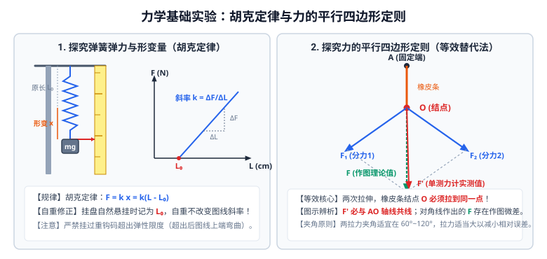

# 02 · 力学基础与相互作用实验

## 核心物理概念与内涵

> [!NOTE]
> 运动学与相互作用力学实验是高中物理的基石。新课标教材（必修第一册）重点考查学生对**微元瞬时测量、矢量合成的等效替代思想、线性化数据处理（逐差法与图像斜率截距）、以及微小形变放大技术**的理解与实操规范。

---

## 实验一：探究小车速度随时间变化的规律

### 1. 实验仪器与打点原理对比

| 仪器类型 | 工作电源 | 打点方式 | 阻力大小与适用场景 |
| :---: | :---: | :---: | :--- |
| **电磁打点计时器** | $4 \sim 6\,\text{V}$ 低压交流电 | 振针带动复写纸打点 | 振针与纸带频繁碰撞，**阻力较大**，易导致较大系统误差。 |
| **电火花计时器** | $220\,\text{V}$ 高压工频交流电 | 高压电火花放电击穿墨粉纸盘 | **几乎无机械摩擦阻力**，打点清晰，实验精度显著高于电磁打点计时器。 |

* **打点周期与计数点周期**：
  我国工频交流电频率为 $f = 50\,\text{Hz}$，打点周期为：
  $$T_0 = \frac{1}{f} = \frac{1}{50\,\text{Hz}} = 0.02\,\text{s}$$
  实验中通常“每 5 个点取一个计数点”（或“每隔 4 个点取一个计数点”），则相邻两计数点之间的时间间隔为：
  $$T = 5 \times T_0 = 5 \times 0.02\,\text{s} = 0.1\,\text{s}$$

* **标准操作规范**：
  1. 实验前先调整滑轮高度，使牵引细线与长木板表面**保持严格平行**；
  2. 释放小车前，小车应**紧靠打点计时器停放**；
  3. **先接通电源，等待打点稳定后，再释放小车**；
  4. 小车到达滑轮前必须及时用手接住，并**立即关闭电源**。

---

### 2. 核心数学数据处理方法

#### ① 瞬时速度的计算（极限定理）
做匀变速直线运动的质点，在某段时间中间时刻的瞬时速度等于这段时间内的平均速度。
对第 $n$ 个计数点，其瞬时速度为相邻两段位移之和除以总时间：
$$v_n = \bar{v} = \frac{x_n + x_{n+1}}{2T}$$

#### ② 逐差法求加速度（消除随机误差与充分利用数据）
设纸带连续截取 6 个相邻位移区段：$x_1, x_2, x_3, x_4, x_5, x_6$。
由匀变速运动位移差通式 $\Delta x = a T^2$，可知：
$$\begin{cases}
x_4 - x_1 = 3 a T^2 \\[0.5em]
x_5 - x_2 = 3 a T^2 \\[0.5em]
x_6 - x_3 = 3 a T^2
\end{cases}$$
将三式相加取平均，解得加速度 $a$：
$$a = \frac{(x_4 + x_5 + x_6) - (x_1 + x_2 + x_3)}{9 T^2}$$

> [!TIP]
> **可汗学院直观思考：为什么严禁用相邻项求平均？**
> 若对每两段求差再平均：
> $$a = \frac{1}{5}\left(\frac{x_2-x_1}{T^2} + \frac{x_3-x_2}{T^2} + \frac{x_4-x_3}{T^2} + \frac{x_5-x_4}{T^2} + \frac{x_6-x_5}{T^2}\right) = \frac{x_6 - x_1}{5 T^2}$$
> 展开后所有中间项 $x_2, x_3, x_4, x_5$ **被完全对消！** 辛辛苦苦测量的 4 个中间数据全部废弃，只剩下第一段与最后一段参与运算，导致偶然误差急剧放大！六段逐差法将所有 6 段数据均以相同权重引入计算，且使正负测量误差最大限度互相抵消。

#### ③ $v - t$ 图像法求加速度
先由 $v_n = \frac{x_n+x_{n+1}}{2T}$ 算出各计数点的瞬时速度，在直角坐标系中描点并绘制拟合直线。
* 图线的斜率即为加速度：$a = \frac{\Delta v}{\Delta t}$；
* 图线与纵轴的截距表示起始计数点的速度 $v_0$。

---

## 实验二：探究弹簧弹力与形变量的关系（胡克定律）

### 1. 实验原理与数学模型
在弹性限度内，弹簧的弹力 $F$ 与弹簧的伸长量（或缩短量）$x$ 成正比（胡克定律）：
$$F = k x = k(L - L_0)$$
式中 $k$ 为弹簧的劲度系数，$L_0$ 为弹簧原长，$L$ 为挂钩码平衡后的弹簧总长度。

### 2. 实验操作与数据采集要点
1. 将弹簧一端固定在铁架台横梁上，旁边垂直固定一把刻度尺（毫米刻度尺，分度值 $1\,\text{mm}$）；
2. 不挂钩码时，记录弹簧下端指针所对的刻度尺读数，作为**参考零点（自由原长 $L_0$）**；
3. 在弹簧下端依次增加挂钩码（如 $1$ 个、$2$ 个、$3$ 个……钩码质量已知且相等），待钩码**完全静止平衡后**，读取弹簧下端指针的刻度读数 $L_1, L_2, L_3 \dots$；
4. 计算每次对应的弹簧伸长量 $x_i = L_i - L_0$ 以及弹力 $F_i = m_i g$。

### 3. 图像处理与劲度系数求解

#### ① $F - x$ 图像法
* 以弹簧伸长量 $x$ 为横轴，以钩码重力 $F$ 为纵轴描点作图；
* 在弹性限度内，拟合图线为一条**过坐标原点的倾斜直线**；
* **物理意义**：直线的斜率即为弹簧的劲度系数：
  $$k = \frac{\Delta F}{\Delta x}$$

#### ② $F - L$ 图像法（免算伸长量法）
* 直接以弹簧总长度 $L$ 为横坐标，弹力 $F$ 为纵坐标作图；
* 关系式为：$F = k(L - L_0) = k L - k L_0$；
* **物理意义**：
  - 图线的斜率仍然严格等于劲度系数 $k$；
  - **图线与横轴的截距即为弹簧的原长 $L_0$**！

### 4. 误差分析与自重修正
1. **弹簧自重的影响与消除**：
   - 弹簧本身具有质量，竖直悬挂时由于自重会导致下部伸长。
   - **消除方法**：在弹簧未挂钩码、仅在自身重力作用下静止时记录指针刻度作为初始长度 $L_0$。此后增加的伸长量 $\Delta x$ 纯粹由所挂钩码重力引起，**完全不影响对劲度系数 $k$ 的测量准确度**！
2. **严禁超出弹性限度**：
   - 挂钩码不可过多。若钩码过重，弹簧发生塑性变形，$F-x$ 图像将在上方开始弯曲，不再满足正比关系。
3. **橡皮筋探究对比**：
   - 橡皮筋的伸长与拉力关系在全范围内通常呈现非线性（先软后硬），其弹性模量随拉伸率改变。

---

## 实验三：探究两个互成角度的力的合成规律（平行四边形定则）

### 1. 核心物理思想：等效替代法（Equivalent Substitution）
* 一只弹簧测力计拉橡皮条产生的效果（使结点拉到某固定位置 $O$），与两只弹簧测力计互成角度拉橡皮条使结点拉到**同一个位置 $O$** 的效果完全相同。
* 这两个力 $F_1, F_2$ 称为分力，单只测力计的拉力 $F'$ 称为这二者的**合力**。

### 2. 实验步骤与五大操作规范
1. **固定木板与白纸**：用图钉把白纸钉在水平桌面的木板上；
2. **固定橡皮条一端**：将橡皮条一端用图钉固定在木板上的 $A$ 点，另一端连接两根带有细绳套的细绳；
3. **两测力计成角度拉伸（记录三大信息）**：
   - 用两个弹簧测力计互成角度地拉两根细绳套，使橡皮条伸长，让结点到达某一确切位置，**用铅笔在白纸上清晰标出结点的位置 $O$**；
   - 记录两个弹簧测力计的读数 $F_1, F_2$；
   - **记录两拉力的方向**：用铅笔在每根细绳正下方**各描出相距较远的两个点**（两点确定一条直线），连接并标出力的方向。
4. **单测力计等效拉伸（求合力 $F'$）**：
   - 只用一个弹簧测力计，通过细绳套把橡皮条的结点**拉到完全相同的同一位置 $O$**；
   - 读出此时弹簧测力计的示数 $F'$，并记录细绳的方向（沿 $AO$ 方向）。
5. **作图与验证**：
   - 选定统一标度（如 $1\,\text{cm}$ 代表 $1\,\text{N}$）；
   - 从 $O$ 点开始按比例画出分力图示 $F_1, F_2$；
   - 以 $F_1, F_2$ 为邻边，利用刻度尺和三角板严密作出平行四边形，画出对角线即为**理论合力 $F$**；
   - 按相同标度画出单测力计测得的**实测合力 $F'$**；
   - 比较 $F$ 与 $F'$ 的大小和方向，在实验误差允许范围内若完全重合，则平行四边形定则得到验证。

### 3. 理论合力 $F$ 与实验值 $F'$ 的辨析铁律

| 力的符号 | 物理本质 | 获取途径 | 线条类型 | 方向特征 |
| :---: | :---: | :---: | :---: | :--- |
| **$F$** | **理论合力** | 用平行四边形定则**作图得出** | 虚线 | 由于作图及读数误差，方向通常与 $AO$ 橡皮条轴线存在微小夹角。 |
| **$F'$** | **实测合力** | 单个测力计拉橡皮条**实测得出** | 实线 | **方向必定严格沿 $AO$ 橡皮条的轴线共线方向**！ |

> [!CAUTION]
> **高考高频画图判据**：
> 在判断题目给出的验证图像正误时：**严格与 $AO$ 橡皮条延长线共线的那一个箭头必定是 $F'$（单弹簧测力计实测值）**；而与 $AO$ 存在微小偏差的那一个箭头必定是对角线作出的理论值 $F$！

### 4. 减小实验误差的关键要点
1. **夹角适中**：两分力 $F_1, F_2$ 之间的夹角 $\theta$ 不宜过大（接近 $180^\circ$）或过小（接近 $0^\circ$），**推荐在 $60^\circ \sim 120^\circ$ 之间**为宜；
2. **拉力适当大**：读数越大，仪器本身的绝对估读误差所占相对比例越小；
3. **两点间距尽量大**：用两点法描记细绳拉力方向时，两点之间距离应尽量大（最好大于 $10\,\text{cm}$），以减小画直线的方位角误差；
4. **拉力与木板平行**：弹簧测力计、细绳套和橡皮条必须始终与木板表面**平行**，严禁与木板或纸面发生贴刮摩擦；
5. **拉力方向预先调零**：两只弹簧测力计在使用前必须在**水平拉动方向**上互相对拉校准调零。

---

## 实验四：微小形变放大思想与教材经典探究

高中物理教材中贯穿着“微小形变通过特殊手段放大显化”的经典实验思想：

### 1. 平面镜光杠杆放大法（光路放大法）
* **实验装置**：在水平桌面上放两个平面镜 $M_1$ 和 $M_2$，激光笔发出一束细光束射向 $M_1$，反射至 $M_2$，最终打在远处的墙壁光屏上形成光斑；
* **物理原理**：用力下压桌面，桌面发生微小弹性向下凹陷，两平面镜发生极其微小的倾角变化 $\Delta\theta$。根据反射定律，反射光线偏转角度放大为 $2\Delta\theta$；经过较长光程 $L$ 后，光屏上的光斑发生显著位移 $\Delta s = 2 L \Delta\theta$。
* **思想传承**：卡文迪什测定万有引力常数 $G$ 的扭秤实验，正是利用了完全相同的**光杠杆双平面镜微小扭转放大思想**！

### 2. 容积微小形变放大法（液体柱放大法）
* **实验装置**：在大玻璃扁瓶中装满红墨水，瓶塞中间紧密插入一根细玻璃管，使红墨水液面升至细管中；
* **物理原理**：用手沿扁瓶厚壁或薄壁用力挤压瓶身，扁瓶横截面积发生微小变化，瓶内容积发生微小改变，迫使细管中红墨水液面发生厘米级的大幅度升降。将人眼不可见的瓶身微小几何形变，转换放大为液柱的高低位移。

### 3. 伽利略斜面实验方法论
* **逻辑外推**：让小球沿倾角不同的光滑斜面滚下，实验测得小球沿斜面下滑加速度 $a \propto \sin\theta$；
* **合理外推**：当斜面倾角增大到 $\theta = 90^\circ$（即自由落体）时，小球运动规律依然保持为匀变速直线运动。伽利略突破了当时无法精确测量毫秒级下落时间的实验限制，将“实验测量 + 逻辑外推”完美结合，开创了现代物理学的研究范式。

---

## 高考力学基础实验避坑指南

| 易错点诊断 | 科学判断 | 规范物理机制 |
| :--- | :---: | :--- |
| 平行四边形定则实验中，橡皮条弹性变差，必须更换新橡皮条重新做 | **×** | 只要在**同一组实验中**把结点拉到同一位置 $O$，橡皮条是否疲劳完全不影响等效替代的受力平衡，无需更换！ |
| 逐差法求加速度时，测出 5 段位移，用 $x_5 - x_1$ 直接除以 $4T^2$ | **×** | 严重错误！这等同于只用了第 1 和第 5 段数据，中间 3 段全部浪费。5 段位移通常应舍弃第 1 段或最后 1 段，保留 4 段进行对称逐差。 |
| 弹簧由于自重伸长，测出的劲度系数 $k$ 比真实值偏小 | **×** | 错误！自重只影响弹簧的自由长度 $L_0$（图线平移），不改变图线的斜率，计算出的劲度系数 $k = \Delta F/\Delta x$ 依然完全准确！ |
| 用两只弹簧测力计拉橡皮条时，两绳套必须互相垂直 | **×** | 错误！夹角只需在 $60^\circ \sim 120^\circ$ 即可，绝不强制要求互相垂直。 |
