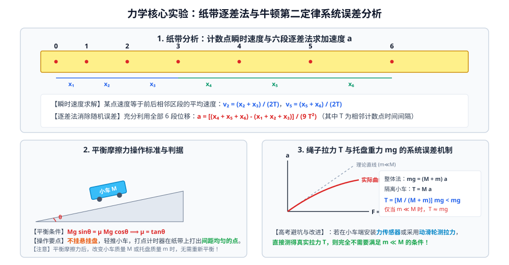
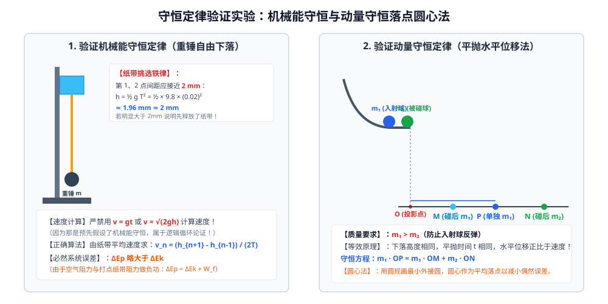

# 02 · 力学核心实验

## 核心物理概念与内涵

> [!NOTE]
> 力学实验是高考物理实验命题的两大台柱之一。无论是全国甲卷、乙卷还是新高考省份自主命题，力学实验均聚焦于**运动学数据处理（纸带与光电门）、动力学受力平衡与误差修正、守恒定律的验证与图像化建模**。掌握其背后的微元数学原理与误差来源，是彻底攻克实验大题的关键。

---

## 实验一：研究匀变速直线运动（打点计时器纸带处理）

### 1. 实验仪器与打点原理对比

| 仪器类型 | 工作电源 | 打点方式 | 阻力大小与适用场景 |
| :---: | :---: | :---: | :--- |
| **电磁打点计时器** | $4 \sim 6\,\text{V}$ 低压交流电 | 振针带动复写纸打点 | 振针与纸带频繁碰撞，**阻力较大**，易导致较大系统误差。 |
| **电火花计时器** | $220\,\text{V}$ 高压工频交流电 | 高压电火花放电击穿墨粉纸盘 | **几乎无机械摩擦阻力**，打点清晰，实验精度显著高于电磁打点计时器。 |

* **打点周期与计数点周期**：
  我国工频交流电频率为 $f = 50\,\text{Hz}$，打点周期为：
  $$T_0 = \frac{1}{f} = \frac{1}{50\,\text{Hz}} = 0.02\,\text{s}$$
  实验中通常“每 5 个点取一个计数点”（或“每隔 4 个点取一个计数点”），则相邻两计数点之间的时间间隔为：
  $$T = 5 \times T_0 = 5 \times 0.02\,\text{s} = 0.1\,\text{s}$$

---

### 2. 核心数学数据处理方法

#### ① 瞬时速度的计算（极限定理）
做匀变速直线运动的质点，在某段时间中间时刻的瞬时速度等于这段时间内的平均速度。
对第 $n$ 个计数点，其瞬时速度为相邻两段位移之和除以总时间：
$$v_n = \bar{v} = \frac{x_n + x_{n+1}}{2T}$$

#### ② 逐差法求加速度（消除随机误差与充分利用数据）
设纸带连续截取 6 个相邻位移区段：$x_1, x_2, x_3, x_4, x_5, x_6$。
由匀变速运动位移差通式 $\Delta x = a T^2$，可知：
$$\begin{cases}
x_4 - x_1 = 3 a T^2 \\[0.5em]
x_5 - x_2 = 3 a T^2 \\[0.5em]
x_6 - x_3 = 3 a T^2
\end{cases}$$
将三式相加取平均，解得加速度 $a$：
$$a = \frac{(x_4 + x_5 + x_6) - (x_1 + x_2 + x_3)}{9 T^2}$$

> [!TIP]
> **可汗学院直观思考：为什么严禁用相邻项求平均？**
> 若学生错误地对每两段求差再平均：
> $$a = \frac{1}{5}\left(\frac{x_2-x_1}{T^2} + \frac{x_3-x_2}{T^2} + \frac{x_4-x_3}{T^2} + \frac{x_5-x_4}{T^2} + \frac{x_6-x_5}{T^2}\right) = \frac{x_6 - x_1}{5 T^2}$$
> 展开后所有中间项 $x_2, x_3, x_4, x_5$ **被完全对消！** 辛辛苦苦测量的 4 个中间数据全部废弃，只剩下第一段与最后一段参与运算，导致偶然误差急剧放大！六段逐差法将所有 6 段数据均以相同权重引入计算，且使正负测量误差最大限度互相抵消。

#### ③ $v - t$ 图像法求加速度
先由 $v_n = \frac{x_n+x_{n+1}}{2T}$ 算出各计数点的瞬时速度，在直角坐标系中描点并绘制拟合直线。
* 图线的斜率即为加速度：$a = \frac{\Delta v}{\Delta t}$；
* 图线与纵轴的截距表示起始计数点的速度 $v_0$。

---

## 实验二：探究加速度与力、质量的关系（牛顿第二定律）

### 1. 核心思想：控制变量法
1. 保持小车总质量 $M$ 不变，探究加速度 $a$ 与合外力 $F$ 的正比关系（$a \propto F$）；
2. 保持小车受力 $F$ 不变，探究加速度 $a$ 与质量 $M$ 的反比关系（绘制 $a - \frac{1}{M}$ 线性图像）。

### 2. 平衡摩擦力的物理本质与操作判据
* **力学平衡方程**：长木板倾角为 $\theta$，小车下滑重力沿斜面的分力恰好与小车及纸带所受的总摩擦阻力平衡：
  $$M g \sin\theta = \mu M g \cos\theta \implies \mu = \tan\theta$$
* **标准操作规范**：
  1. 取下细绳与挂盘（**绝对不挂钩码！**）；
  2. 接通打点计时器电源，轻推小车，观察打出的纸带；
  3. 直至纸带上的点**点迹间距严格均匀（匀速直线运动）**，说明平衡恰到好处。
* **不变性铁律**：平衡好摩擦力后，后续在小车上增减砝码（改变 $M$）或在托盘中增减钩码（改变 $m$）时，**完全不需要重新平衡摩擦力**！因为平衡条件 $\mu = \tan\theta$ 与质量 $M$ 无关。

### 3. 悬挂盘 $m \ll M$ 的系统误差机制
设小车总质量为 $M$，悬挂盘与钩码总质量为 $m$。
以整体为研究对象：
$$m g = (M + m) a \implies a = \frac{m}{M + m} g$$
以小车为研究对象，细绳对小车的真实拉力 $T$ 为：
$$T = M a = \frac{M}{M + m} m g = \frac{1}{1 + \dfrac{m}{M}} m g < m g$$

* **误差本质**：我们通常将钩码重力 $mg$ 当作小车受到的合外力。但实际上 $T < mg$，钩码自身的重力还要给钩码自己提供向下的加速动力！
* **线性条件**：当且仅当 $m \ll M$（通常要求 $M \ge 10m$）时，$\frac{m}{M} \to 0$，才可近似认为 $T \approx mg$。
* **$a - F$ 图像下弯现象**：若钩码质量 $m$ 逐渐增大，$m/M$ 不可忽略，$a = \frac{mg}{M+m} = \frac{g}{1 + M/m} \to g$。图线将逐渐向横轴偏转并向下弯曲，渐近于 $a = g$。

### 4. 现代实验改进方案（彻底摆脱 $m \ll M$ 限制）
* **方案 A（力传感器）**：在小车前端固定一个微型力传感器，细绳直接挂在传感器挂钩上。传感器直接读出绳子真实拉力 $T$，小车受力就是 $T$，**无论 $m$ 多大均不需要满足 $m \ll M$**！
* **方案 B（动滑轮法）**：在小车上安装轻质动滑轮，细绳一端固定在力传感器上，另一端跨过动滑轮挂钩码。拉力 $F_{\text{合}} = 2T$。

---

## 实验三：验证机械能守恒定律

### 1. 实验原理与守恒方程
使重锤从静止开始做自由落体运动，重力做正功，重力势能转化为动能：
$$\Delta E_p = m g h_n, \quad \Delta E_k = \frac{1}{2} m v_n^2$$
理论上若机械能守恒，应有：$m g h_n = \frac{1}{2} m v_n^2$。

> [!NOTE]
> 方程两边的重锤质量 $m$ 可以直接约去，转化为验证 $g h_n = \frac{1}{2} v_n^2$。因此，**本实验无需使用天平测量重锤的质量**！

### 2. 纸带挑选铁律（$2\,\text{mm}$ 准则）
若重锤从打点计时器打第一个点时严格从静止释放，根据自由落体位移公式，前两个相邻计数点（时间间隔 $T_0 = 0.02\,\text{s}$）之间的距离应为：
$$h_1 = \frac{1}{2} g T_0^2 = \frac{1}{2} \times 9.8\,\text{m/s}^2 \times (0.02\,\text{s})^2 \approx 1.96\,\text{mm} \approx 2\,\text{mm}$$
* 若纸带前两点间距接近 $2\,\text{mm}$，说明第一个点是初速度为零的起点；
* 若间距明显大于 $2\,\text{mm}$，说明操作失误（先释放了重锤，后接通了电源），不能以第一个点作为零速度基准，必须任取纸带后方两点间进行增量验证（$\Delta E_p = \Delta E_k$）。

### 3. 速度测量的绝对禁区
* **正确算法**：第 $n$ 点速度必须由打点纸带实测位移算出：
  $$v_n = \frac{h_{n+1} - h_{n-1}}{2T}$$
* **严禁使用的错误公式**：**严禁用 $v_n = g t$ 或 $v_n = \sqrt{2 g h_n}$ 计算速度！**
  因为这两个公式是直接假设机械能守恒（或自由落体加速度恒为 $g$）导出的结论。如果用其算速度再去验证机械能守恒，属于典型的**逻辑循环论证（伪科学）**！

### 4. 误差特性与必然规律
在实际操作中，计算出的重力势能减少量必定**略大于**动能增加量：
$$\Delta E_p > \Delta E_k$$
**物理原因**：重锤下落过程中受到空气阻力，纸带穿过限位孔时受到摩擦阻力，阻力做负功产生了内能：
$$\Delta E_p = \Delta E_k + W_{\text{阻}}$$

---

## 实验四：验证动量守恒定律（斜槽平抛落点圆心法）

### 1. 实验设计与巧妙代换
两小球在光滑水平槽末端发生正碰，碰撞后做平抛运动。设小球下落高度为 $H$，根据平抛规律，竖直下落时间完全相同：
$$t = \sqrt{\frac{2H}{g}} = \text{常数}$$
水平速度 $v = \frac{x}{t} \propto x$。
因此，可以用**小球平抛落地的水平射程 $x$ 严格线性代替碰撞前后的瞬时速度**！

### 2. 实验守恒方程
设入射球质量为 $m_1$，被碰球质量为 $m_2$。
* $P$ 点：不放被碰球时，$m_1$ 单独飞出的落点（初速度 $v_0$）；
* $M$ 点：碰撞后，$m_1$ 飞出的落点（碰后速度 $v_1$）；
* $N$ 点：碰撞后，$m_2$ 飞出的落点（碰后速度 $v_2$）。
动量守恒方程化简为：
$$m_1 \cdot \overline{OP} = m_1 \cdot \overline{OM} + m_2 \cdot \overline{ON}$$

### 3. 操作铁律与核心要求
1. **质量关系**：必须满足 **$m_1 > m_2$**（若 $m_1 < m_2$，入射球碰撞后会向后反弹，无法通过斜槽末端平抛测量）；
2. **两球半径**：两球半径必须严格相等（保证水平正碰）；
3. **斜槽末端必须严格水平**（保证平抛初速度沿水平方向）；
4. **同一位置释放**：每次释放入射小球 $m_1$ 必须从斜槽上的**同一高度由静止释放**；
5. **平均落点圆心法**：在白纸上铺复写纸，重复做 10 次实验，用圆规画一个包含绝大多数落点的最小外接圆，**圆心即为平均落点**，可最大程度消除偶然误差。
