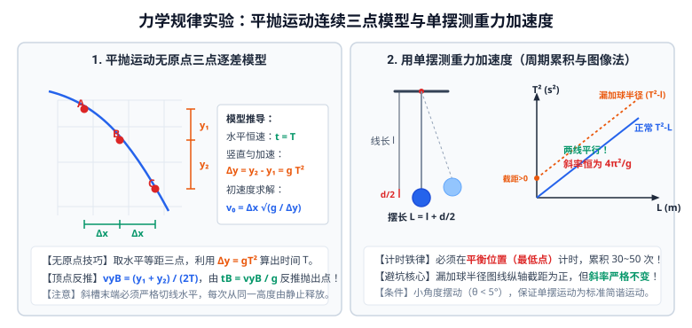

# 03 · 力学动力学与守恒定律实验

## 核心物理概念与内涵

> [!NOTE]
> 动力学与守恒定律是整个经典物理学的“大厦支柱”。高考实验题中，对牛顿第二定律的受力平衡控制、平抛与圆周的运动学分解、机械能与动量守恒的无损转换验证、以及单摆微元简谐振动的测量，构成了力学命题的最高频载体。

---

## 实验一：探究加速度与力、质量的关系（牛顿第二定律）

### 1. 核心思想：控制变量法
1. 保持小车总质量 $M$ 不变，探究加速度 $a$ 与合外力 $F$ 的正比关系（$a \propto F$）；
2. 保持小车受力 $F$ 不变，探究加速度 $a$ 与质量 $M$ 的反比关系（绘制 $a - \frac{1}{M}$ 线性图像）。

### 2. 平衡摩擦力的物理本质与操作判据
* **力学平衡方程**：长木板倾角为 $\theta$，小车下滑重力沿斜面的分力恰好与小车及纸带所受的总摩擦阻力平衡：
  $$M g \sin\theta = \mu M g \cos\theta \implies \mu = \tan\theta$$
* **标准操作规范**：
  1. 取下细绳与挂盘（**绝对不挂钩码！**）；
  2. 接通打点计时器电源，轻推小车，观察打出的纸带；
  3. 直至纸带上的点**点迹间距严格均匀（匀速直线运动）**，说明平衡恰到好处。
* **不变性铁律**：平衡好摩擦力后，后续在小车上增减砝码（改变 $M$）或在托盘中增减钩码（改变 $m$）时，**完全不需要重新平衡摩擦力**！因为平衡条件 $\mu = \tan\theta$ 与质量 $M$ 无关。

### 3. 悬挂盘 $m \ll M$ 的系统误差机制
设小车总质量为 $M$，悬挂盘与钩码总质量为 $m$。
以整体为研究对象：
$$m g = (M + m) a \implies a = \frac{m}{M + m} g$$
以小车为研究对象，细绳对小车的真实拉力 $T$ 为：
$$T = M a = \frac{M}{M + m} m g = \frac{1}{1 + \dfrac{m}{M}} m g < m g$$

* **误差本质**：通常将钩码重力 $mg$ 当作小车受到的合外力。但实际上 $T < mg$，钩码自身的重力还要给钩码自己提供向下的加速动力！
* **线性条件**：当且仅当 $m \ll M$（通常要求 $M \ge 10m$）时，$\frac{m}{M} \to 0$，才可近似认为 $T \approx mg$。
* **$a - F$ 图像下弯现象**：若钩码质量 $m$ 逐渐增大，$m/M$ 不可忽略，$a = \frac{mg}{M+m} \to g$。图线将逐渐向横轴偏转并向下弯曲，渐近于水平渐近线 $a = g$。

### 4. 现代实验改进方案（彻底摆脱 $m \ll M$ 限制）
* **方案 A（力传感器）**：在小车前端固定一个微型力传感器，细绳直接挂在传感器挂钩上。传感器直接读出绳子真实拉力 $T$，小车受力就是 $T$，**无论 $m$ 多大均不需要满足 $m \ll M$**！
* **方案 B（动滑轮法）**：在小车上安装轻质动滑轮，细绳一端固定在力传感器上，另一端跨过动滑轮挂钩码。拉力 $F_{\text{合}} = 2T$。

---

## 实验二：探究平抛运动的特点

### 1. 运动分解物理思想
平抛运动可分解为：
- 水平方向：不受外力，做**匀速直线运动**（$v_x = v_0, x = v_0 t$）；
- 竖直方向：仅受重力，做**自由落体运动**（$v_y = g t, y = \frac{1}{2} g t^2$）。

### 2. 斜槽描迹法实验操作规范
1. **调节斜槽末端水平**：将小球置于斜槽末端各处，若小球能在任意位置**静止不动**，说明斜槽末端已调整至水平；
2. **固定木板与铅垂线**：木板必须竖直放置，板面与小球飞出后的运动轨迹平面平行，通过铅垂线校准；
3. **严格同一位置释放**：每次让小球从斜槽上的**同一固定位置由静止释放**，保证平抛初速度 $v_0$ 严格恒定；
4. **描迹定位**：用挡铅板或复写纸记录小球在不同飞行距离时的落点，连成平滑曲线。

### 3. 数据处理与初速度计算

#### ① 已知抛出点原点 $O$
在轨迹曲线上任取一点 $(x, y)$：
$$x = v_0 t, \quad y = \frac{1}{2} g t^2 \implies t = \sqrt{\frac{2y}{g}} \implies v_0 = x \sqrt{\frac{g}{2y}}$$

#### ② 未知抛出点原点（平抛断裂轨迹 / 连续三点法模型）
若题目只给出平抛轨迹中的一部分，原点丢失。在曲线上选取水平间距相等的连续三点 $A(x_1, y_1), B(x_2, y_2), C(x_3, y_3)$，使得 $\Delta x = x_2 - x_1 = x_3 - x_2$：
* 因为水平速度恒定，运动从 $A \to B$ 和从 $B \to C$ 所用时间相等，记为 $T$；
* 竖直方向做初速度不为零的匀加速直线运动，根据位移差公式：
  $$\Delta y = (y_3 - y_2) - (y_2 - y_1) = g T^2 \implies T = \sqrt{\frac{\Delta y}{g}}$$
* 平抛初速度为：
  $$v_0 = \frac{\Delta x}{T} = \Delta x \sqrt{\frac{g}{\Delta y}}$$
* **反推抛出点顶点坐标**：
  $B$ 点的竖直瞬时速度等于 $AC$ 段的平均速度：
  $$v_{yB} = \frac{y_3 - y_1}{2T}$$
  从真正抛出点到 $B$ 点所经历的时间为 $t_B = \frac{v_{yB}}{g}$。
  抛出点在 $B$ 点左侧的水平距离为 $x_0 = v_0 t_B$，在 $B$ 点上方的竖直距离为 $y_0 = \frac{1}{2} g t_B^2$。

---

## 实验三：探究向心力大小的表达式

### 1. 向心力演示仪构造原理
教材采用向心力演示仪，通过皮带轮变速系统、长短槽、挡板和标尺红白等分格进行探究：
* **转速比调节**：皮带分别套在左右塔轮的不同轮层上，使左右两变速槽获得不同的角速度比（如 $\omega_1 : \omega_2 = 1:1, 1:2, 1:3$）；
* **运动半径调节**：将滑块挡板固定在长短槽的不同刻度处（半径 $r$ 可调）；
* **滑块质量调节**：选用不同质量的钢球或铝球（质量 $m$ 可调）；
* **向心力读数**：小球做圆周运动产生的离心挤压力压缩弹簧，使立柱标尺向上露出红白格数，露出的格数之比即为两球向心力之比。

### 2. 控制变量三步走
1. **探究 $F$ 与 $m$ 的关系**：保持两球运动半径 $r$ 相同、两塔轮角速度 $\omega$ 相同，换用质量不同的两小球（如质量比 $1:2$），观察标尺红白格数比为 $1:2 \implies F \propto m$；
2. **探究 $F$ 与 $r$ 的关系**：选用质量相同的两小球，保持塔轮角速度 $\omega$ 相同，调节两小球做圆周运动的半径（如半径比 $1:2$），观察标尺格数比为 $1:2 \implies F \propto r$；
3. **探究 $F$ 与 $\omega$ 的关系**：选用质量相同的两小球，保持运动半径 $r$ 相同，调节皮带传动比改变角速度（如角速度比 $1:2$），观察标尺格数比为 $1:4 \implies F \propto \omega^2$。
* **综合结论**：在实验误差允许范围内，向心力大小与质量、半径、角速度平方成正比：
  $$F_n = m \omega^2 r = m \frac{v^2}{r}$$

---

## 实验四：探究功与速度变化的关系（橡皮筋做功）

### 1. 核心巧妙构思：倍数做功法（避开变力积分）
橡皮筋拉伸时的弹力是变力，其做功 $W = \int F \, dx$ 无法用普通公式直接计算。
* **解决方案**：选用完全相同的橡皮筋。挂 1 根橡皮筋拉长到同一固定位置，弹力对小车做功记为 $W$；
* 挂 2 根相同的橡皮筋并列拉长到同一位置，弹力对小车做功为 $2W$；
* 挂 3 根做功为 $3W$……巧用倍数关系代替了复杂的功的绝对测量！

### 2. 实验操作两大铁律
1. **平衡摩擦力**：必须将木板倾斜，使小车下滑重力沿斜面的分力恰好抵消摩擦阻力。这样小车在运动过程中，**合外力对小车所做的总功就严格等于橡皮筋弹力所做的功**！
2. **测速阶段的精确截取**：
   - 橡皮筋在恢复原长前加速小车；当橡皮筋恢复原长后，小车脱离橡皮筋，做匀速直线运动。
   - **取点铁律**：计算小车的速度时，**必须在纸带上选取点迹间距均匀的一段（即匀速运动段 / 最大速度段）**进行测量！

### 3. 图像探究与动能定理得出
* 绘制 $W - v$ 图像：为一条向上弯曲的曲线，无法直观判断数学关系；
* 绘制 $W - v^2$ 图像：数据点密集分布在一条**过坐标原点的倾斜直线上**；
* **物理结论**：功与速度的平方成正比，即 $W \propto v^2$。这为动能定理的发现提供了坚实的实验证据。

---

## 实验五：验证机械能守恒定律

### 1. 实验原理与守恒方程
使重锤从静止开始做自由落体运动，重力做正功，重力势能转化为动能：
$$\Delta E_p = m g h_n, \quad \Delta E_k = \frac{1}{2} m v_n^2$$
理论上若机械能守恒，应有：$m g h_n = \frac{1}{2} m v_n^2$。

> [!NOTE]
> 方程两边的重锤质量 $m$ 可以直接约去，转化为验证 $g h_n = \frac{1}{2} v_n^2$。因此，**本实验无需使用天平测量重锤的质量**！

### 2. 纸带挑选铁律（$2\,\text{mm}$ 准则）
若重锤从打点计时器打第一个点时严格从静止释放，根据自由落体位移公式，前两个相邻计数点（时间间隔 $T_0 = 0.02\,\text{s}$）之间的距离应为：
$$h_1 = \frac{1}{2} g T_0^2 = \frac{1}{2} \times 9.8\,\text{m/s}^2 \times (0.02\,\text{s})^2 \approx 1.96\,\text{mm} \approx 2\,\text{mm}$$
* 若纸带前两点间距接近 $2\,\text{mm}$，说明第一个点是初速度为零的起点；
* 若间距明显大于 $2\,\text{mm}$，说明操作失误（先释放了重锤，后接通了电源），不能以第一个点作为零速度基准，必须任取纸带后方两点间进行增量验证（$\Delta E_p = \Delta E_k$）。

### 3. 速度测量的绝对禁区
* **正确算法**：第 $n$ 点速度必须由打点纸带实测位移算出：
  $$v_n = \frac{h_{n+1} - h_{n-1}}{2T}$$
* **严禁使用的错误公式**：**严禁用 $v_n = g t$ 或 $v_n = \sqrt{2 g h_n}$ 计算速度！**
  因为这两个公式是直接假设机械能守恒（或自由落体加速度恒为 $g$）导出的结论。如果用其算速度再去验证机械能守恒，属于典型的**逻辑循环论证（伪科学）**！

### 4. 误差特性与必然规律
在实际操作中，计算出的重力势能减少量必定**略大于**动能增加量：
$$\Delta E_p > \Delta E_k$$
**物理原因**：重锤下落过程中受到空气阻力，纸带穿过限位孔时受到摩擦阻力，阻力做负功产生了内能：
$$\Delta E_p = \Delta E_k + W_{\text{阻}}$$

---

## 实验六：验证动量守恒定律（多元方案全景）

### 方案 A：斜槽平抛碰小球（落点圆心法）
两小球在光滑水平槽末端发生正碰，碰撞后做平抛运动。设小球下落高度为 $H$，根据平抛规律，竖直下落时间完全相同 $t = \sqrt{\frac{2H}{g}}$，水平速度 $v = \frac{x}{t} \propto x$。
因此，可以用**小球平抛落地的水平射程 $x$ 严格线性代替碰撞前后的瞬时速度**！

* **守恒方程**：
  $$m_1 \cdot \overline{OP} = m_1 \cdot \overline{OM} + m_2 \cdot \overline{ON}$$
  （$P$ 为 $m_1$ 不放被碰球时的落点，$M$ 为碰后 $m_1$ 落点，$N$ 为碰后 $m_2$ 落点）。
* **四大操作铁律**：
  1. 质量关系：**$m_1 > m_2$**（防入射小球碰后反弹）；
  2. 半径关系：两球半径必须严格相等（保证水平正碰）；
  3. 斜槽末端必须严格切线水平；
  4. 每次从斜槽同一高度由静止释放；采用外接最小圆的**落点圆心法**取平均落点。

### 方案 B：气垫导轨光电门滑块碰撞
* **装置**：在水平气垫导轨上安装两个光电门，两滑块上安装宽度为 $d$ 的遮光条；
* **测速原理**：滑块经过光电门时遮光时间为 $\Delta t$，瞬时速度为 $v = \frac{d}{\Delta t}$；
* **碰撞模型**：
  - 弹性碰撞：两滑块碰撞端安装轻质弹簧圈；
  - 完全非弹性碰撞：两滑块碰撞端安装橡皮泥或尼龙搭扣，碰后粘为一体同速运动。

---

## 实验七：用单摆测量重力加速度的大小

### 1. 实验原理与单摆周期公式
当单摆摆角很小（$\theta < 5^\circ$）时，摆球在平衡位置附近的往复摆动可视为简谐运动。其周期公式为：
$$T = 2\pi\sqrt{\frac{L}{g}} \implies g = \frac{4\pi^2 L}{T^2}$$
式中 $L$ 为单摆的有效摆长，$T$ 为单摆做全振动的周期。

### 2. 测量操作与高精度技巧
1. **有效摆长的严格测定**：
   - 摆长是指**悬挂点到摆球球心的距离**；
   - 用毫米刻度尺测量悬线原长 $l$，用游标卡尺测量小球直径 $d$；
   - 有效摆长为：$L = l + \frac{d}{2}$。
2. **周期的累积测量法（消除人眼反应时间误差）**：
   - **起始计时位置**：必须在摆球**经过最低点（平衡位置）过零点时**开始计时！
     > [!IMPORTANT]
     > 平衡位置小球速度最大，经过该位置时间极其短暂，视觉定位清晰；若在最大位移处计时，小球速度为零、转向缓慢，人眼难以精确捕捉瞬间，引入极大人为偶然误差。
   - **累积次数**：测定单摆完成 $n = 30 \sim 50$ 次全振动的总时间 $t$，则周期为 $T = \frac{t}{n}$。

### 3. $T^2 - L$ 图像处理法与免测半径模型
根据理论公式 $T^2 = \frac{4\pi^2}{g} L$：
* 绘制 $T^2 - L$ 图像为一条过坐标原点的倾斜直线；
* 图线的斜率 $k = \frac{\Delta (T^2)}{\Delta L} = \frac{4\pi^2}{g}$；
* 重力加速度计算式：
  $$g = \frac{4\pi^2}{k}$$

#### 高考经典思维陷阱：漏加摆球半径对 $g$ 测定有无影响？
* 若实验者粗心，直接将悬线长度 $l$ 当作摆长作图（漏加了半径 $r$）：
  $$T^2 = \frac{4\pi^2}{g}(l + r) = \frac{4\pi^2}{g} l + \frac{4\pi^2 r}{g}$$
* **深度剖析**：此时 $T^2 - l$ 图线不再过原点，与纵轴出现正截距 $\frac{4\pi^2 r}{g}$。但是，**图线的斜率 $k = \frac{4\pi^2}{g}$ 保持绝对不变！**
* **结论**：只要用图像法取斜率求 $g$，**漏加摆球半径完全不影响重力加速度 $g$ 的测量结果**！

---

## 实验八：受迫振动与共振现象（教材演示探究）

* **受迫振动**：物体在周期性驱动力作用下的振动，其稳定振动的频率**始终严格等于驱动力的频率 $f_{\text{驱}}$**，与系统自身的固有频率无关。
* **共振现象**：当驱动力的频率**等于系统的固有频率（$f_{\text{驱}} = f_{\text{固}}$）**时，系统的振幅达到最大值，称为共振。
* **共振演示器实验**：在一根张紧的水平绳上悬挂不同摆长的单摆，当使其中一个摆摆动时（作为驱动摆），与该摆**摆长相等（即固有周期相同）**的另一个摆振幅最大，其余摆长不同的单摆振幅显著较小。

---

## 高考动力学实验核心避坑指南

| 常见易错认知 | 科学判断 | 规范物理机理 |
| :--- | :---: | :--- |
| 牛顿第二定律实验中，小车受到的合外力就是挂盘和钩码的重力 $mg$ | **×** | 挂盘自身也在向下加速，绳子真实拉力 $T = \frac{M}{M+m}mg < mg$。只有当 $m \ll M$ 时才近似成立。 |
| 验证机械能守恒时，可以用天平分别测出重锤和小球的质量代入方程 | **×** | 无需测量！公式两边质量 $m$ 严格对消，测质量属于画蛇添足且浪费时间。 |
| 单摆测重力加速度时，在摆球运动到最高点（最大位移处）按下秒表计时 | **×** | 严重错误！最高点速度为零、转向模糊，人眼反应误差极大。必须在摆球过最低点（平衡位置）时计时。 |
| 平抛运动实验中，斜槽表面粗糙会导致小球平抛轨迹严重变形 | **×** | 只要每次都在同一固定位置由静止释放，沿粗糙斜槽下滑过程克服摩擦力做功相同，到达末端的初速度依然严格恒定，对平抛无影响！ |
