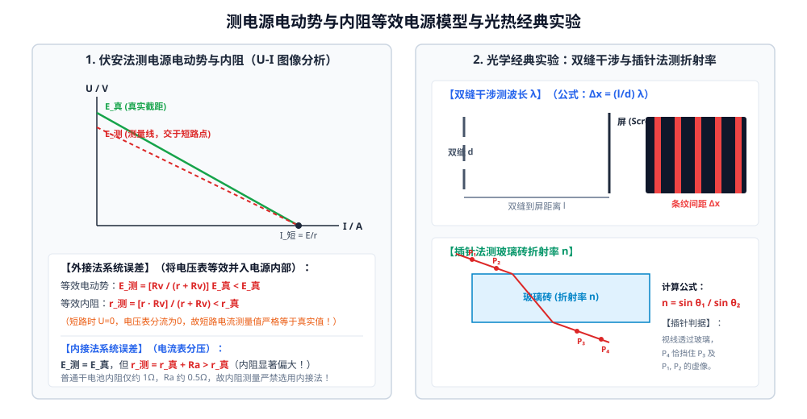

# 03 · 电学核心实验

## 核心物理概念与内涵

> [!NOTE]
> 电学实验在历年高考物理中占有极重分量（通常赋分 9~10 分，往往作为实验题的“压轴大题”出现）。命题侧重考查**控制电路与测量电路的设计、仪器选型、系统误差的等效电路剖析、以及将非线性物理规律转换为线性函数图线的数学建模能力**。


---

## 实验一：测定金属的电阻率（伏安法）

### 1. 实验原理与数学模型
由电阻定律公式 $R = \rho \frac{l}{S}$，其中均匀金属丝截面可视为圆，面积 $S = \frac{\pi d^2}{4}$。
联立可得金属电阻率的计算方程：
$$\rho = \frac{R S}{l} = \frac{\pi d^2 R}{4l}$$

### 2. 测量物理量与对应仪器矩阵

| 物理量 | 符号 | 测量仪器 | 测量与规范要求 |
| :---: | :---: | :---: | :--- |
| **金属丝直径** | $d$ | **螺旋测微器** | 在金属丝的**不同位置测量 3 次**取平均值；必须估读到千分位（$0.001\,\text{mm}$）。 |
| **有效长度** | $l$ | **毫米刻度尺** | 金属丝拉直后，测量**接入电路的两接线柱之间**的有效长度（切勿将接线柱内部夹紧包裹部分算入！），测量 3 次取平均。 |
| **金属丝电阻** | $R$ | **伏安法回路** | 电流表与电压表读数，多次改变滑片位置记录多组 $(U, I)$，用 $R = \frac{\Delta U}{\Delta I}$ 拟合计算。 |

### 3. 电路设计与选型判据
1. **测量电路（外接法）**：金属丝电阻 $R_x$ 通常较小（一般在 $1\,\Omega \sim 15\,\Omega$ 之间），远小于普通电压表内阻（$R_V \sim 3\,\text{k}\Omega$）。满足 $R_x \ll R_V$，因此必须采用**电流表外接法**，使电压表分流带来的系统误差降至最低。
2. **控制电路（限流式优先）**：若滑动变阻器的最大阻值与金属丝电阻相当（如 $R_{\text{滑}} = 20\,\Omega$），为降低实验功耗并保护元器件，优先选用**限流式接法**。

---

## 实验二：描绘小灯泡的伏安特性曲线

### 1. 实验现象与物理本质
小灯泡灯丝由钨丝制成。随着灯丝两端电压 $U$ 和通过电流 $I$ 的增大，灯丝消耗电功率 $P = UI$ 增大，温度剧烈升高（从常温升至两千摄氏度以上）。
* **金属电阻率随温度升高而显著增大**：小灯泡的真实阻值 $R$ 随着电压升高而急剧增大！
* **伏安特性曲线形态**：在 $I - U$ 直角坐标系中，图线并不是一条过原点的直线，而是一条**逐渐向下弯曲的非线性曲线**（图线上各点与原点连线的割线斜率 $k = \frac{I}{U} = \frac{1}{R}$ 随着 $U$ 的增大而逐渐变小）。

```
        I (电流)
        ▲
        │         ┌─────────── 曲线向下弯曲 (割线斜率 1/R 减小)
        │       .'
        │     .'
        │   .'
        │ .'
        └───────────────────► U (电压)
```

### 2. 电路选型两大刚性铁律
1. **控制电路必须采用【分压式接法】**：
   * **命题要求**：描绘伏安特性曲线必须获取从小灯泡**完全熄灭（$U = 0$）到正常发光（额定电压）**的全量程连续数据。
   * **物理限制**：限流电路中，即使将滑动变阻器滑到最大阻值处，小灯泡两端仍存在最小截止电压 $U_{\text{min}} = \frac{R_L}{R_{\text{滑}} + R_L} E > 0$，无法将电压调节到零！故**必须选用分压式**。
2. **测量电路必须采用【电流表外接法】**：
   * 小灯泡额定电压通常为 $2.5\,\text{V} \sim 3.8\,\text{V}$，额定电流约为 $0.3\,\text{A}$，对应额定工作电阻仅 $10\,\Omega$ 左右；而在冷态未点亮时电阻甚至小于 $2\,\Omega$。
   * 电阻远小于电压表内阻（$R_L \ll R_V$），外接法电压表分流极小。若误用内接法，电流表内阻（约 $0.5\,\Omega$）将造成高达 $25\% \sim 50\%$ 的巨大系统误差！

---

## 实验三：测定电池的电动势和内阻



本实验是高考考查频次最高的电学压轴大题，其核心在于理解不同接法背后的**戴维南等效电源模型（Thevenin Equivalent）与系统误差修正**。

### 1. 伏安法（电流表 + 电压表 + 滑动变阻器）

#### 方案 A：电流表相对电源外接法（高考测量干电池标准接法）
* **电路结构**：电压表直接并联在电源两端（测路端电压 $U$），电流表串联在滑动变阻器支路中（测变阻器电流 $I$）。
* **误差根源**：电压表内阻 $R_V$ 并不是无穷大，它会分流一部分电流：
  $$I_{\text{总}} = I + I_V = I + \frac{U}{R_V}$$
  电流表读数 $I$ 总是**小于通过电源的真实总电流 $I_{\text{总}}$**。
* **等效电源法严密推导**：
  将电压表与电源视为一个“等效虚假电源”：
  $$\begin{cases}
  E_{\text{测}} = \dfrac{R_V}{r + R_V} E_{\text{真}} < E_{\text{真}} \\[1em]
  r_{\text{测}} = \dfrac{r \cdot R_V}{r + R_V} < r_{\text{真}}
  \end{cases}$$
* **$U - I$ 图像分析判据**：
  * 纵轴截距：对应外电路断路（$I = 0$ 时），此时电压表仍与电源闭合，$U = E_{\text{测}} < E_{	ext{真}}$，**电动势测量值偏小**；
  * 横轴截距（短路电流）：当 $U = 0$ 时，电压表两端电压为零，$I_V = 0$ 无分流！故**短路电流测量值严格等于真实短路电流**（$I_{\text{短}} = \frac{E}{r}$），真实图线与测量图线必**交于横轴上的短路点**！
  * 图线斜率：$|k| = r_{\text{测}} < r_{\text{真}}$，**内阻测量值偏小**。
* **为何适用于普通干电池？**
  干电池内阻很小（新电池约 $0.3\,\Omega$，旧电池约 $1\,\Omega$），而电压表内阻通常在 $3000\,\Omega$ 以上。$\frac{r}{R_V} \approx \frac{1}{3000} \ll 1\%$，系统误差微乎其微！

---

#### 方案 B：电流表相对电源内接法
* **电路结构**：电流表紧接电源正极（测干路总电流），电压表测量滑动变阻器两端电压。
* **误差根源**：电流表内阻 $R_A$ 分压：$U_{\text{测}} = U_{\text{路端}} - I R_A$。
* **等效电源推导**：将电流表内阻等效计入电源内阻中：
  $$\begin{cases}
  E_{\text{测}} = E_{\text{真}} \\[0.5em]
  r_{\text{测}} = r_{\text{真}} + R_A > r_{\text{真}}
  \end{cases}$$
* **结论与适用场景**：电动势测量值准确无误，但**内阻测量值严重偏大（包含了电流表内阻）**！由于干电池内阻本身只有 $1\,\Omega$，电流表内阻常有 $0.5\,\Omega$，相对误差高达 $50\%$，故**普通干电池严禁采用此法**！只有测量内阻极大的水果电池（内阻几千欧姆）时才可使用。

---

### 2. 变换法测量：安阻法与伏阻法的图像线性化

#### ① 安阻法（电流表 A + 电阻箱 R）
由闭合电路欧姆定律：
$$E = I(R + r) \implies \frac{1}{I} = \frac{1}{E} R + \frac{r}{E}$$
* **绘图策略**：以 $R$ 为横轴、$\frac{1}{I}$ 为纵轴，绘制 $\frac{1}{I} - R$ 线性图像。
* **物理量提取**：
  $$\text{斜率 } k = \frac{1}{E} \implies E = \frac{1}{k}; \quad \text{纵截距 } b = \frac{r}{E} \implies r = \frac{b}{k}$$

#### ② 伏阻法（电压表 V + 电阻箱 R）
由闭合电路欧姆定律：
$$E = U + \frac{U}{R} r \implies \frac{1}{U} = \frac{r}{E} \left(\frac{1}{R}\right) + \frac{1}{E}$$
* **绘图策略**：以 $\frac{1}{R}$ 为横轴、$\frac{1}{U}$ 为纵轴，绘制 $\frac{1}{U} - \frac{1}{R}$ 线性图像。
* **物理量提取**：
  $$\text{纵截距 } b = \frac{1}{E} \implies E = \frac{1}{b}; \quad \text{斜率 } k = \frac{r}{E} \implies r = \frac{k}{b}$$

---

## 典型高考防错避坑指南

| 常见易错认知 | 科学判断 | 物理本质与规范操作 |
| :--- | :---: | :--- |
| 伏安法测干电池电动势和内阻，电流表选内接法更准确 | **×** | 致命错误！内接法测出的内阻包含 $R_A$，由于电池内阻极小，内阻相对误差可达 $50\%$ 以上！必须选外接法。 |
| $U - I$ 图像中，内阻计算直接套用公式 $r = \frac{U}{I}$ | **×** | 严重概念混淆！$U/I$ 是外电路电阻值 $R$；电源内阻是图线的斜率绝对值：$r = \left|\frac{\Delta U}{\Delta I}\right|$！ |
| 描绘小灯泡伏安特性曲线时，滑动变阻器选限流式接法 | **×** | 题目明确要求从 0 开始记录数据，限流电路存在起始分压截距无法调零，必须采用分压式接法。 |
