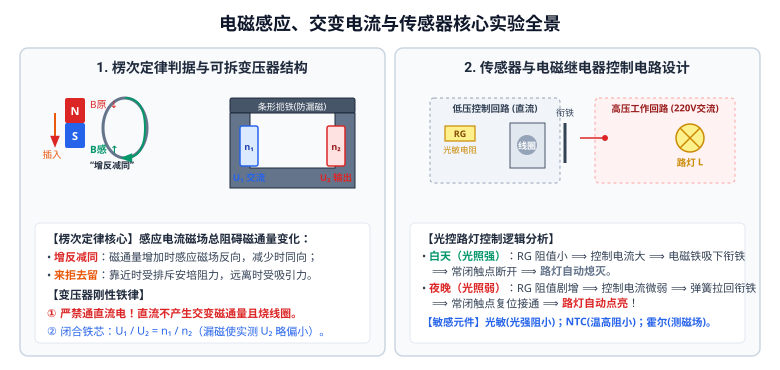

# 05 · 电磁感应、交变电流与传感器实验

## 核心物理概念与内涵

> [!NOTE]
> 电磁感应与现代传感器技术是经典电磁理论通往现代工业自动化的桥梁。新课标教材（选择性必修第二册）聚焦于**磁通量动态变化率对感应效应的决定机制（楞次定律与法拉第定律）、可拆变压器的闭合磁路能量耦合、以及非电学量（光、热、磁）向电学量转换的传感器电路设计**。

---

## 实验一：探究感应电流产生的条件

### 1. 产生感应电流的核心判据
无论是闭合导线在磁场中切割磁感线，还是线圈处在变化的磁场中，产生感应电流的物理充要条件是：
$$\text{穿过闭合导体回路的磁通量 } \Phi \text{ 发生变化（即 } \Delta\Phi \ne 0 \text{）}$$

### 2. 教材三大典型实验方案

1. **方案 A（动生电动势）**：闭合回路的一部分导体在磁场中做切割磁感线运动；
2. **方案 B（感生电动势）**：条形磁铁插入或拔出闭合螺线管（线圈处于变化磁场中）；
3. **方案 C（互感现象）**：原线圈 $A$ 插入副线圈 $B$ 中：
   - 闭合或断开开关 $S$ 瞬间 $\implies$ 检流计指针发生剧烈偏转；
   - 开关闭合后，快速移动滑动变阻器滑片 $\implies$ 检流计指针发生偏转；
   - 电路接通且滑动变阻器静止不动时 $\implies$ 检流计指针指在零位**完全不偏转**！

---

## 实验二：探究感应电流的方向（楞次定律实验）

### 1. 实验仪器连接与试触准备
* **灵敏电流计指针偏转方向判定（第一步！）**：
  - 用一节干电池与高阻值保护电阻串联，将电流引入灵敏电流计；
  - 观察并记录：**电流从哪个接线柱流入，指针向哪个方向偏转**（例如：“电流从正接线柱流入，指针向右偏转”）。
* **螺线管导线绕向记录**：仔细观察螺线管正面导线的绕行方向，在草图上明确标出。

### 2. 实验探究操作矩阵

| 条形磁铁动作 | 穿过线圈的原磁场 $B_{\text{原}}$ 方向 | 磁通量 $\Phi$ 变化 | 感应电流磁场 $B_{\text{感}}$ 方向 | 阻碍作用的宏观外在表现 |
| :---: | :---: | :---: | :---: | :--- |
| **$N$ 极向下插入** | 向下 | **增加** ($\Delta\Phi > 0$) | **向上**（与原磁场反向） | 排斥作用（**来拒**，感应线圈上端为 $N$ 极） |
| **$N$ 极向上拔出** | 向下 | **减少** ($\Delta\Phi < 0$) | **向下**（与原磁场同向） | 吸引作用（**去留**，感应线圈上端为 $S$ 极） |
| **$S$ 极向下插入** | 向上 | **增加** ($\Delta\Phi > 0$) | **向下**（与原磁场反向） | 排斥作用（**来拒**，感应线圈上端为 $S$ 极） |
| **$S$ 极向上拔出** | 向上 | **减少** ($\Delta\Phi < 0$) | **向上**（与原磁场同向） | 吸引作用（**去留**，感应线圈上端为 $N$ 极） |

### 3. 楞次定律的“四步解题法则”
1. **明确原磁场方向**：判断引起感应的原磁场 $B_{\text{原}}$ 在回路内的方向；
2. **明确磁通量增减**：判断穿过闭合回路的磁通量是增加还是减少；
3. **应用楞次定律确定 $B_{\text{感}}$**：**“增反减同”**（增加则 $B_{\text{感}}$ 与 $B_{\text{原}}$ 反向；减少则 $B_{\text{感}}$ 与 $B_{\text{原}}$ 同向）；
4. **应用安培定则确定电流方向**：右手握住螺线管，大拇指指向 $B_{\text{感}}$ 方向，四指弯曲方向即为**感应电流的绕行方向**。

---

## 实验三：探究影响感应电动势大小的因素（法拉第定律探究）

* **控制变量探究**：
  1. 保持磁铁强度和移动距离不变，**改变插入或拔出的速度**：快速插拔时，磁通量变化所用时间 $\Delta t$ 极短，检流计偏角显著变大；
  2. 保持移动速度不变，**换用强弱不同的磁铁**：强磁铁引起的磁通量变化量 $\Delta\Phi$ 更大，检流计偏角显著变大；
  3. 保持磁铁和移动速度不变，**换用匝数不同的线圈**：线圈匝数 $n$ 越多，感应电动势越大。
* **物理结论**：感应电动势大小与磁通量的变化率成正比，即法拉第电磁感应定律：
  $$E = n \frac{\Delta\Phi}{\Delta t}$$

---

## 实验四：探究变压器原、副线圈电压与匝数的关系

### 1. 实验仪器与操作安全规范
* **实验仪器**：可拆变压器（包括铁芯、扼铁、不同匝数的线圈）、低压交流电源、多用电表（交流电压挡）。
* **操作刚性铁律**：
  > [!CAUTION]
  > 1. **严禁连接直流电源！** 变压器基于互感原理工作，恒定直流电产生恒定磁场，副线圈磁通量不变化，无法感应出电动势，且直流电会导致原线圈无感抗而烧毁！
  > 2. **严禁用手触碰接线柱**：尤其是使用升压变压器时，副线圈输出高压存在触电风险。

### 2. 实验原理与数据处理
* **闭合铁芯的作用**：安装可拆变压器时，必须把 $U$ 形铁芯与上方的条形扼铁通过螺丝**紧密夹紧闭合**。闭合铁芯引导磁感线无泄漏地穿过副线圈，大大减小漏磁损耗；
* **电压与匝数方程**：
  $$\frac{U_1}{U_2} = \frac{n_1}{n_2}$$
* **误差规律**：在实际测量中，测得的副线圈输出电压 $U_2$ 总是**略小于**理论计算值 $\frac{n_2}{n_1} U_1$。
  **原因**：可拆变压器并非理想变压器，存在铁芯漏磁、铜损（线圈导线发热内阻分压）以及铁损（铁芯内涡流损耗）。

---

## 实验五：探究传感器及其简单使用

### 1. 常见敏感元件的物理特性

| 敏感元件类型 | 敏感物理量 | 内部物理机制 | 典型应用电路 |
| :---: | :---: | :--- | :--- |
| **光敏电阻** （硫化镉材料） | **光照强度** | 光照增强，价带电子被激发为自由载流子，导电性能剧增，**阻值急剧减小**。 | 光控路灯开关、自动曝光计 |
| **热敏电阻 (NTC)** （负温度系数） | **温度** | 半导体材料载流子浓度随温度升高呈指数增加，**温度升高阻值显著减小**。 | 恒温箱控制、电子体温计 |
| **热敏电阻 (PTC)** （正温度系数） | **温度** | 达到居里点温度后，晶界势垒突增，**阻值剧烈增大**。 | 过热保护器、恒温加热器 |
| **霍尔元件** （半导体薄片） | **磁感应强度 $B$** | 洛伦兹力使载流子横向偏转形成电势差：$U_H = k \frac{I B}{d}$。 | 测速传感器、电流传感器、电子罗盘 |
| **干簧管** | **磁场通断** | 强磁铁靠近时，两软磁性簧片被磁化相互吸引闭合接通回路。 | 门磁防盗报警器、液位计 |

### 2. 继电器自动控制电路设计（以光控路灯为例）
* **控制逻辑**：
  - **白天**：光照强，光敏电阻 $R_G$ 阻值很小，控制回路电流很大，电磁铁吸力大，吸下衔铁，使工作回路常闭触点断开，路灯熄灭；
  - **夜晚**：光照弱，光敏电阻 $R_G$ 阻值剧增，控制回路电流减小，电磁铁吸力不足以克服弹簧拉力，衔铁复位，工作回路接通，路灯自动点亮。

---

## 实验六：教材经典演示实验精萃

### 1. 通电自感与断电自感实验
* **通电自感**：闭合开关瞬间，电流增大，电感线圈产生阻碍电流增大的自感电动势，使与线圈串联的灯泡**逐渐延时变亮**，而与定值电阻串联的灯泡立即点亮；
* **断电自感**：断开开关瞬间，线圈产生极大的同向自感电动势阻碍电流减小。若断开前流经线圈的电流 $I_L > I_{\text{灯}}$，断电瞬间灯泡将**先闪亮一下，然后再逐渐熄灭**！

### 2. 铝管下落强磁铁实验（电磁阻尼）
* 强磁铁自由穿过非磁性厚铝管下落时，所用时间远大于自由落体时间！
* **物理机制**：强磁铁下落导致管内各横截面磁通量剧烈变化，铝管内部感应出闭合圆环状**涡流**。根据楞次定律“来拒去留”，涡流对磁铁施加向上的安培阻力，抵消绝大部分重力，磁铁以极小的匀速终端速度缓缓飘落。

---

## 高考电磁与传感器避坑指南

| 常见易错认知 | 科学判断 | 规范物理机制 |
| :--- | :---: | :--- |
| 变压器实验可以用学生低压电源的直流输出端供电 | **×** | 致命违规！直流电不产生交变磁通量，副线圈感应电压为 0，且原线圈无感抗极易被大电流烧毁。必须用交流电。 |
| 测变压器变压比时，把可拆铁芯的上方条形扼铁拿开不影响测量 | **×** | 拿开扼铁破坏了闭合磁路，空气磁阻极大导致严重漏磁，副线圈测得的电压将大幅度跌落！ |
| 楞次定律中感应电流的磁场方向必定与原磁场方向相反 | **×** | 只有当穿过回路的磁通量**增加**时才相反；当磁通量**减少**时，感应磁场方向与原磁场方向**相同**（“增反减同”）。 |
| 热敏电阻 NTC 随着温度升高，阻值会大幅度变大 | **×** | 混淆正负系数！NTC（Negative Temperature Coefficient）阻值随温度升高而**减小**！ |
