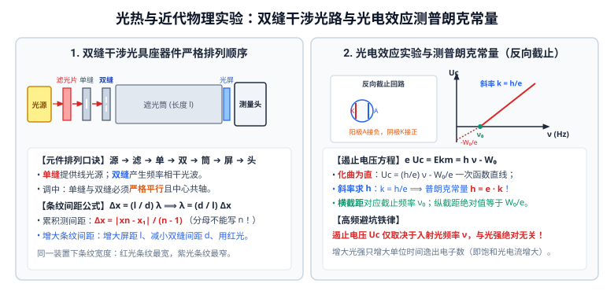

# 06 · 光学、热学与近代物理实验

## 核心物理概念与内涵

> [!NOTE]
> 光学、热学与近代物理实验是高中物理连接“微观量子本质与宏观可观测现象”的关键纽带。试题重点考查**相干光场的空间几何叠加、几何光路全反射追踪、微观分子尺度宏观放大估算、气体状态方程的线性化实验验证、以及光电效应反向电场截止测量普朗克常量**。

---

## 实验一：用双缝干涉测量光的波长

### 1. 实验仪器与器件排列顺序（高考高频考点）
在长光具座上，从光源开始沿光轴方向，各光学器件的**严格排列顺序**为：
$$\text{白炽光源} \longrightarrow \text{滤光片} \longrightarrow \text{单缝} \longrightarrow \text{双缝} \longrightarrow \text{遮光筒} \longrightarrow \text{毛玻璃屏} \longrightarrow \text{测量头}$$

* **滤光片的作用**：滤去其他杂色光，仅透过某种特定颜色的**单色光**（如红光或绿光）。
* **单缝的作用**：白炽光源是面光源，单缝将其转换为**线光源**，向双缝提供具有固定初相位的线光源。
* **双缝的作用**：将来自单缝的同一列光波分割为两列频率相同、振动方向相同、相位差恒定的**相干光波**（Coherent Light）。
* **对中与共轴调节**：安装时必须使单缝与双缝**严格平行**，且各元件中心位于遮光筒的中心轴线上，此时屏上才能呈现出最明亮、清晰度最高的干涉条纹。

---

### 2. 测量原理与条纹间距公式
根据杨氏双缝干涉理论，相邻两条明条纹（或暗条纹）的中心间距 $\Delta x$ 为：
$$\Delta x = \frac{l}{d} \lambda \implies \lambda = \frac{d}{l} \Delta x$$
式中：
* $d$：双缝之间的中心距离（仪器出厂时已标定，通常为 $0.2\,\text{mm} \sim 0.5\,\text{mm}$）；
* $l$：双缝到毛玻璃屏的距离（用毫米刻度尺测出，通常约为 $0.7\,\text{m} \sim 1.0\,\text{m}$）；
* $\Delta x$：干涉条纹的相邻间距。

### 3. 条纹间距 $\Delta x$ 的高精度测量（累积法）
由于单个条纹间距仅为零点几毫米，直接测量单格误差极大，必须采用**累积测量法**：
1. 旋转测量头手轮，使分划板中心刻线对齐第 1 条亮纹中心，读取读数 $x_1$；
2. 继续沿同方向旋转手轮，使分划板中心刻线对齐第 $n$ 条亮纹中心，读取读数 $x_n$；
3. 相邻两条纹间距计算式为：
   $$\Delta x = \frac{|x_n - x_1|}{n - 1}$$

> [!WARNING]
> **高考致命笔误**：分母必须是 **$n - 1$**，绝对不能写成 $n$！第 1 条到第 $n$ 条亮纹之间只有 $(n - 1)$ 个间距。

### 4. 增大条纹间距的操作判据
根据 $\Delta x = \frac{l}{d}\lambda$：
* 增大双缝到屏的距离 $l$；
* 减小双缝之间的距离 $d$；
* 换用波长 $\lambda$ 更长的单色光（同一装置下：红光条纹最宽，紫光条纹最窄）。

---

## 实验二：测定玻璃的折射率

### 方案 A：插针法测平行玻璃砖折射率

#### 1. 实验原理与插针视线遮挡判据
根据折射定律：$n = \frac{\sin\theta_1}{\sin\theta_2}$。
1. 在平铺白纸上画出界面线 $aa'$ 和 $bb'$（玻璃砖两平行光学面）；
2. 斜插大头针 $P_1, P_2$，两针间距应大于 $5\,\text{cm}$；
3. 视线透过玻璃砖观察，移动眼睛使 $P_1$ 的像被 $P_2$ 的像完全挡住；
4. 随后插上大头针 $P_3$，使 **$P_3$ 挡住 $P_1, P_2$ 的虚像**；
5. 再插上大头针 $P_4$，使 **$P_4$ 挡住 $P_3$ 本身以及 $P_1, P_2$ 的虚像**；
6. 拔针连线，连接 $P_1P_2$ 与 $P_3P_4$ 确定折射光线路径 $OO'$。

#### 2. 单位圆几何辅助线法（免查三角函数表）
以入射点 $O$ 为圆心，以适宜长度 $R$ 为半径画辅助圆：
* 辅助圆与入射光线交于 $A$ 点，与折射光线 $OO'$ 延长线交于 $B$ 点；
* 过 $A$ 作法线垂线 $AE$，过 $B$ 作法线垂线 $BF$；
* 由正弦定义可得：
  $$n = \frac{\sin\theta_1}{\sin\theta_2} = \frac{AE}{BF}$$

#### 3. 画线偏差与系统误差模型

| 实验失误 / 偏差情况 | 光路图影响特征 | 折射角测量偏差 | 折射率 $n$ 测定结果 |
| :--- | :--- | :---: | :---: |
| **界面 $bb'$ 画得比实际更靠下** （厚度画大） | 折射光线出射点 $O'$ 偏下，连接 $OO'$ 导致折射光线偏离法线 | $\theta_2$ 偏大 | **偏小** |
| **界面 $bb'$ 画得比实际更靠上** （厚度画小） | 折射光线出射点 $O'$ 偏上，连接 $OO'$ 导致折射光线靠近法线 | $\theta_2$ 偏小 | **偏大** |
| **玻璃砖两界面不严格平行** （梯形玻璃砖） | 只要真实描出两个表面的确切位置与交点，内部光路依然准确 | 正常 | **准确无误** |

---

### 方案 B：半圆形玻璃砖全反射法测折射率
* 将半圆形玻璃砖放在画有角度坐标的白纸上；
* 让一束细光束从圆弧面沿半径方向垂直射入圆心 $O$；
* 绕圆心缓慢转动玻璃砖，使入射角 $\theta$ 逐渐增大；
* 当界面上**恰好发生全反射（折射光线恰好完全消失）**时，读取此时的临界角 $C$；
* 根据全反射临界角公式：
  $$\sin C = \frac{1}{n} \implies n = \frac{1}{\sin C}$$

---

## 实验三：用油膜法估测油酸分子的大小

### 1. 理想化微观物理模型
1. **单分子油膜假设**：油酸分子在水面上充分展开，形成一层**紧密排列且厚度仅为一个分子的单分子薄层**；
2. **球形分子模型**：将复杂的长链油酸分子理想化视为直径为 $d$ 的球体；
3. **无间隙紧密排列**：忽略分子间的空隙，油膜的厚度即为油酸分子的直径 $d$。

### 2. 实验核心步骤与微观量放大算法
1. **配制稀释溶液**：将纯油酸用无水酒精按体积比稀释，浓度为：
   $$\eta = \frac{V_{\text{油酸}}}{V_{\text{溶液}}}$$
2. **累积法测单滴体积**：用注射器吸取溶液，数出滴下 $1\,\text{mL}$ 溶液所需要的总滴数 $N$。每滴溶液体积为 $V_0 = \frac{1}{N}\,\text{mL}$；
3. **一滴溶液中所含纯油酸的实际体积**：
   $$V_{\text{纯}} = V_0 \cdot \eta = \frac{1}{N} \cdot \eta\,\text{mL}$$
4. **形成油膜与方格法算面积**：
   - 浅盘中盛水，均匀撒上薄层痱子粉；
   - 滴入一滴油酸酒精溶液，油酸在水面散开形成稳定轮廓；
   - 覆盖带小方格（边长为 $a$）的透明塑料板描出轮廓；
   - **计数原则**：方格面积**超过半格算一格，不足半格舍去不计**，数出总格数 $m$，总面积 $S = m \cdot a^2$；
5. **计算分子直径**：
   $$d = \frac{V_{\text{纯}}}{S}$$
   * **数量级判据**：最终计算出的油酸分子直径数量级必须在 **$10^{-10}\,\text{m}$**（通常在 $10^{-10} \sim 5 \times 10^{-10}\,\text{m}$ 之间）。

---

## 实验四：探究气体实验三定律与绝对零度外推

### 1. 探究等温变化规律（玻意耳定律）
* **等温控制（$T = \text{常数}$）**：推拉活塞过程必须**极其缓慢**，使封闭气体能与外界充分热交换；**严禁用手握住气缸部分**；
* **等质量控制（$m = \text{常数}$）**：活塞涂抹润滑油防漏气；
* **死体积修正**：由于注射器前端软管连接处存在未标示的“死体积” $V_0$：
  $$p(V + V_0) = C \implies \frac{1}{p} = \frac{1}{C} V + \frac{V_0}{C}$$
  绘制 $\frac{1}{p} - V$ 图像，图线与横轴的负截距绝对值即为死体积 $V_0$！

### 2. 探究等容变化规律（查理定律）与绝对零度外推
* **实验装置**：将装有一定质量气体的烧瓶浸入水浴中加热，通过压强计测量不同摄氏温度 $t$ 下的气体压强 $p$；
* **$p - t$ 图像与绝对零度**：
  在平面直角坐标系中绘制 $p - t$ 图像，实验数据点呈现出一条**不过坐标原点的向上倾斜直线**；
  $$p = p_0 \left(1 + \frac{t}{273.15}\right) = p_0 + \frac{p_0}{273.15} t$$
* **外推法（Extrapolation）**：
  将图线向左反向虚线延长，图线与横坐标（温度轴 $t$）交于一点：
  $$t_0 = -273.15^\circ\text{C}$$
  **物理意义**：该截距表明在此温度下理想气体的压强趋近于零，这就是开尔文热力学温标的起点——**绝对零度（$0\,\text{K}$）**！引入热力学温度 $T = t + 273.15\,\text{K}$ 后，方程简化为严格过原点的正比关系：$p \propto T$。

---

## 实验五：探究光电效应规律与测量普朗克常量

### 1. 实验电路原理（反向截止回路）
利用光电管研究光电效应。将单色光照射到光电管的阴极 $K$ 上，光子逸出光电子飞向阳极 $A$ 形成光电流。
* **反向电压接法**：将光电管的阳极 $A$ 接电源负极，阴极 $K$ 接电源正极，在极板间建立阻碍电子飞行的反向电场；
* **遏止电压 $U_c$（Stopping Potential）**：
  逐渐增大反向电压，光电流逐渐减小。当光电流恰好降为零时，两极间所加的反向电压即为遏止电压 $U_c$。
* 处于遏止临界时，反向电场力对具有最大初动能的光电子所做的负功恰好使其减速到零：
  $$e U_c = E_{km}$$

### 2. 图像法测量普朗克常量 $h$
结合爱因斯坦光电效应方程：
$$E_{km} = h \nu - W_0 \implies e U_c = h \nu - W_0 \implies U_c = \frac{h}{e} \nu - \frac{W_0}{e}$$
* **绘图策略**：使用不同波长（不同频率 $\nu$）的单色滤光片照射，分别测出对应的遏止电压 $U_c$，绘制 $U_c - \nu$ 图像。
* **物理参数提取**：
  1. **图线斜率**：$k = \frac{\Delta U_c}{\Delta \nu} = \frac{h}{e}$
     $$\implies \text{普朗克常量 } h = e \cdot k$$
     （已知电子电荷量 $e = 1.60 \times 10^{-19}\,\text{C}$，即可算出普朗克常量 $h \approx 6.63 \times 10^{-34}\,\text{J}\cdot\text{s}$）；
  2. **横轴截距**：令 $U_c = 0$，图线与横轴的交点即为该阴极金属材料的**截止频率（极限频率）$\nu_0$**；
  3. **纵轴负截距**：图线与纵轴的负交点绝对值等于 $\frac{W_0}{e}$，由此可测定金属的**逸出功 $W_0 = e |b|$**。

---

## 实验六：教材经典演示实验精萃

### 1. 观察布朗运动与分子引力演示
* **布朗运动**：在显微镜下观察悬浮在液体中的花粉或炭黑微粒的无规则运动。微粒越小、温度越高，运动越剧烈。**物理本质**：布朗运动不是分子的运动，而是固体小颗粒受到周围液体分子**碰撞的不平衡性**引起的，间接反映了液体分子在做永不停息的无规则热运动；
* **铅柱粘合实验**：将两根铅柱底面用小刀削平后用力挤压在一起，能在下方悬挂重物而不脱落。证明分子间存在**引力**。

### 2. 改变内能的两种方式演示
* **压缩引燃硝化棉**：在厚玻璃筒底部放入一小撮浸有乙醚的硝化棉，迅速压下活塞，硝化棉瞬间燃烧。**结论**：外界对气体做功，气体内能增加，温度剧烈升高达到燃点；
* **气体膨胀降温做功**：向装有少量水的玻璃瓶内打气，当瓶塞被冲出瞬间，瓶内充满白雾。**结论**：瓶内气体膨胀对外界做功，内能减小，温度骤降使水蒸气液化形成小水滴。

---

## 高考光热近物避坑指南

| 常见易错认知 | 科学判断 | 规范物理机制 |
| :--- | :---: | :--- |
| 双缝干涉实验中，把单缝与双缝互相垂直放置 | **×** | 严重失误！单缝必须与双缝**严格平行**，否则无法在双缝处获得同相位的相干振动，屏上无法形成清晰干涉条纹。 |
| 光电效应中，入射光越强，遏止电压 $U_c$ 越大 | **×** | 致命概念错误！遏止电压 $U_c = \frac{h\nu - W_0}{e}$ **仅由入射光频率 $\nu$ 决定**，与光强无关！光强增大只增加单位时间逸出的光电子数目（即饱和光电流增大）。 |
| 油膜法测分子大小时，将每滴溶液的体积直接当作油酸体积计算 | **×** | 必须乘以稀释浓度比 $\eta$！计算出的是单滴溶液中纯油酸的体积 $V_{\text{纯}} = V_0 \cdot \eta$。 |
| 查理定律实验中，压强 $p$ 与摄氏温度 $t$ 成正比 | **×** | 概念混淆！$p$ 是与**热力学温度 $T$** 成正比，与摄氏温度 $t$ 是线性一次函数关系（存在 $-273.15^\circ\text{C}$ 的绝对零度截距）。 |
