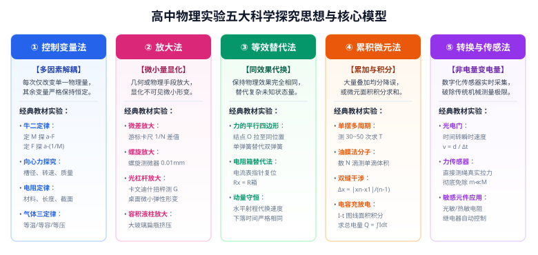

# 考点 · 物理实验思想方法与数据处理模型

## 考点模型深度解析

> [!IMPORTANT]
> 纵观近五年全国新高考实验试题，命题已经从“单一器材步骤识记”全面升级为**“基于物理学科本质的思想方法迁移与非线性数据建模能力考查”**。很多压轴实验大题给出的实验装置考生从未见过，但只要识别出其背后的**科学思想方法（如放大、替代、微元）**与**数学建模机制（化曲为直）**，就能快速拆解方程，实现满分突破。

---

## 考点一：高中物理五大核心实验思想方法

### 1. 控制变量法（Control of Variables）
* **思想内涵**：当一个物理量受到多个变量共同制约时，每次只改变其中一个变量，同时人为控制其余所有变量严格保持恒定，从而解耦研究该物理量与特定变量的独立定量规律。
* **经典实验矩阵**：
  1. **牛顿第二定律实验**：先保持小车质量 $M$ 不变探究 $a \propto F$；再保持外力 $F$ 不变探究 $a \propto \frac{1}{M}$；
  2. **向心力大小探究**：在演示仪上分别控制 $(m, r)$ 探究 $F \propto \omega^2$、控制 $(m, \omega)$ 探究 $F \propto r$、控制 $(r, \omega)$ 探究 $F \propto m$；
  3. **电阻定律实验**：分别控制材料与横截面积探究 $R \propto l$；控制材料与长度探究 $R \propto \frac{1}{S}$；
  4. **气体实验三定律**：控制温度 $T$ 得玻意耳定律；控制体积 $V$ 得查理定律；控制压强 $p$ 得盖-吕萨克定律。

---

### 2. 放大法（Amplification Method）
* **思想内涵**：当待测物理量或形变量极其微小，超出人眼或常规仪器的分辨极限时，利用几何构型或物理机制将其放大为容易测量的宏观物理量。

| 放大机制 | 物理原理 | 教材经典应用 |
| :---: | :--- | :--- |
| **微差放大** | 主尺与游标尺每小格微小差值 $\Delta = \frac{1}{N}\,\text{mm}$ | **游标卡尺**（10/20/50 分度将读数精度放大到 $0.1\,\text{mm} \sim 0.02\,\text{mm}$） |
| **机械螺旋放大** | 螺纹旋转一周轴向推进 $0.5\,\text{mm}$，套管 50 等分转动 | **螺旋测微器**（千分尺将轴向微小位移放大到 $0.01\,\text{mm}$） |
| **光路光杠杆放大** | 反射定律使反射光线转角放大为镜面倾角的 2 倍，经长光程投影为大位移 | **微小弹性形变演示**、**卡文迪什扭秤测万有引力常数 $G$**、**库仑扭秤实验** |
| **容积液柱放大** | 容器三维容积微小形变压缩，转化为极细玻璃管内一维液柱大幅升降 | **大玻璃扁瓶受压形变演示**、**水银/酒精温度计** |

---

### 3. 等效替代法（Equivalent Substitution）
* **思想内涵**：在保证物理效果（如受力平衡、电路状态、机械功）完全相同的前提下，用一个物理量或状态去等效替换另一个物理量或状态，使复杂未知的物理关系得以直接求解。
* **经典实验矩阵**：
  1. **探究力的平行四边形定则**：两次拉伸中，单测力计的拉力 $F'$ 与双测力计的拉力 $F_1, F_2$，必须将橡皮条结点拉到**同一个几何位置 $O$**（保证拉力效果等效）；
  2. **电阻箱替代法测未知电阻**：将待测电阻 $R_x$ 接入电路，记录电流表读数 $I$；用电阻箱 $R_0$ 替换 $R_x$，调节电阻箱阻值使电流表读数恢复为 $I$，则 $R_x = R_0$（无需测量具体电压即可实现无系统误差测阻）；
  3. **动量守恒水平射程代换**：小球碰撞后平抛运动的下落高度 $H$ 相同，下落时间 $t$ 完全等效，故用平抛落点的**水平射程 $x$ 线性等效代换碰后瞬时速度 $v$**。

---

### 4. 累积法与微元积分法（Accumulation & Micro-Element Method）
* **思想内涵**：
  - **累积法**：待测单体量极其微小无法单次精确测量时，将 $N$ 个相同单体叠加后测量总值，再除以 $N$ 获得平均单体量，大幅度降低单次读数的偶然误差；
  - **微元法**：面对非线性、变化过程时，将其切分为极其微小的时间或空间单元，在微元内视为常量计算后再累加求和（微积分思想）。
* **经典实验矩阵**：
  1. **累积测周期**：单摆测周期时，测出 $30\sim 50$ 次全振动的总时间 $t$，周期 $T = t/n$；
  2. **累积测单滴体积**：油膜法中用注射器数出滴下 $1\,\text{mL}$ 溶液的总滴数 $N$，单滴体积 $V_0 = \frac{1}{N}\,\text{mL}$；
  3. **累积测干涉条纹间距**：双缝干涉中测量第 1 条到第 $n$ 条亮纹的总间距，单格间距 $\Delta x = \frac{|x_n - x_1|}{n - 1}$；
  4. **传感器面积积分求电荷量**：电容器充放电实验中，$I - t$ 图像曲线与时间轴所围的面积 $S = \int I \, dt$，在微元积分上等于总电荷量 $Q$。

---

### 5. 转换法与现代传感技术（Conversion & Sensor Method）
* **思想内涵**：将人眼不可直观感知、或传统机械仪器无法连续采集的物理量（如力、磁场、光强、微小瞬时速度），转换为容易测量记录的电学量（电压、电流、电阻或数字脉冲）。
* **经典实验矩阵**：
  1. **光电门与遮光条**：将质点通过某位置的瞬时速度，转换为遮光条宽度 $d$ 与传感器记录的挡光时间 $\Delta t$ 之比（$v = d/\Delta t$）；
  2. **力传感器**：小车受到的瞬时拉力通过应变片压电效应直接转为数字电压信号实时输出，彻底解除 $m \ll M$ 的近似约束；
  3. **热敏电阻与光敏电阻**：将温度变化和光照变化转换为电阻电学变化，驱动微电脑控制继电器回路。

---

## 考点二：四大数据处理与逐差法严密数学论证

### 1. 列表法与有效数字规范
* **列表要求**：必须明确物理量名称、符号及法定物理单位（如 $U / \text{V}$、$t / \text{s}$）；
* **有效数字记录铁律**：
  - 测量仪器允许估读时，记录数据必须严格包含**全部准确值 + 1 位估计值**；
  - 多次测量求平均值时，平均值的位数应与单次测量有效数字位数**保持一致**。

---

### 2. 逐差法的严密数学推导与消项避坑

#### ① 数学推导：为什么必须隔项分组？
设物体在匀变速直线运动中，打出的连续相等时间间隔 $T$ 内的 6 段位移为 $x_1, x_2, x_3, x_4, x_5, x_6$。
由位移差递推式 $x_{m} - x_n = (m - n) a T^2$：
$$\begin{cases}
x_4 - x_1 = 3 a T^2 \\[0.5em]
x_5 - x_2 = 3 a T^2 \\[0.5em]
x_6 - x_3 = 3 a T^2
\end{cases}$$
将以上三式相加：
$$(x_4 + x_5 + x_6) - (x_1 + x_2 + x_3) = 9 a T^2$$
解得加速度 $a$ 的无偏估计值为：
$$a = \frac{(x_4 + x_5 + x_6) - (x_1 + x_2 + x_3)}{9 T^2}$$

#### ② 严禁用相邻项求差再平均的“消项伪科学”
若学生错误地对每两段求差再平均：
$$a_{\text{错}} = \frac{1}{5}\left(\frac{x_2-x_1}{T^2} + \frac{x_3-x_2}{T^2} + \frac{x_4-x_3}{T^2} + \frac{x_5-x_4}{T^2} + \frac{x_6-x_5}{T^2}\right)$$
展开分子：
$$(x_2 - x_1) + (x_3 - x_2) + (x_4 - x_3) + (x_5 - x_4) + (x_6 - x_5) = x_6 - x_1$$
代入化简得：
$$a_{\text{错}} = \frac{x_6 - x_1}{5 T^2}$$
> [!CAUTION]
> **消项陷阱揭秘**：中间测量的 $x_2, x_3, x_4, x_5$ 四组数据全部被数学对消！实验中辛辛苦苦记录的数据有 $67\%$ 被彻底废弃，只剩下第一段与最后一段参与运算，导致单点读数误差被急剧放大！**分组逐差法保证了全部 6 个数据均平等参与运算，且正负偶然误差最大限度互补抵消**。

#### ③ 奇数段位移的处理准则
若实验纸带只打出了 5 段有效位移（$x_1, x_2, x_3, x_4, x_5$）：
* **标准操作**：舍弃最中间的一段 $x_3$（或舍弃两端读数误差较大的一段如 $x_1$），利用两组对称数据计算：
  $$a = \frac{(x_4 + x_5) - (x_1 + x_2)}{4 T^2}$$

---

## 考点三：图像化建模——“化曲为直”二十大经典方程速查手册

在高考物理实验中，若两个物理量之间是非线性函数关系（如反比例、二次方、指数关系），直接描点绘制的是一条曲线，曲线不仅难以拟合，而且无法准确定量读取斜率与截距。
**“化曲为直”（Linearization）的本质**：通过数学变量代换，构建出形式为 $Y = k X + b$ 的一次函数线性关系，将复杂的物理规律浓缩在直线的**斜率 $k$** 与**截距 $b$** 之中！

| 实验场景 / 物理模型 | 原始非线性物理规律 | 线性化坐标选取 ($Y - X$) | 线性方程标准形式 | 斜率 $k$ 的物理内涵 | 截距 $b$ 的物理内涵 |
| :--- | :--- | :---: | :--- | :---: | :---: |
| **牛顿第二定律** | $a = \frac{F}{M}$ (定 $F$ 探 $M$) | $a - \frac{1}{M}$ | $a = F \cdot \left(\frac{1}{M}\right)$ | 合外力 $F$ | 过原点 ($b = 0$) |
| **胡克定律** | $F = k(L - L_0)$ | $F - L$ | $F = k L - k L_0$ | 劲度系数 $k$ | 横截距为弹簧原长 $L_0$ |
| **橡皮筋动能定理** | $W = \frac{1}{2} m v^2$ | $W - v^2$ | $W = \left(\frac{1}{2}m\right) v^2$ | $\frac{1}{2} m$ (半质量) | 过原点 ($b = 0$) |
| **自由落体验证机械能** | $v^2 = 2 g h$ | $v^2 - h$ | $v^2 = (2g) h$ | $2g$ (两倍重力加速度) | 过原点 ($b = 0$) |
| **单摆测重力加速度** | $T = 2\pi\sqrt{\frac{L}{g}}$ | $T^2 - L$ | $T^2 = \left(\frac{4\pi^2}{g}\right) L$ | $k = \frac{4\pi^2}{g} \implies g = \frac{4\pi^2}{k}$ | 过原点 ($b = 0$) |
| **单摆漏加半径作图** | $T = 2\pi\sqrt{\frac{l+r}{g}}$ | $T^2 - l$ | $T^2 = \left(\frac{4\pi^2}{g}\right) l + \frac{4\pi^2 r}{g}$ | $k = \frac{4\pi^2}{g} \implies g = \frac{4\pi^2}{k}$ | 纵截距 $b = \frac{4\pi^2 r}{g}$ |
| **双缝干涉波长测量** | $\Delta x = \frac{l}{d}\lambda$ | $\Delta x - l$ | $\Delta x = \left(\frac{\lambda}{d}\right) l$ | $\frac{\lambda}{d} \implies \lambda = k d$ | 过原点 ($b = 0$) |
| **安阻法测电源参数** | $E = I(R + r)$ | $\frac{1}{I} - R$ | $\frac{1}{I} = \frac{1}{E} R + \frac{r}{E}$ | $k = \frac{1}{E} \implies E = \frac{1}{k}$ | $b = \frac{r}{E} \implies r = \frac{b}{k}$ |
| **伏阻法测电源参数** | $E = U + \frac{U}{R} r$ | $\frac{1}{U} - \frac{1}{R}$ | $\frac{1}{U} = \frac{r}{E}\left(\frac{1}{R}\right) + \frac{1}{E}$ | $k = \frac{r}{E} \implies r = \frac{k}{b}$ | $b = \frac{1}{E} \implies E = \frac{1}{b}$ |
| **玻意耳定律 (等温)** | $p V = C$ | $p - \frac{1}{V}$ | $p = C \left(\frac{1}{V}\right)$ | 常数 $C = nRT$ | 过原点 ($b = 0$) |
| **等温实验死体积修正** | $p(V + V_0) = C$ | $\frac{1}{p} - V$ | $\frac{1}{p} = \frac{1}{C} V + \frac{V_0}{C}$ | 斜率 $k = \frac{1}{C}$ | 横截距绝对值等于死体积 $V_0$ |
| **查理定律 (等容外推)** | $p = p_0\left(1+\frac{t}{273.15}\right)$ | $p - t$ | $p = \left(\frac{p_0}{273.15}\right) t + p_0$ | 斜率 $k = \frac{p_0}{273.15}$ | 横截距为绝对零度 $-273.15^\circ\text{C}$ |
| **光电效应测普朗克常数** | $e U_c = h\nu - W_0$ | $U_c - \nu$ | $U_c = \left(\frac{h}{e}\right)\nu - \frac{W_0}{e}$ | $k = \frac{h}{e} \implies h = e k$ | 横截距为截止频率 $\nu_0$；纵截距绝对值 $\frac{W_0}{e}$ |
| **光敏电阻光照特性** | $R = A \cdot E_v^{-\gamma}$ | $\lg R - \lg E_v$ | $\lg R = -\gamma \lg E_v + \lg A$ | 指数系数 $-\gamma$ | 截距 $\lg A$ |
| **热敏电阻阻温特性** | $R = R_0 e^{B/T}$ | $\ln R - \frac{1}{T}$ | $\ln R = B \left(\frac{1}{T}\right) + \ln R_0$ | 材料常数 $B$ | 纵截距 $\ln R_0$ |
| **匀变速光电门二次位移** | $v_2^2 - v_1^2 = 2 a x$ | $v^2 - x$ | $v^2 = (2a) x + v_0^2$ | $2a$ (两倍加速度) | 初速度平方 $v_0^2$ |
| **圆周运动向心力探究** | $F = m r \omega^2$ | $F - \omega^2$ | $F = (m r) \omega^2$ | 质量与半径之积 $m r$ | 过原点 ($b = 0$) |
| **电容器恒流充电** | $U = \frac{I_0}{C} t$ | $U - t$ | $U = \left(\frac{I_0}{C}\right) t$ | $\frac{I_0}{C} \implies C = \frac{I_0}{k}$ | 过原点 ($b = 0$) |
| **半偏法系统误差分析** | $I_g R_g = I(R_g // R')$ | $\frac{1}{I} - R'$ | $\frac{1}{I} = \frac{R_g}{E} + \dots$ | 线性灵敏度系数 | 极限制约项 |
| **小灯泡功率特性** | $P = U I = k U^n$ | $\lg P - \lg U$ | $\lg P = n \lg U + \lg k$ | 非线性幂次指数 $n$ | 阻抗特征常数 $\lg k$ |

---

## 图像拟合解题三大黄金法则

1. **图线平滑拟合原则**：在直角坐标系中描点后，画拟合线必须用刻度尺比齐绝大多数点。**图线应穿过尽可能多的数据点，未穿过的点必须大致均匀分布在拟合直线两侧**，严禁将所有点折线连接（“心电图式画法”为严重错误）；
2. **剔除异常坏点（Outliers）**：个别严重偏离直线趋势的数据点，通常是由实验粗心或读数笔误造成的，作图时应主动将其标注为无效点予以舍弃；
3. **计算斜率取点铁律**：计算拟合直线的斜率 $k = \frac{\Delta Y}{\Delta X}$ 时，**所选取的两点必须是拟合直线上的点（通常选取相距较远且在网格交点上的两点），严禁直接抓取原始实验数据表格中的离散点代入计算！**
