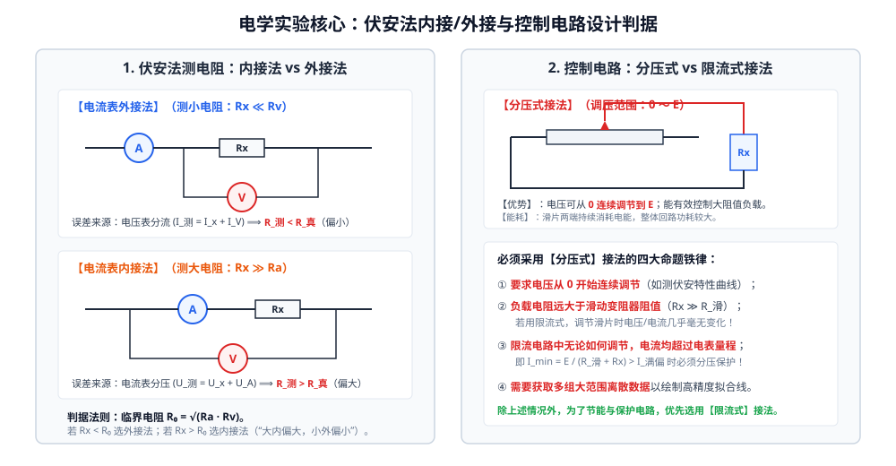

# 考点 · 电学实验器材选择与控制电路设计

## 考点模型深度解析

> [!IMPORTANT]
> 电学实验设计大题是高考物理全国卷与新高考省份命题中“思维容量最大、综合度最高、分值最集中”的压轴考点。实验设计的本质是**在有限的器材约束（电源、滑动变阻器、电表量程）下，通过最合理的电路拓扑消除或最小化系统误差**。本专题提炼出高考电学设计的五大核心解题模块。

---

## 考点一：测量电路的设计——伏安法“内接法 vs 外接法”的终极判据

### 1. 理论根源与误差比较
设待测电阻真实值为 $R_x$，电流表内阻为 $R_A$，电压表内阻为 $R_V$。
* **外接法测量值**：$R_{\text{外}} = \frac{U}{I} = \frac{R_x R_V}{R_x + R_V} < R_x$（由于电压表分流，$R_{\text{测}}$ **偏小**）；
  相对误差绝对值为：$\varepsilon_{\text{外}} = \frac{R_x - R_{\text{外}}}{R_x} = \frac{R_x}{R_x + R_V} \approx \frac{R_x}{R_V}$。
* **内接法测量值**：$R_{\text{内}} = \frac{U}{I} = R_x + R_A > R_x$（由于电流表分压，$R_{\text{测}}$ **偏大**）；
  相对误差绝对值为：$\varepsilon_{\text{内}} = \frac{R_{\text{内}} - R_x}{R_x} = \frac{R_A}{R_x}$。

### 2. 三大判据法则

#### ① 临界电阻比较法（若已知 $R_A, R_V$ 与 $R_x$ 大致阻值）
令两法相对误差相等：
$$\frac{R_x}{R_V} = \frac{R_A}{R_x} \implies R_x^2 = R_A R_V \implies R_0 = \sqrt{R_A R_V}$$
$R_0$ 称为**临界电阻（Critical Resistance）**。

| 条件关系 | 电阻属性 | 选用接法 | 记忆口诀 |
| :---: | :---: | :---: | :--- |
| **$R_x > \sqrt{R_A R_V}$** | 待测电阻为**大电阻** | **电流表内接法** | **“大内偏大”**（大电阻用内接法，测量值偏大） |
| **$R_x < \sqrt{R_A R_V}$** | 待测电阻为**小电阻** | **电流表外接法** | **“小外偏小”**（小电阻用外接法，测量值偏小） |

#### ② 相对比值法
直接计算两个比值：
* 若 $\frac{R_x}{R_A} > \frac{R_V}{R_x}$，说明待测电阻相对电流表更大，内接法分压影响更小，**选用内接法**；
* 若 $\frac{R_V}{R_x} > \frac{R_x}{R_A}$，说明电压表内阻相对待测电阻更大，外接法分流影响更小，**选用外接法**。

#### ③ 试触法（未给出 $R_A, R_V$ 阻值时的现场实操判据）
将电压表的一端固定在待测电阻一侧，另一端分别试触接线点 $a$（外接）和点 $b$（内接），观察两电表示数变化量：
$$\begin{cases}
\text{若 } \dfrac{\Delta I}{I} > \dfrac{\Delta U}{U} \implies \text{电流表示数变化显著，说明电压表分流严重，应选用【内接法】} \\[1em]
\text{若 } \dfrac{\Delta U}{U} > \dfrac{\Delta I}{I} \implies \text{电压表示数变化显著，说明电流表分压严重，应选用【外接法】}
\end{cases}$$

---

## 考点二：控制电路的设计——“分压式 vs 限流式”的四大刚性判据

### 1. 两种控制接法的调节特性数学对比

| 对比维度 | 限流式接法（Rheostat in Series） | 分压式接法（Potential Divider） |
| :---: | :---: | :---: |
| **电路能耗** | **能耗低**（总电流小，无旁路损耗） | **能耗高**（变阻器全阻始终接入电源两端） |
| **负载电压调节范围** | $U_x \in \left[\dfrac{R_x}{R_{\text{滑}} + R_x} E, \; E\right]$（**有非零起始下限**） | $U_x \in [0, \; E]$（**从零连续可调**） |
| **负载电流调节范围** | $I_x \in \left[\dfrac{E}{R_{\text{滑}} + R_x}, \; \dfrac{E}{R_x}\right]$ | $I_x \in \left[0, \; \dfrac{E}{R_x}\right]$ |

---

### 2. 必须采用【分压式接法】的四大刚性条件

> [!CAUTION]
> 在高考答题中，控制电路只要触发以下四条中的**任意一条**，必须毫不犹豫选择**分压式接法**：

1. **要求电压从 0 开始连续调节**（例如题目出现“从零开始记录多组数据”、“描绘小灯泡伏安特性曲线”等关键词）；
2. **负载电阻远大于滑动变阻器的最大阻值（$R_x \gg R_{\text{滑}}$）**：
   若采用限流式，回路总电阻主要由 $R_x$ 决定，无论滑片如何大幅度移动，负载两端的电压和通过电流变化极微弱，无法实现有效控制；
3. **电表保护与限流超量程**：
   在限流电路中，即使将滑动变阻器滑至最大阻值处，回路的最小电流仍超过电流表的量程或被测元件的额定电流（即 $I_{\text{min}} = \frac{E}{R_{\text{滑}} + R_x} > I_{\text{满偏}}$）；
4. **要求大范围采集数据以提高作图精度**（例如要求在全电压范围内均匀打点拟合直线）。

### 3. 滑动变阻器的选型策略
* **限流式接法**：选用最大阻值与负载相当（$R_{\text{滑}} \approx 0.5 R_x \sim 2 R_x$）的变阻器，调节时电流变化最均匀平缓；
* **分压式接法**：选用**最大阻值较小**（$R_{\text{滑}} \ll R_x$）的变阻器，不仅输出电压随滑片位移线性度好，而且便于平稳调节。

---

## 考点三：电表改装与校准模型

### 1. 表头扩程改装数学模型
微安表或小量程毫安表（表头参数：满偏电流 $I_g$，内阻 $R_g$，满偏电压 $U_g = I_g R_g$）。

#### ① 改装为大量程安培表（并联分流小电阻 $R_p$）
设量程扩大为 $I$（扩大倍数 $n = \frac{I}{I_g} > 1$），分流电阻 $R_p$ 与表头并联：
$$I_g R_g = (I - I_g) R_p \implies R_p = \frac{I_g R_g}{I - I_g} = \frac{R_g}{n - 1}$$
改装后电流表总内阻为：$R_A = \frac{R_g R_p}{R_g + R_p} = \frac{R_g}{n}$。

#### ② 改装为大量程伏特表（串联分压大电阻 $R_s$）
设量程扩大为 $U$（扩大倍数 $n = \frac{U}{U_g} > 1$），分压电阻 $R_s$ 与表头串联：
$$U = I_g (R_g + R_s) \implies R_s = \frac{U}{I_g} - R_g = (n - 1) R_g$$
改装后电压表总内阻为：$R_V = R_g + R_s = n R_g$。

### 2. 改装电表的校准电路
改装后的电表必须与标准表（精度更高的对应量程电表）进行校准。
* **校准电路供电形式**：**必须采用分压式接法**！保证校准电压能从零逐渐升至满刻度。
* **满偏偏差校正**：
  * 若改装电流表示数比标准表读数偏大，说明分流电阻 $R_p$ 分流不足（$R_p$ 过大），应**并联微调电阻减小 $R_p$**；
  * 若改装电压表示数比标准表读数偏大，说明分压电阻 $R_s$ 分压不足（$R_s$ 偏小），应**增大分压电阻 $R_s$**。

---

## 考点四：半偏法测电表内阻系统误差深度剖析

### 1. 半偏法测电流表内阻 $R_g$
* **电路结构**：电源、大电阻滑动变阻器 $R$、电阻箱 $R'$、开关 $S_1, S_2$。
* **操作步骤**：
  1. 断开 $S_2$，闭合 $S_1$，调节变阻器 $R$ 使表头满偏（示数为 $I_g$）；
  2. 保持 $R$ 不变，闭合 $S_2$，调节电阻箱 $R'$ 使表头指针指在**半偏位置（$\frac{1}{2}I_g$）**；
  3. 读出此时电阻箱阻值 $R'$，认为 $R_g = R'$。
* **系统误差机理**：
  闭合 $S_2$ 后，表头与电阻箱并联，该支路并联总电阻减小，导致**全电路总电阻变小，干路总电流增大（$I_{\text{总}} > I_g$）**！
  由于表头通过的电流严格等于 $\frac{1}{2}I_g$，故流过电阻箱的电流必为：
  $$I_{R'} = I_{\text{总}} - \frac{1}{2}I_g > \frac{1}{2}I_g$$
  电阻箱与表头两端并联电压相等：$I_{R'} R' = \frac{1}{2}I_g R_g$。
  因 $I_{R'} > \frac{1}{2}I_g$，故必有：
  $$R' < R_g \implies R_{\text{测}} < R_{\text{真}} \quad (\text{测量值必然偏小！})$$
* **消除误差策略**：选用电动势 $E$ 尽可能大的电源，使变阻器阻值 $R \gg R_g$（通常 $R > 100 R_g$），闭合 $S_2$ 引起的总电阻相对改变可以忽略不计。

---

## 考点五：创新电表应用模型（“安安法”与“伏伏法”）

在高考试题中，往往出现“电表内阻已知”的特殊条件。一旦电表内阻已知，该表便具有了“双重身份”：

### 1. “安安法”（两只电流表测电阻）
若有一只内阻已知的灵敏电流表 $A_1$（内阻 $R_{A1}$ 已知）：
* $A_1$ 本身就可以充当高精度电压表使用！其两端电压为：
  $$U = I_1 R_{A1}$$
* 若将 $A_1$ 与待测电阻 $R_x$ 并联，干路上接另一电流表 $A_2$：
  $$R_x = \frac{I_1 R_{A1}}{I_2 - I_1}$$
  此电路**不存在任何由于电表内阻导致的系统误差**！

### 2. “伏伏法”（两只电压表测内阻与电动势）
若有一只内阻已知的电压表 $V_1$（内阻 $R_{V1}$ 已知）：
* $V_1$ 本身就可以充当高精度微安表/毫安表使用！通过它的电流为：
  $$I = \frac{U_1}{R_{V1}}$$
* 串联在回路中即可精确获取干路电流，彻底摆脱电流表的内阻分压干扰。
